下面演示如何在 Markdown 代码块中直接渲染各类图表。注意：页面上只显示图，不显示原始代码块。

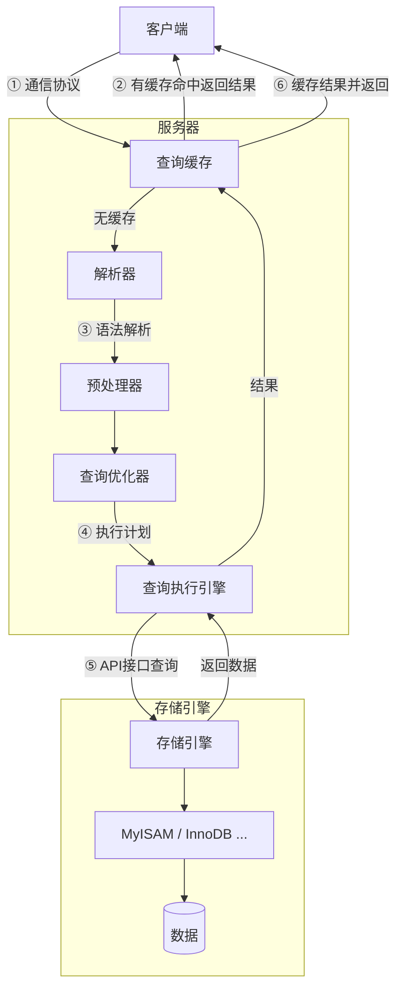

## Mermaid

流程图
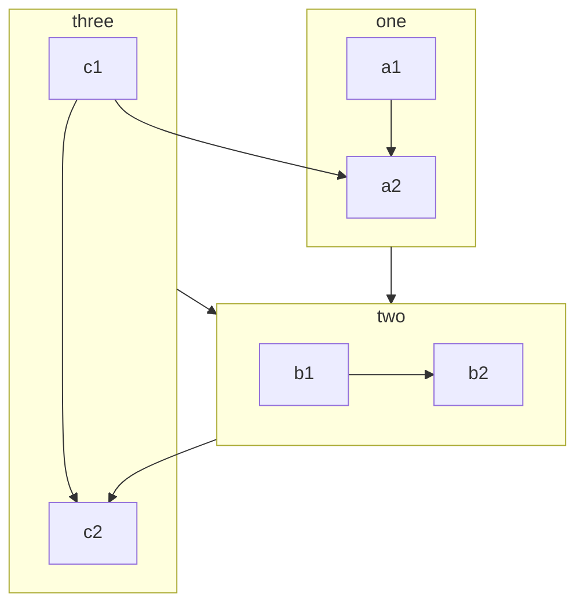
循序图
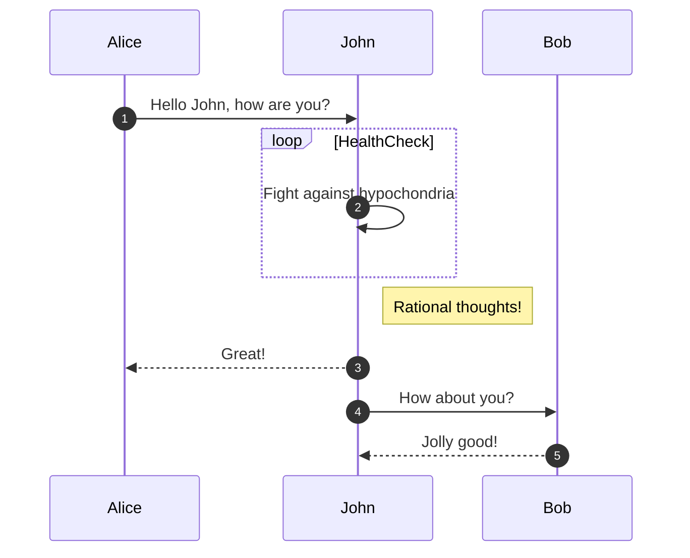
类图
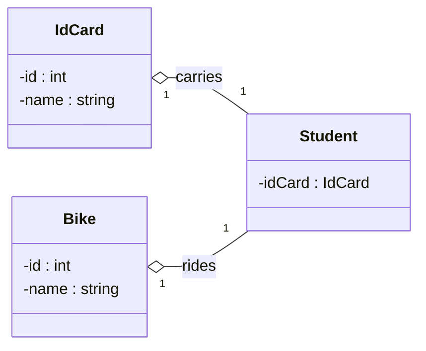
甘特图
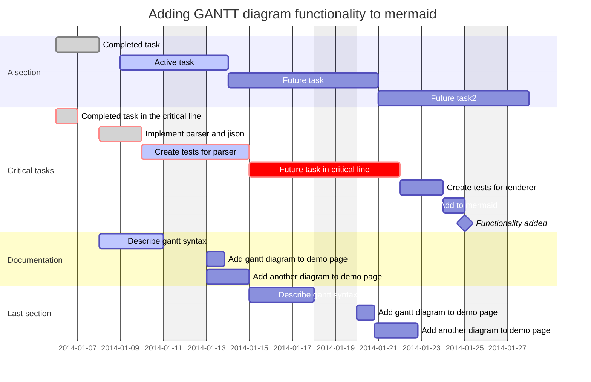
git图
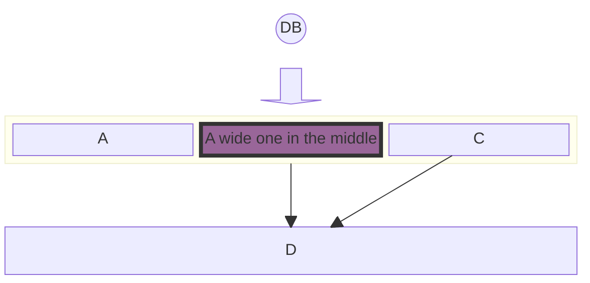
包图
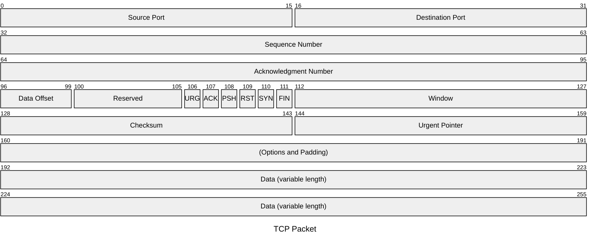

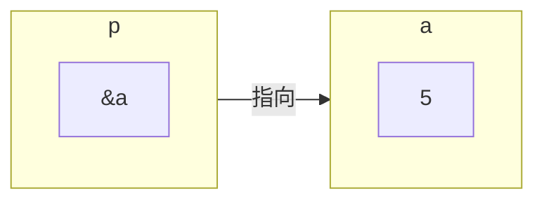

## Flowchart.js

```flowchart
st=>start: Start
op=>operation: My Operation
cond=>condition: Yes or No?
e=>end
st->op->cond
cond(yes)->e
cond(no)->op
```

## Markmap（思维导图）

```markmap
---
markmap:
  colorFreezeLevel: 2
---

# markmap

## 链接

- <https://markmap.js.org/>
- [GitHub](https://github.com/markmap/markmap)

## 功能

- 链接
- **强调** ~~删除线~~ *斜体* ==高亮==
- 多行
  文字
- `行内代码`
-
    ```go
    package main

    import "fmt"

    func 
    ```
- Katex
  - $x = {-b \pm\sqrt{b^2-4ac} \over 2a}$
- 现在我们可以通过 `maxWidth` 选项自动换行非常非常非常非常非常非常非常非常非常非常长的内容
```

## PlantUML

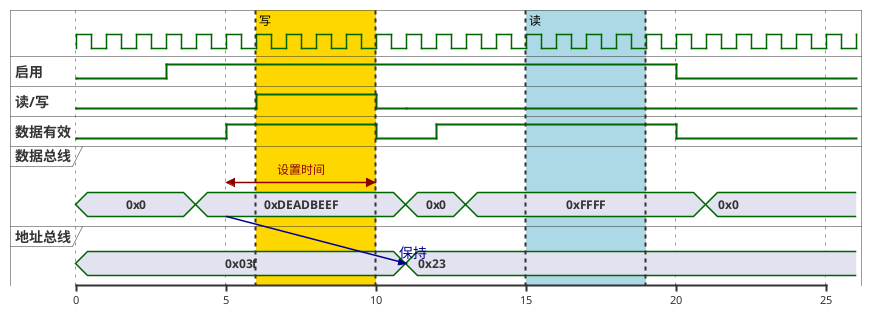
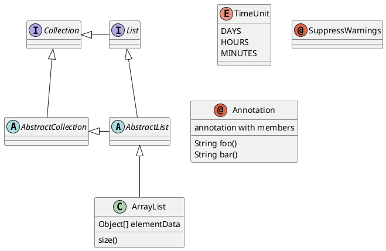


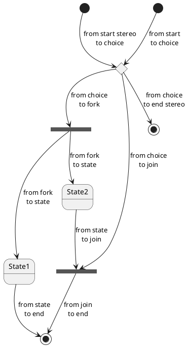
正则表达式
```plantuml
@startuml
skinparam rectangle {
  RoundCorner 8
}

' 第一行
rectangle "a" as A #lightgrey
rectangle "5" as B
A --> B

' 第二行
rectangle "p" as C #lightgrey
rectangle "&a" as D
C --> D
@enduml
```


组件图
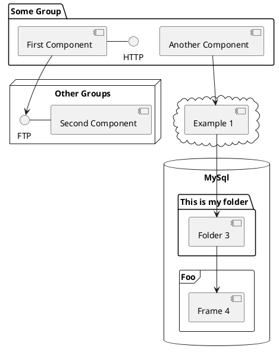


思维导图
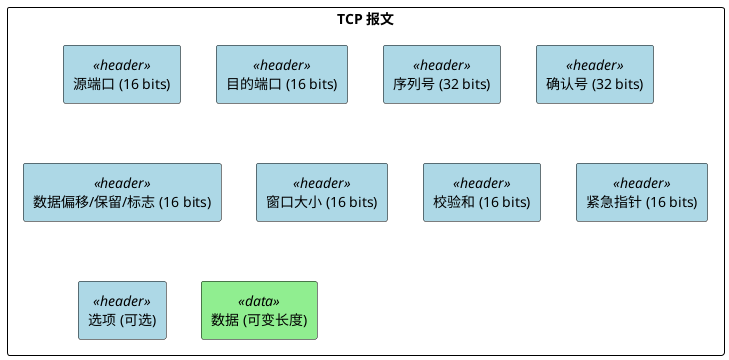


## ECharts


```echarts
{
  "title": { "text": "示例柱状图" },
  "tooltip": { "trigger": "axis", "show": true },
  "toolbox": {
    "show": true,
    "feature": {
      "dataView": { "show": true, "readOnly": false },
      "restore": { "show": true },
      "saveAsImage": { "show": true }
    }
  },
  "xAxis": { "type": "category", "data": ["A","B","C","D","E"] },
  "yAxis": { "type": "value" },
  "series": [{ "type": "bar", "data": [5, 20, 36, 10, 10] }]
}
```
```echarts
{
  "title": { "text": "示例饼图" },
  "tooltip": { "trigger": "item", "show": true },
  "toolbox": {
    "show": true,
    "feature": {
      "dataView": { "show": true, "readOnly": false },
      "restore": { "show": true },
      "saveAsImage": { "show": true }
    }
  },
  "series": [{
    "type": "pie",
    "radius": "60%",
    "data": [
      { "value": 1048, "name": "Search" },
      { "value": 735, "name": "Direct" },
      { "value": 580, "name": "Email" },
      { "value": 484, "name": "Union Ads" },
      { "value": 300, "name": "Video Ads" }
    ]
  }]
}
```
```echarts
{
  "title": { "text": "示例散点图" },
  "tooltip": { "show": true },
  "toolbox": {
    "show": true,
    "feature": {
      "dataView": { "show": true, "readOnly": false },
      "restore": { "show": true },
      "saveAsImage": { "show": true }
    }
  },
  "xAxis": {},
  "yAxis": {},
  "series": [{ "type": "scatter", "symbolSize": 10, "data": [[10,8],[20,15],[30,10],[40,20],[50,16]] }]
}
```

```echarts
{
  "title": { "text": "南丁格尔" },
  "legend": {
    "top": "bottom"
  },
  "toolbox": {
    "show": true,
    "feature": {
      "mark": {
        "show": true
      },
      "dataView": {
        "show": true,
        "readOnly": false
      },
      "restore": {
        "show": true
      },
      "saveAsImage": {
        "show": true
      }
    }
  },
  "series": [
    {
      "name": "Nightingale Chart",
      "type": "pie",
      "radius": [20, 100],
      "center": ["50%", "50%"],
      "roseType": "area",
      "itemStyle": {
        "borderRadius": 8
      },
      "data": [
        {
          "value": 40,
          "name": "rose 1"
        },
        {
          "value": 38,
          "name": "rose 2"
        },
        {
          "value": 32,
          "name": "rose 3"
        },
        {
          "value": 30,
          "name": "rose 4"
        },
        {
          "value": 28,
          "name": "rose 5"
        },
        {
          "value": 26,
          "name": "rose 6"
        },
        {
          "value": 22,
          "name": "rose 7"
        },
        {
          "value": 18,
          "name": "rose 8"
        }
      ]
    }
  ]
}
```
```echarts
{
  "title": { "text": "示例雷达图" },
  "tooltip": { "show": true },
  "toolbox": {
    "show": true,
    "feature": {
      "dataView": { "show": true, "readOnly": false },
      "restore": { "show": true },
      "saveAsImage": { "show": true }
    }
  },
  "legend": { "top": "top" },
  "radar": {
    "indicator": [
      { "name": "销售", "max": 6500 },
      { "name": "管理", "max": 16000 },
      { "name": "信息技术", "max": 30000 },
      { "name": "客服", "max": 38000 },
      { "name": "研发", "max": 52000 },
      { "name": "市场", "max": 25000 }
    ],
    "center": ["50%", "55%"]
  },
  "series": [
    {
      "name": "预算 vs 开销",
      "type": "radar",
      "data": [
        { "value": [4200, 3000, 20000, 35000, 50000, 18000], "name": "预算" },
        { "value": [5000, 14000, 28000, 26000, 42000, 21000], "name": "开销" }
      ]
    }
  ]
}
```
```echarts
{
  "title": { "text": "四象限函数图 (Weierstrass Function)" },
  "tooltip": { "trigger": "axis" },
  "toolbox": {
    "show": true,
    "feature": {
      "dataView": { "show": true, "readOnly": false },
      "restore": { "show": true },
      "saveAsImage": { "show": true }
    }
  },
  "xAxis": { "type": "value", "min": -10, "max": 10 },
  "yAxis": { "type": "value", "min": -2, "max": 2 },
  "series": [
    {
      "type": "line",
      "data": [
        [-10, -0.544], [-9.8, -0.366], [-9.6, -0.185], [-9.4, -0.005], [-9.2, 0.175],
        [-9.0, 0.355], [-8.8, 0.535], [-8.6, 0.714], [-8.4, 0.894], [-8.2, 1.073],
        [-8.0, 1.252], [-7.8, 1.431], [-7.6, 1.610], [-7.4, 1.788], [-7.2, 1.967],
        [-7.0, 2.145], [-6.8, 2.322], [-6.6, 2.499], [-6.4, 2.676], [-6.2, 2.852],
        [-6.0, 3.028], [-5.8, 2.852], [-5.6, 2.676], [-5.4, 2.499], [-5.2, 2.322],
        [-5.0, 2.145], [-4.8, 1.967], [-4.6, 1.788], [-4.4, 1.610], [-4.2, 1.431],
        [-4.0, 1.252], [-3.8, 1.073], [-3.6, 0.894], [-3.4, 0.714], [-3.2, 0.535],
        [-3.0, 0.355], [-2.8, 0.175], [-2.6, -0.005], [-2.4, -0.185], [-2.2, -0.366],
        [-2.0, -0.544], [-1.8, -0.366], [-1.6, -0.185], [-1.4, -0.005], [-1.2, 0.175],
        [-1.0, 0.355], [-0.8, 0.535], [-0.6, 0.714], [-0.4, 0.894], [-0.2, 1.073],
        [0.0, 1.252], [0.2, 1.073], [0.4, 0.894], [0.6, 0.714], [0.8, 0.535],
        [1.0, 0.355], [1.2, 0.175], [1.4, -0.005], [1.6, -0.185], [1.8, -0.366],
        [2.0, -0.544], [2.2, -0.366], [2.4, -0.185], [2.6, -0.005], [2.8, 0.175],
        [3.0, 0.355], [3.2, 0.535], [3.4, 0.714], [3.6, 0.894], [3.8, 1.073],
        [4.0, 1.252], [4.2, 1.073], [4.4, 0.894], [4.6, 0.714], [4.8, 0.535],
        [5.0, 0.355], [5.2, 0.175], [5.4, -0.005], [5.6, -0.185], [5.8, -0.366],
        [6.0, -0.544], [6.2, -0.366], [6.4, -0.185], [6.6, -0.005], [6.8, 0.175],
        [7.0, 0.355], [7.2, 0.535], [7.4, 0.714], [7.6, 0.894], [7.8, 1.073],
        [8.0, 1.252], [8.2, 1.073], [8.4, 0.894], [8.6, 0.714], [8.8, 0.535],
        [9.0, 0.355], [9.2, 0.175], [9.4, -0.005], [9.6, -0.185], [9.8, -0.366],
        [10.0, -0.544]
      ],
      "smooth": true,
      "showSymbol": false
    }
  ]
}
```

```echarts
{
  "title": { "text": "Two Value-Axes in Polar" },
  "tooltip": { "trigger": "axis" },
  "toolbox": {
    "show": true,
    "feature": {
      "dataView": { "show": true, "readOnly": false },
      "restore": { "show": true },
      "saveAsImage": { "show": true }
    }
  },
  "polar": {},
  "angleAxis": { "type": "value", "startAngle": 0 },
  "radiusAxis": { "type": "value" },
  "series": [
    {
      "type": "line",
      "coordinateSystem": "polar",
      "data": [[0, 0], [30, 10], [60, 20], [90, 30], [120, 40], [150, 50], [180, 60]],
      "name": "Line A"
    },
    {
      "type": "line",
      "coordinateSystem": "polar",
      "data": [[0, 0], [30, -10], [60, -20], [90, -30], [120, -40], [150, -50], [180, -60]],
      "name": "Line B"
    }
  ],
  "legend": { "show": true, "top": "top" }
}
```

```echarts
{
  "title": { "text": "关系图（力引导布局）" },
  "tooltip": { "show": true },
  "toolbox": {
    "show": true,
    "feature": {
      "dataView": { "show": true, "readOnly": false },
      "restore": { "show": true },
      "saveAsImage": { "show": true }
    }
  },
  "legend": {
    "data": ["HTMLElement", "WebGL", "SVG", "CSS", "Other"]
  },
  "series": [
    {
      "type": "graph",
      "layout": "force",
      "animation": false,
      "roam": true,
      "scaleLimit": { "max": 8, "min": 0.5 },
      "label": {
        "position": "right",
        "formatter": "{b}"
      },
      "draggable": true,
      "data": [
        { "name": "HTMLElement", "category": 0, "value": 10, "symbolSize": 40 },
        { "name": "WebGL", "category": 1, "value": 20, "symbolSize": 50 },
        { "name": "SVG", "category": 2, "value": 15, "symbolSize": 45 },
        { "name": "CSS", "category": 3, "value": 8, "symbolSize": 35 },
        { "name": "Other", "category": 4, "value": 12, "symbolSize": 38 }
      ],
      "categories": [
        { "name": "HTMLElement" },
        { "name": "WebGL" },
        { "name": "SVG" },
        { "name": "CSS" },
        { "name": "Other" }
      ],
      "force": {
        "edgeLength": 100,
        "repulsion": 200,
        "gravity": 0.3
      },
      "links": [
        { "source": "HTMLElement", "target": "WebGL" },
        { "source": "HTMLElement", "target": "SVG" },
        { "source": "WebGL", "target": "CSS" },
        { "source": "SVG", "target": "CSS" },
        { "source": "CSS", "target": "Other" }
      ]
    }
  ]
}
```