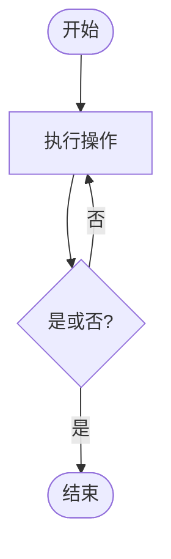
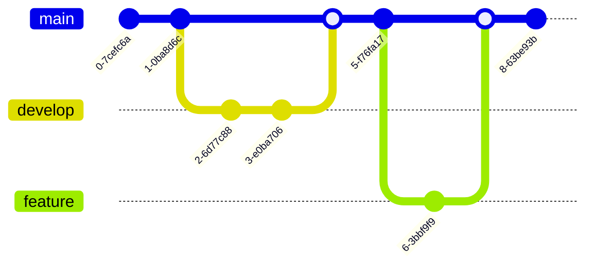

# 图表渲染完整示例

本文档全面展示如何在 Markdown 中使用各类图表渲染工具，包括 Mermaid、PlantUML、ECharts、Markmap 等。所有图表均可直接在代码块中编写并自动渲染。

---

## 目录

1. [Mermaid 图表](#mermaid-图表) - 流程图、时序图、类图、甘特图、状态图、实体关系图等
2. [PlantUML 图表](#plantuml-图表) - UML图、组件图、时序图、状态图等
3. [ECharts 数据可视化](#echarts-数据可视化) - 柱状图、折线图、饼图、雷达图、散点图、关系图等
4. [Markmap 思维导图](#markmap-思维导图) - 交互式思维导图

---

## Mermaid 图表

Mermaid 是一个基于 JavaScript 的图表工具，可以通过文本描述生成各种图表。

### 1. 流程图 (Flowchart)

#### 1.1 数据库查询流程


#### 1.2 用户登录流程

流程图

循序图

类图

甘特图

git图

包图


## 更多流程图示例

### 简单决策流程



## Markmap（思维导图）

```markmap
# Markmap 功能展示

## 文本格式
- **粗体文本**
- *斜体文本*
- ~~删除线~~
- `行内代码`

## 链接
- [Markmap官网](https://markmap.js.org/)
- [GitHub仓库](https://github.com/markmap/markmap)

## 数学公式
- 勾股定理：$a^{2}+b^{2}=c^{2}$
- 二次方程：$x = \frac{-b \pm \sqrt{b^2-4ac}}{2a}$
- 欧拉公式：$e^{i\pi} + 1 = 0$
- 求和公式：$\sum_{i=1}^{n} i = \frac{n(n+1)}{2}$
- 积分公式：$\int_0^\infty e^{-x^2} dx = \frac{\sqrt{\pi}}{2}$
- 微分方程：$\frac{dy}{dx} + P(x)y = Q(x)$
- 矩阵：$\begin{bmatrix} a & b \\ c & d \end{bmatrix}$
- 极限：$\lim_{x \to \infty} f(x) = L$

## 代码块
- Python示例
- JavaScript示例
- Go语言示例

## 多级列表
- 一级项目
  - 二级项目A
    - 三级项目1
    - 三级项目2
  - 二级项目B
- 另一个一级项目
```

## PlantUML


正则表达式


组件图


思维导图


## ECharts


```echarts
{
  "title": { "text": "示例柱状图" },
  "tooltip": { "trigger": "axis", "show": true },
  "toolbox": {
    "show": true,
    "feature": {
      "dataView": { "show": true, "readOnly": false },
      "restore": { "show": true },
      "saveAsImage": { "show": true }
    }
  },
  "xAxis": { "type": "category", "data": ["A","B","C","D","E"] },
  "yAxis": { "type": "value" },
  "series": [{ "type": "bar", "data": [5, 20, 36, 10, 10] }]
}
```
```echarts
{
  "title": { "text": "示例饼图" },
  "tooltip": { "trigger": "item", "show": true },
  "toolbox": {
    "show": true,
    "feature": {
      "dataView": { "show": true, "readOnly": false },
      "restore": { "show": true },
      "saveAsImage": { "show": true }
    }
  },
  "series": [{
    "type": "pie",
    "radius": "60%",
    "data": [
      { "value": 1048, "name": "Search" },
      { "value": 735, "name": "Direct" },
      { "value": 580, "name": "Email" },
      { "value": 484, "name": "Union Ads" },
      { "value": 300, "name": "Video Ads" }
    ]
  }]
}
```
```echarts
{
  "title": { "text": "示例散点图" },
  "tooltip": { "show": true },
  "toolbox": {
    "show": true,
    "feature": {
      "dataView": { "show": true, "readOnly": false },
      "restore": { "show": true },
      "saveAsImage": { "show": true }
    }
  },
  "xAxis": {},
  "yAxis": {},
  "series": [{ "type": "scatter", "symbolSize": 10, "data": [[10,8],[20,15],[30,10],[40,20],[50,16]] }]
}
```

```echarts
{
  "title": { "text": "南丁格尔" },
  "legend": {
    "top": "bottom"
  },
  "toolbox": {
    "show": true,
    "feature": {
      "mark": {
        "show": true
      },
      "dataView": {
        "show": true,
        "readOnly": false
      },
      "restore": {
        "show": true
      },
      "saveAsImage": {
        "show": true
      }
    }
  },
  "series": [
    {
      "name": "Nightingale Chart",
      "type": "pie",
      "radius": [20, 100],
      "center": ["50%", "50%"],
      "roseType": "area",
      "itemStyle": {
        "borderRadius": 8
      },
      "data": [
        {
          "value": 40,
          "name": "rose 1"
        },
        {
          "value": 38,
          "name": "rose 2"
        },
        {
          "value": 32,
          "name": "rose 3"
        },
        {
          "value": 30,
          "name": "rose 4"
        },
        {
          "value": 28,
          "name": "rose 5"
        },
        {
          "value": 26,
          "name": "rose 6"
        },
        {
          "value": 22,
          "name": "rose 7"
        },
        {
          "value": 18,
          "name": "rose 8"
        }
      ]
    }
  ]
}
```
```echarts
{
  "title": { "text": "示例雷达图" },
  "tooltip": { "show": true },
  "toolbox": {
    "show": true,
    "feature": {
      "dataView": { "show": true, "readOnly": false },
      "restore": { "show": true },
      "saveAsImage": { "show": true }
    }
  },
  "legend": { "top": "top" },
  "radar": {
    "indicator": [
      { "name": "销售", "max": 6500 },
      { "name": "管理", "max": 16000 },
      { "name": "信息技术", "max": 30000 },
      { "name": "客服", "max": 38000 },
      { "name": "研发", "max": 52000 },
      { "name": "市场", "max": 25000 }
    ],
    "center": ["50%", "55%"]
  },
  "series": [
    {
      "name": "预算 vs 开销",
      "type": "radar",
      "data": [
        { "value": [4200, 3000, 20000, 35000, 50000, 18000], "name": "预算" },
        { "value": [5000, 14000, 28000, 26000, 42000, 21000], "name": "开销" }
      ]
    }
  ]
}
```
```echarts
{
  "title": { "text": "四象限函数图 (Weierstrass Function)" },
  "tooltip": { "trigger": "axis" },
  "toolbox": {
    "show": true,
    "feature": {
      "dataView": { "show": true, "readOnly": false },
      "restore": { "show": true },
      "saveAsImage": { "show": true }
    }
  },
  "xAxis": { "type": "value", "min": -10, "max": 10 },
  "yAxis": { "type": "value", "min": -2, "max": 2 },
  "series": [
    {
      "type": "line",
      "data": [
        [-10, -0.544], [-9.8, -0.366], [-9.6, -0.185], [-9.4, -0.005], [-9.2, 0.175],
        [-9.0, 0.355], [-8.8, 0.535], [-8.6, 0.714], [-8.4, 0.894], [-8.2, 1.073],
        [-8.0, 1.252], [-7.8, 1.431], [-7.6, 1.610], [-7.4, 1.788], [-7.2, 1.967],
        [-7.0, 2.145], [-6.8, 2.322], [-6.6, 2.499], [-6.4, 2.676], [-6.2, 2.852],
        [-6.0, 3.028], [-5.8, 2.852], [-5.6, 2.676], [-5.4, 2.499], [-5.2, 2.322],
        [-5.0, 2.145], [-4.8, 1.967], [-4.6, 1.788], [-4.4, 1.610], [-4.2, 1.431],
        [-4.0, 1.252], [-3.8, 1.073], [-3.6, 0.894], [-3.4, 0.714], [-3.2, 0.535],
        [-3.0, 0.355], [-2.8, 0.175], [-2.6, -0.005], [-2.4, -0.185], [-2.2, -0.366],
        [-2.0, -0.544], [-1.8, -0.366], [-1.6, -0.185], [-1.4, -0.005], [-1.2, 0.175],
        [-1.0, 0.355], [-0.8, 0.535], [-0.6, 0.714], [-0.4, 0.894], [-0.2, 1.073],
        [0.0, 1.252], [0.2, 1.073], [0.4, 0.894], [0.6, 0.714], [0.8, 0.535],
        [1.0, 0.355], [1.2, 0.175], [1.4, -0.005], [1.6, -0.185], [1.8, -0.366],
        [2.0, -0.544], [2.2, -0.366], [2.4, -0.185], [2.6, -0.005], [2.8, 0.175],
        [3.0, 0.355], [3.2, 0.535], [3.4, 0.714], [3.6, 0.894], [3.8, 1.073],
        [4.0, 1.252], [4.2, 1.073], [4.4, 0.894], [4.6, 0.714], [4.8, 0.535],
        [5.0, 0.355], [5.2, 0.175], [5.4, -0.005], [5.6, -0.185], [5.8, -0.366],
        [6.0, -0.544], [6.2, -0.366], [6.4, -0.185], [6.6, -0.005], [6.8, 0.175],
        [7.0, 0.355], [7.2, 0.535], [7.4, 0.714], [7.6, 0.894], [7.8, 1.073],
        [8.0, 1.252], [8.2, 1.073], [8.4, 0.894], [8.6, 0.714], [8.8, 0.535],
        [9.0, 0.355], [9.2, 0.175], [9.4, -0.005], [9.6, -0.185], [9.8, -0.366],
        [10.0, -0.544]
      ],
      "smooth": true,
      "showSymbol": false
    }
  ]
}
```

```echarts
{
  "title": { "text": "Two Value-Axes in Polar" },
  "tooltip": { "trigger": "axis" },
  "toolbox": {
    "show": true,
    "feature": {
      "dataView": { "show": true, "readOnly": false },
      "restore": { "show": true },
      "saveAsImage": { "show": true }
    }
  },
  "polar": {},
  "angleAxis": { "type": "value", "startAngle": 0 },
  "radiusAxis": { "type": "value" },
  "series": [
    {
      "type": "line",
      "coordinateSystem": "polar",
      "data": [[0, 0], [30, 10], [60, 20], [90, 30], [120, 40], [150, 50], [180, 60]],
      "name": "Line A"
    },
    {
      "type": "line",
      "coordinateSystem": "polar",
      "data": [[0, 0], [30, -10], [60, -20], [90, -30], [120, -40], [150, -50], [180, -60]],
      "name": "Line B"
    }
  ],
  "legend": { "show": true, "top": "top" }
}
```

```echarts
{
  "title": { "text": "关系图（力引导布局）" },
  "tooltip": { "show": true },
  "toolbox": {
    "show": true,
    "feature": {
      "dataView": { "show": true, "readOnly": false },
      "restore": { "show": true },
      "saveAsImage": { "show": true }
    }
  },
  "legend": {
    "data": ["HTMLElement", "WebGL", "SVG", "CSS", "Other"]
  },
  "series": [
    {
      "type": "graph",
      "layout": "force",
      "animation": false,
      "roam": true,
      "scaleLimit": { "max": 8, "min": 0.5 },
      "label": {
        "position": "right",
        "formatter": "{b}"
      },
      "draggable": true,
      "data": [
        { "name": "HTMLElement", "category": 0, "value": 10, "symbolSize": 40 },
        { "name": "WebGL", "category": 1, "value": 20, "symbolSize": 50 },
        { "name": "SVG", "category": 2, "value": 15, "symbolSize": 45 },
        { "name": "CSS", "category": 3, "value": 8, "symbolSize": 35 },
        { "name": "Other", "category": 4, "value": 12, "symbolSize": 38 }
      ],
      "categories": [
        { "name": "HTMLElement" },
        { "name": "WebGL" },
        { "name": "SVG" },
        { "name": "CSS" },
        { "name": "Other" }
      ],
      "force": {
        "edgeLength": 100,
        "repulsion": 200,
        "gravity": 0.3
      },
      "links": [
        { "source": "HTMLElement", "target": "WebGL" },
        { "source": "HTMLElement", "target": "SVG" },
        { "source": "WebGL", "target": "CSS" },
        { "source": "SVG", "target": "CSS" },
        { "source": "CSS", "target": "Other" }
      ]
    }
  ]
}
```

### 更多 Mermaid 示例

#### 状态图 (State Diagram)


#### 实体关系图 (Entity Relationship Diagram)


#### 用户旅程图 (User Journey)


#### Git 分支图



#### 饼图 (Pie Chart)


#### 时间线图 (Timeline)

```mermaid
timeline
    title 项目开发时间线
    section 2024 Q1
      需求分析 : 完成产品需求文档
      技术选型 : 确定技术栈
    section 2024 Q2
      开发阶段 : 完成核心功能开发
      测试阶段 : 单元测试和集成测试
    section 2024 Q3
      上线准备 : 性能优化
      正式发布 : 产品上线
    section 2024 Q4
      运维监控 : 系统稳定运行
      迭代优化 : 功能优化和bug修复
```

### 更多 ECharts 示例

#### 漏斗图

```echarts
{
  "title": {
    "text": "销售漏斗分析"
  },
  "tooltip": {
    "trigger": "item",
    "formatter": "{a} <br/>{b} : {c}%"
  },
  "toolbox": {
    "show": true,
    "feature": {
      "dataView": { "show": true, "readOnly": false },
      "restore": { "show": true },
      "saveAsImage": { "show": true }
    }
  },
  "legend": {
    "data": ["展现", "点击", "访问", "咨询", "订单"]
  },
  "series": [
    {
      "name": "漏斗图",
      "type": "funnel",
      "left": "10%",
      "width": "80%",
      "label": {
        "show": true,
        "position": "inside"
      },
      "labelLine": {
        "length": 10,
        "lineStyle": {
          "width": 1,
          "type": "solid"
        }
      },
      "itemStyle": {
        "borderColor": "#fff",
        "borderWidth": 1
      },
      "data": [
        { "value": 100, "name": "展现" },
        { "value": 80, "name": "点击" },
        { "value": 60, "name": "访问" },
        { "value": 40, "name": "咨询" },
        { "value": 20, "name": "订单" }
      ]
    }
  ]
}
```

#### 仪表盘

```echarts
{
  "title": {
    "text": "系统性能监控"
  },
  "tooltip": {
    "formatter": "{a} <br/>{b} : {c}%"
  },
  "toolbox": {
    "show": true,
    "feature": {
      "restore": { "show": true },
      "saveAsImage": { "show": true }
    }
  },
  "series": [
    {
      "name": "CPU使用率",
      "type": "gauge",
      "center": ["25%", "55%"],
      "radius": "60%",
      "detail": {
        "formatter": "{value}%"
      },
      "data": [
        {
          "value": 65,
          "name": "CPU"
        }
      ]
    },
    {
      "name": "内存使用率",
      "type": "gauge",
      "center": ["75%", "55%"],
      "radius": "60%",
      "detail": {
        "formatter": "{value}%"
      },
      "data": [
        {
          "value": 78,
          "name": "内存"
        }
      ]
    }
  ]
}
```

#### 桑基图

```echarts
{
  "title": {
    "text": "能量流转桑基图"
  },
  "tooltip": {
    "trigger": "item",
    "triggerOn": "mousemove"
  },
  "series": [
    {
      "type": "sankey",
      "layout": "none",
      "emphasis": {
        "focus": "adjacency"
      },
      "data": [
        { "name": "煤炭" },
        { "name": "石油" },
        { "name": "天然气" },
        { "name": "发电" },
        { "name": "供暖" },
        { "name": "交通" },
        { "name": "工业" },
        { "name": "居民" }
      ],
      "links": [
        { "source": "煤炭", "target": "发电", "value": 50 },
        { "source": "煤炭", "target": "工业", "value": 30 },
        { "source": "石油", "target": "交通", "value": 60 },
        { "source": "石油", "target": "工业", "value": 20 },
        { "source": "天然气", "target": "供暖", "value": 40 },
        { "source": "天然气", "target": "发电", "value": 25 },
        { "source": "发电", "target": "居民", "value": 35 },
        { "source": "发电", "target": "工业", "value": 40 },
        { "source": "供暖", "target": "居民", "value": 30 },
        { "source": "交通", "target": "居民", "value": 20 }
      ]
    }
  ]
}
```

#### 热力图

```echarts
{
  "title": {
    "text": "一周活跃时间热力图"
  },
  "tooltip": {
    "position": "top"
  },
  "grid": {
    "height": "50%",
    "top": "15%"
  },
  "xAxis": {
    "type": "category",
    "data": ["周一", "周二", "周三", "周四", "周五", "周六", "周日"],
    "splitArea": {
      "show": true
    }
  },
  "yAxis": {
    "type": "category",
    "data": ["0-6时", "6-12时", "12-18时", "18-24时"],
    "splitArea": {
      "show": true
    }
  },
  "visualMap": {
    "min": 0,
    "max": 100,
    "calculable": true,
    "orient": "horizontal",
    "left": "center",
    "bottom": "5%"
  },
  "series": [
    {
      "name": "活跃度",
      "type": "heatmap",
      "data": [
        [0, 0, 15], [0, 1, 35], [0, 2, 65], [0, 3, 45],
        [1, 0, 18], [1, 1, 42], [1, 2, 72], [1, 3, 52],
        [2, 0, 12], [2, 1, 38], [2, 2, 68], [2, 3, 48],
        [3, 0, 20], [3, 1, 45], [3, 2, 75], [3, 3, 55],
        [4, 0, 22], [4, 1, 48], [4, 2, 78], [4, 3, 58],
        [5, 0, 35], [5, 1, 65], [5, 2, 95], [5, 3, 75],
        [6, 0, 30], [6, 1, 60], [6, 2, 90], [6, 3, 70]
      ],
      "label": {
        "show": true
      },
      "emphasis": {
        "itemStyle": {
          "shadowBlur": 10,
          "shadowColor": "rgba(0, 0, 0, 0.5)"
        }
      }
    }
  ]
}
```

#### 树图

```echarts
{
  "title": {
    "text": "组织架构树图"
  },
  "tooltip": {
    "trigger": "item",
    "triggerOn": "mousemove"
  },
  "series": [
    {
      "type": "tree",
      "data": [
        {
          "name": "CEO",
          "children": [
            {
              "name": "CTO",
              "children": [
                {
                  "name": "研发部",
                  "children": [
                    { "name": "前端组" },
                    { "name": "后端组" },
                    { "name": "测试组" }
                  ]
                },
                {
                  "name": "运维部",
                  "children": [
                    { "name": "系统运维" },
                    { "name": "网络运维" }
                  ]
                }
              ]
            },
            {
              "name": "CFO",
              "children": [
                { "name": "财务部" },
                { "name": "审计部" }
              ]
            },
            {
              "name": "COO",
              "children": [
                { "name": "市场部" },
                { "name": "销售部" },
                { "name": "客服部" }
              ]
            }
          ]
        }
      ],
      "top": "10%",
      "left": "10%",
      "bottom": "10%",
      "right": "20%",
      "symbolSize": 7,
      "label": {
        "position": "left",
        "verticalAlign": "middle",
        "align": "right",
        "fontSize": 12
      },
      "leaves": {
        "label": {
          "position": "right",
          "verticalAlign": "middle",
          "align": "left"
        }
      },
      "emphasis": {
        "focus": "descendant"
      },
      "expandAndCollapse": true,
      "animationDuration": 550,
      "animationDurationUpdate": 750
    }
  ]
}
```

#### 旭日图

```echarts
{
  "title": {
    "text": "技能树旭日图"
  },
  "tooltip": {
    "trigger": "item"
  },
  "series": [
    {
      "type": "sunburst",
      "data": [
        {
          "name": "编程语言",
          "children": [
            {
              "name": "Python",
              "value": 40,
              "children": [
                { "name": "Django", "value": 15 },
                { "name": "Flask", "value": 10 },
                { "name": "FastAPI", "value": 15 }
              ]
            },
            {
              "name": "JavaScript",
              "value": 35,
              "children": [
                { "name": "React", "value": 15 },
                { "name": "Vue", "value": 12 },
                { "name": "Node.js", "value": 8 }
              ]
            },
            {
              "name": "Java",
              "value": 25,
              "children": [
                { "name": "Spring", "value": 15 },
                { "name": "MyBatis", "value": 10 }
              ]
            }
          ]
        },
        {
          "name": "数据库",
          "children": [
            { "name": "MySQL", "value": 30 },
            { "name": "PostgreSQL", "value": 20 },
            { "name": "MongoDB", "value": 25 },
            { "name": "Redis", "value": 25 }
          ]
        },
        {
          "name": "DevOps",
          "children": [
            { "name": "Docker", "value": 30 },
            { "name": "Kubernetes", "value": 25 },
            { "name": "Jenkins", "value": 20 },
            { "name": "GitLab CI", "value": 25 }
          ]
        }
      ],
      "radius": [0, "90%"],
      "label": {
        "rotate": "radial"
      }
    }
  ]
}
```

#### K线图 (Candlestick)

```echarts
{
  "title": {
    "text": "股票K线图示例"
  },
  "tooltip": {
    "trigger": "axis",
    "axisPointer": {
      "type": "cross"
    }
  },
  "xAxis": {
    "type": "category",
    "data": ["2024-01", "2024-02", "2024-03", "2024-04", "2024-05", "2024-06"]
  },
  "yAxis": {
    "scale": true
  },
  "series": [
    {
      "type": "candlestick",
      "data": [
        [20, 34, 10, 38],
        [40, 35, 30, 50],
        [31, 38, 33, 44],
        [38, 15, 5, 42],
        [14, 30, 5, 36],
        [30, 28, 26, 42]
      ],
      "itemStyle": {
        "color": "#ec0000",
        "color0": "#00da3c",
        "borderColor": "#8A0000",
        "borderColor0": "#008F28"
      }
    }
  ]
}
```

---

## 图表类型总结

本文档包含以下图表类型：

### Mermaid (15+ 种)
- 流程图 (Flowchart)
- 时序图 (Sequence Diagram)
- 类图 (Class Diagram)
- 甘特图 (Gantt Chart)
- 状态图 (State Diagram)
- 实体关系图 (ER Diagram)
- 用户旅程图 (User Journey)
- Git 分支图
- 饼图 (Pie Chart)
- 时间线图 (Timeline)
- 块图 (Block Diagram)
- 包图 (Packet Diagram)

### PlantUML (10+ 种)
- 时序图 (Sequence Diagram)
- 类图 (Class Diagram)
- 状态图 (State Diagram)
- 组件图 (Component Diagram)
- 时间图 (Timing Diagram)
- 思维导图
- 正则表达式图
- TCP包结构图

### ECharts (20+ 种)
- 柱状图 (Bar Chart)
- 折线图 (Line Chart)
- 饼图 (Pie Chart)
- 散点图 (Scatter Chart)
- 雷达图 (Radar Chart)
- 南丁格尔玫瑰图
- 漏斗图 (Funnel Chart)
- 仪表盘 (Gauge Chart)
- 桑基图 (Sankey Diagram)
- 热力图 (Heatmap)
- 树图 (Tree Chart)
- 旭日图 (Sunburst Chart)
- K线图 (Candlestick)
- 关系图 (Graph)
- 极坐标图
- 函数图

### Markmap
- 交互式思维导图

---

**文档更新时间**: 2025-10-25  
**图表总数**: 50+ 个示例
