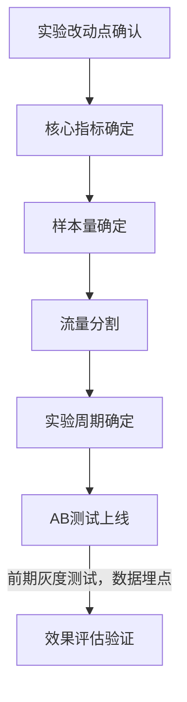
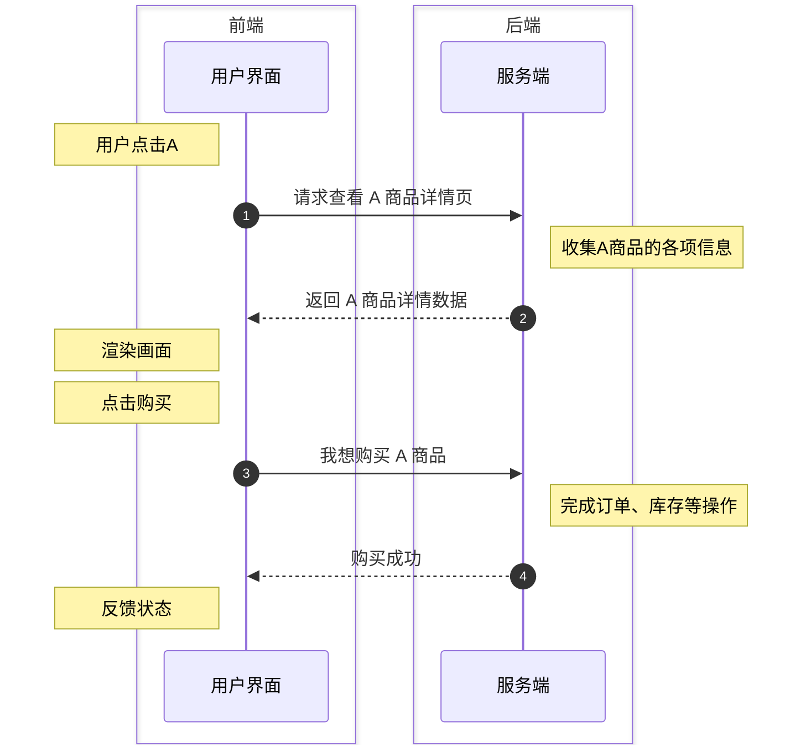

# A/B 测试是什么

## A/B 测试的起源与发展
- A/B 测试起源于**对照实验**（比如达尔文实验）
- 前期主要应用于医疗领域（比如双盲实验）
- 后期广泛用于互联网、工程、教育等多个领域的商业实践中

## A/B 测试的定义

**本质特征**：通过控制单一变量从多个方案中寻找局部最优解的方法论

**核心概念**：为Web或App界面/流程制作两个(A/B)或多个(A/B/n)版本，在同一时间维度让成分相似的目标人群随机访问不同版本，通过收集用户体验和业务数据来评估最优版本

**实施过程**：
1. 将目标人群随机分为实验组（如A组）和对照组（如B组）
2. 分别展示不同版本（如A组访问A版本，B组访问B版本）
3. 收集关键指标数据（如转化率、点击率等）
4. 分析数据并选择表现更优的版本正式采用

**方法论基础**：源于对照实验思想，通过隔离变量影响进行效果验证

**局限性**：所得结果为局部最优解而非全局最优，需要持续迭代优化

**实施要点**：必须保证测试组间的用户特征分布相似，避免样本偏差影响结果有效性


## A/B测试的在互联网领域的发展历程

1. **谷歌**
   - **起源事件**：2000年2月27日由搜索部门工程师发起，测试搜索结果每页展示数量（默认10条），实验组分别展示20/25/30条。
   - **意外发现**：技术故障导致实验组加载延迟0.1秒，但发现响应时间对用户满意度影响显著，促使谷歌将响应速度优化列为高优先级
   - **发展规模**：2011年全年7000次测试，2019年增长至年10万次实验，界面元素因人而异持续优化

2. **亚马逊**
   - **创新突破**：早期工程师提出支付页个性化推荐设想，虽被副总裁否决，仍坚持用3.5个月业余时间开发测试版本。
   - **验证效果**：简陋测试版本使实验组购买规模提升17%，促成现代电商"猜你喜欢""顺手买一件"等标配功能诞生。
   - **方法论启示**：通过小流量实验（0.1%-1%用户）快速验证假设，用数据结果推翻主观判断。

3. **Facebook**
   - **运行规模**：扎克伯格公开表示同时运行超1万个版本，不同用户看到不同界面用于收集行为数据。
   - **优化逻辑**：通过海量测试捕捉用户细微行为差异，最终将最优版本推向全体用户。
   - **行业影响**：形成"七秒法则"——页面加载超过7秒将导致用户流失，成为互联网产品设计基准。

4. **字节跳动**
   - **应用广度**：覆盖产品命名（如头条视频更名西瓜视频）、交互设计、广告优化、字体弹窗等细节
   - **执行强度**：日均新增1500个实验，累计超70万次测试，服务400+业务线
   - **文化理念**：张一鸣强调"99%把握仍需测试"，将AB测试写入企业基因，支撑算法驱动的内容分发体系


# A/B 测试的基本原理

**A/B测试的统计理论基础是假设检验**：
- 假设检验是统计推断中的重要方法，其基本思路是“**先假设、再检验**”
- 即事先对总体参数或总体分布形式作出一个假设、然后利用样本信息来判断假设是否合理的过程
- 假设检验会判断样本信息与原假设是否有显著差异，从而决定应接受还是否定原假设

## 假设检验是什么

**假设检验的核心思想**：小概率事件在一次试验中基本上不会发生，是
带着某种概率性质的反证法

反证法思想就是先提出假设（$H_0$）,再利用适当的统计方法确定假设成立的可能性的大小
- 若可能性小，则认为假设不成立
- 若可能性大，则不能认为假设不成立

## 如何进行假设检验

### 假设检验基本步骤

```markmap
# 假设检验基本步骤

## 建立假设

### 原假设和备择假设

### 确定检验类型
- 单侧检验
- 双侧检验

## 选择检验统计量

### 确定抽样分布类型
- 正态分布
- t分布
- F分布
- 卡方分布

### 确定检验方向
- 双尾检验
- 单尾检验左尾
- 单尾检验右尾

### 计算P值

## 确定检验规则
- 给出显著性水平 $α(0.1\%，1\%，5\%)$

## 做出结论
- 如果$P < α$，则在显著性水平$α$下，拒绝原假设
- 如果$P ≥ α$，则在显著性水平$α$下，不拒绝原假设
```

### 原假设和备择假设

**原假设**$H_0$：研究者想收集证据反对的假设（零假设）

**备择假设**$H_1$：研究者想收集证据支持的假设（研究假设）

**业务实践**：在AB测试中通常$H_0$设为无差异，$H_1$设为有差异

**案例**：APP直播频道UI实验
- **背景**：某社交APP希望**增加直播频道的点击率**，于是产品经理设计了这样的产品方案：在直播频道的选项卡上**增加了红点提示**，希望吸引用户更多的注意
- **实验设计**：将A组用户设置为对照组，B组用户设置为实验组，实验进行时会让实验组的用户在直播选项卡上看到红点，对照组用户则看不到红点
- **实验预期**：实验组用户(能看到红点)的直播频道点击转化率会高于对照组用户
  - **原假设**$H_0$：有红点展示不会提升用户的转化率
  - **备择假设**$H_1$：有红点展示会提升用户的转化率

### 单侧检验和双侧检验

**单侧检验**：理论上，想要得到的结论是实验组比对照组的效果有所提升，应采用单侧检验（仅检验单一方向差异，如 提升）

**双侧检验**：实际上，在A/B测试中，还是会设置备择假设为实验组和对照组不同，即采用双侧检验（全面考虑变化带来的正负结果，还能避免主观想法来干扰数据）

### 检验的选择

**按样本数量**：
- **单样本检验**：样本与固定值比较（如时长是否>10分钟）
- **双样本检验**：两组独立样本比较（如AB测试的实验组与对照组比较）
- **配对检验**：同组前后比较（如领券前后时长）

**按方差信息**：
- **T检验**：总体方差未知时使用
- **Z检验**：总体方差已知且样本量>30时使用

### P值
**统计学定义**：P值就是在原假设$H_0$成立时，观察到当前样本数据出现的概率
- 当P值小于置信水平α时（$P < α$），就拒绝原假设，接受备择假设

**A/B测试场景**：在对照组和实验组事实上是相同的，A/B测试中用样本数据观测到的实验组和对照指标不同的概率
- A/B测试两组指标是不同的，这个就是**结果显著**

### 检验结果中的两类错误
组合统计决策（是否拒绝原假设）与实际情况（原假设）产生四种结果：
<table style="margin:auto">
  <thead>
    <tr>
      <th rowspan="2">基于样本的决策</th>
      <th colspan="2">有关总体的事实</th>
    </tr>
    <tr>
      <th>$H_0$为真</th>
      <th>$H_0$为假</th>
    </tr>
  </thead>
  <tbody>
    <tr>
      <td><strong>接受原假设$H_0$</strong></td>
      <td>正确接受原假设$H_0$</td>
      <td>第二类错误<br>(当$H_0$为假时，接受的概率)</td>
    </tr>
    <tr>
      <td><strong>拒绝原假设$H_0$</strong></td>
      <td>第一类错误<br>(当$H_0$为真时，否定的概率)</td>
      <td>正确拒绝原假设$H_0$</td>
    </tr>
  </tbody>
</table>

<br/>

**第一类错误：弃真错误**  
- 原假设为真，我们却拒绝了它 ⇒ 犯第一类错误  
- 显著性水平 $\alpha$ 即犯第一类错误的概率：$P(\text{拒绝 }H_0 \mid H_0 \text{ 为真})=\alpha$  
- 若原假设为真且未被拒绝 ⇒ 正确决策，概率 $1-\alpha$

**第二类错误：存伪错误**  
- 原假设为假，我们却接受（未拒绝）它 ⇒ 犯第二类错误  
- 其概率记作 $\beta$：$P(\text{不拒绝 }H_0 \mid H_0 \text{ 为假})=\beta$  
- 若原假设为假并被拒绝 ⇒ 正确决策（检验功效），概率 $1-\beta$


# 为什么要做A/B测试

为什么互联网热衷应用A/B测试？
1. A/B测试是数据驱动理念的最佳实践，能够以最小风险实现业务的有效反馈和快速验证

2. 互联网A/B测试的实验成本较低

# 应用场景
世界上没有万能的工具，A/B测试也有其适用范围，不能解决所有问题

## A/B测试可应用场景

1. **产品迭代**
   - **界面优化**：这是应用最多的场景，与功能设计不同，界面优化涉及审美、使用习惯等主观因素
   - **功能优化**
   - **流程增加**
2. **算法优化**
   - **验证方法**：通过流量切分构造实验组和对照组
   - **应用场景**：算法筛选、算法优化
3. **市场营销相关运营策略**
   - **内容筛选**
   - **时间筛选**
   - **人群筛选**
   - **运营玩法**

## A/B测试不可应用场景

**1. 变量不可控**
   - 跨产品场景案例：比如业务两个APP，验证用户使用APP A转到APP B的概率
   - 原因：用户行为路径中存在太多不可控因素（如关闭APP后的行为），无法保证单一变量控制，测试结果不可靠

**2. 样本量少**
   - 统计学要求：需要足够样本量才能保证数据有效性
   - 企业差异：
     - 互联网巨头：流量充足，适合AB测试
     - 小公司：流量有限时需谨慎使用

**3. 全量投放**
   - 品牌级变更案例：如公司logo更换
   - 原因：必须面向所有用户统一展示，无法分割用户群体进行对比测试

## 字节跳动是如何应用A/B测试的

1. **头条视频APP更名**
   - **实验背景**: 为提升"头条视频"APP在短视频行业的品牌辨识度，字节跳动决定进行名称变更，前期通过用户调研收集4个备选名称，将选定的4个名称进行A/B测试
   - **实验目的**：采用A/B测试验证各名称对应用商店点击下载率的影响
   - **实验设计**：
    | 试验版本 | 测试名称 | 试验指标效果（点击率） |
    |----------|----------|------------------------|
    | 对照组V0 | 头条视频 | /                      |
    | V1       | 西瓜视频 | 5.22%                 |
    | V2       | 奇妙视频 | 5.08%                 |
    | V3       | 筷子视频 | 4.87%                 |
    | V4       | 阳光视频 | 4.36%                 |
   - **实验结果**：西瓜视频和奇妙视频点击率领先且差距不显著，结合用户调研、A/B测试等因素综合考量，最终选择"西瓜视频"作为新名称
2. **哪个首页新UI版本更受欢迎**
   - **改版背景**：今日头条原UI风格被诟病"偏大龄化"，不利于吸引年轻和女性用户，历史改版尝试均导致数据显著负向
   - **实验目的**：在可接受的负向影响范围内，优化出用户评价更好的UI版本
   - **实验设计**：结合用户调研数据，采用控制变量法对每个变量进行多次A/B测试
     - 头部色值饱和度
     - 字号大小
     - 字重(加粗程度)
     - 上下左右间距
     - 底部tab icon样式
   - **实验结果**：用户停留时间负向影响从-0.38%降至-0.24%，图文类时长显著提升1.66%，搜索渗透率提升1.47%，71%高频用户已适应新UI
3. **视频上滑引导优化**
   - **实验背景**：短视频初期用户不熟悉上滑操作，需要优化引导方式提升用户体验
   - **实验目的**：提升新用户7日留存率，上滑操作渗透率提升1%，错误操作率下降1%
   - **实验设计与结果**：
     - **首轮实验(半动态引导)**：
       - 上滑渗透率下降1%
       - 错误操作率上升1.5%
       - 留存无显著变化
     - **二轮实验(全动态引导)**：
       - 上滑渗透率上升1.5%
       - 新用户7日留存提升1%-1.8%
       - 所有指标显著正向

## A/B测试的局限和问题

**1. 独立性问题**
- **问题本质**:实验分组要求完全独立，除测试变量外其他条件应一致
- **具体案例（网约车的司机分配策略）**:按用户分组测试不同分配策略，但两组用户可能抢到同一司机，导致策略效果交叉影响
- **影响结果**:成单量/率等指标受干扰，难以准确评估策略优劣

**2. 长短期问题**
- **问题本质**:A/B测试通常周期较短(1-4周)，无法捕捉长期价值效应
- **具体案例（对评价低的商品做一些控制和惩罚）**：
  - **短期**: 惩罚低分商品导致交易量下降
  - **长期**: 平台信誉提升带来交易量增长
- **解决方案**:延长测试周期（增加成本），结合业务判断做决策


# AA测试

## 什么是AA测试

AA测试（空测试、特殊AB测试）：与AB测试类似但实验组变量（策略）未生效，实验组和对照组配置完全相同

## 为什么要AA测试

**目的**: 验证AB测试的基础可靠性，确保实验组和对照组在策略实施前无系统差异

**理论**: AB测试要求除控制变量外其他因素完全一致，AA测试可验证该前提是否成立

**案例**：
- 案例背景: 腾讯视频广告团队对首页推荐进行优化，实验组采用新策略，对照组保留老策略
- 异常发现: AA测试阶段实验组人均访问时长已比对照组长10秒且统计显著
- 后续问题: 使用相同分流逻辑进行AB测试后，实验组比对照组长12秒且统计显著
- 结论分析: 不能认定新策略更优，因差异可能来自用户群体本身的系统偏差
- 关键启示: AA测试发现的初始差异会污染AB测试结果，导致结论不可靠

**AA测试的作用**：
- **验证AB实验配置是否正确且有效**，例如埋点上报、数据回流链路等
- **确保实验和对照组的分流比例符合预期**，即保证样本/特征均匀分布，排除样本自身差异带来的影响，确保实验差异仅由变量带来，如果AA测试阶段的实验和对照组的用户比例不符合预期，需要重新进行分流，以确保AB实验期间的分流准确
- **确保实验和对照组的评估指标可信度**，通俗来说，所选取的实验指标在AA测试中，实验组和对照组应当无显著差异，否则会对后续的AB实验结果造成虚假繁荣/遮盖，带来一定误导性

# 多变量测试

## 什么是多变量测试

多变量测试MVT (Multi-Variable Testing) 指的是通过比较页面上各元素中的选项组合，来确定哪个组合对特定受众的效果最佳，以及哪个元素对活动成功的影响最大

## 为什么要多变量测试

- 与 A/B 测试相比，多变量测试提供的一个优势在于，它能够显示页面上哪些元素会对转化产生最大的影响，这被称为**主效应**

- 多变量测试还可以发现页面上两个或多个元素之间的复合效果这被称为**交互效应**（比如特定文案与特定横幅或主题图像结合使用时，特定广告可能会产生更多转化）

## 全因子多变量测试

多变量测试的终极版本，以相等概率测试所有可能的内容的组合

## 多变量测试的局限性

由于可能生成大量的组合，因此多变量测试需要的时间和流量多于A/B测试，而且页面必须获得足够的流量才能为每个体验产生具有统计意义的结果

# A/B测试基本流程



## 1. 确定实验目标和假设

**需求来源**：通常由产品经理或项目经理提出A/B测试需求，数据分析师作为参与者需在实验前明确实验的变量是什么，确保实验设计符合科学原则

**单一因素原则**：我们要保证每个实验的评估因素都是单一因素，避免多因素干扰导致无法区分具体影响来源进而得出错误结论

## 2. 确定观测指标⭐

**指标数量**：核心观测指标通常为1个，最多不超过3个，遵循"一次测试对应一个核心目标"原则

**指标类型**：
- **绝对值类指标（较少使用）**：如DAU、平均停留时长等直接测量值，计算时多采用时间段均值。
- **比率类指标（更常用）**：通过多指标计算得出，如点击率（点击人数/曝光人数）、转化率、复购率等

## 3. A/B测试样本量的计算⭐ 

AB测试样本量的选取基于大数定律（实验条件不变时，重复实验频率近似等于概率）和中心极限定理（独立同分布的大量样本均值服从正态分布$N(0, 1)$）

简言之，只要样本足够大，样本就能够代表整体的表现

**样本量计算**

每个实验组所需样本量计算公式：

$$
N=\frac{\sigma^2}{\delta^2}(Z_{1-\frac{\alpha}{2}}+Z_{1-\beta})^2
$$

- $\sigma$：样本标准差（衡量整体样本数据的波动性）
- $\delta$：预期实验组与对照组差值（如点击率$ 20\\% $  →   $25\\% $，则 $ \sigma=5\\% $）
- 置信水平：第一类错误概率$\alpha=0.05$，（$Z_{1-\frac{\alpha}{2}}=1.96$）
- 统计功效：第二类错误概率$\beta=0.2$，（$Z_{1-\beta}=0.84$）

**样本量指标类型不同，标准差计算公式不同**

- **绝对值类指标（较少使用）**：

    绝对值类样本方差计算公式：

    $$\sigma^2=\frac{\sum_1^n(x_i-\bar{x})^2}{n-1}$$

    $\bar{x}$指的是样本均值，$n$为样本数

    **案例**：某商品详情页平均停留时长的标准差是20秒，优化了商品详情页后，预估至少有5秒的绝对提升，AB测试每个组需要的最少样本量为多少？（$\sigma = 20, \delta = 5$）

    每个组所需的最少样本量$=20^2/5^2*(1.96+0.84)^2=125$

- **比率类指标（更常用）**：
    比率类样本方差计标准差计算公式：
    $$\sigma^{2} = P_{A}(1 - P_{A}) + P_{B}(1 - P_{B})$$
    $P_{A}$、$P_{B}$分别是对照组和实验组的观测值（比如，我们希望点击率从 20% 提升至 25%，那么 $ P_{A} = 20 \\%$，$ P_{B} = 25 \\% $）

    **案例**：某商品详情页点击率 20%，优化了该功能后，预期点击率提升到 25%，AB 测试每个组需要的最少样本量是多少？

    每个组所需的最少样本量 $= \dfrac{(0.2 \times (1 - 0.2) + 0.25 \times (1 - 0.25))}{(0.25 - 0.2)^{2} \times (1.96 + 0.84)^{2}} = 1090$

**计算样本量的工具**
- https://www.evanmiller.org/ab-testing/sample-size.html

- http://powerandsamplesize.com/Calculators/Compare-2-Means/2-Sample-Equality

## 4. A/B测试的流量分割⭐

**为什么要进行合理的流量分割？**：
避免辛普森悖论（细分结果与汇总结果相矛盾）

**流量分割常用方法**

- **分流（用户互斥）**：按地域/性别/年龄等将用户均匀分组，一个用户仅出现在一个组
  
   组间互斥（组1+组2=100%流量）
- **分层（用户正交）**:同一批流量可分布在多个无业务关联的实验层
  
  每一层用完的流量进入下一层时，一定均匀的重新分配
- **分流分层模型**：分流+分层

   ```mermaid
   flowchart TB
      T[流量] --> G1[A版本] 
      T --> B1T

      subgraph BOX[ 分流分层模型 ]
         direction LR
         G1BOX
         G2BOX
      end

      subgraph G1BOX[ 组1 ]
         direction TB
         G1
      end

      subgraph G2BOX[ 组2 ]
         direction TB
         B1T[ B1层 ]
         subgraph B1VAR[ ]
            direction LR
            B1_1[ B1-1 ]
            B1_2[ B1-2 ]
            B1_3[ B1-3 ]
         end
         B2[ B2层 ]
         B3[ B3层 ]
      end

      B1T --> B1_1
      B1T --> B1_2
      B1T --> B1_3
      B1_1 --> B2
      B1_2 --> B2
      B1_3 --> B2
      B2 --> B3

      %% 样式
      style G1 fill:#f7d7b5,stroke:#e7a766,color:#333
      style B1T fill:#445064,stroke:#2d3746,color:#fff
      style B1_1 fill:#6d7788,stroke:#2d3746,color:#fff
      style B1_2 fill:#aeb4bf,stroke:#2d3746,color:#333
      style B1_3 fill:#6d7788,stroke:#2d3746,color:#fff
      style B2 fill:#445064,stroke:#2d3746,color:#fff
      style B3 fill:#445064,stroke:#2d3746,color:#fff
   ```

   - **分流阶段**：将总流量分为互斥的组1和组2（各50%）

   - **分层阶段**：组2流量可复用至B1/B2/B3层

   - **扩展应用**：B1层可再分为互斥的B1-1/B1-2/B1-3

## 5. 实验周期的计算⭐ 

样本量越大、实验时间越长，结果越准确，但实际需平衡迭代速度与实验周期

计算公式：实验所需最少时间$=\frac{\text{每组最小样本数}\times\text{组数量}}{\text{某时间段的访问流量}}$ （某时间段可以是每天，流量大可以按每小时）

**案例**：假如某商品详情页每日访问量为500，现在的页面点击率为20%，优化该页面之后，预期点击率提升到25%，问AB测试所需要的最小实验周期是几天？

$$N = \frac{\sigma^2}{\delta^2} (Z_{1-\frac{\alpha}{2}} + Z_{1-\beta})^2$$
$$\sigma^2 = P_A(1 - P_A) + P_B(1 - P_B)$$

根据最小样本计算公式，可计算得出每组最小样本数为1090，最小实验周期=1090*2/500=4.36≈5（天）

## 6. 实施测试

### 灰度测试
**灰度测试**：验证改动不会造成极端影响，确保流程通畅

**正式发版流程**：
- 灰度测试通过后正式发版
- 实验周期结束后提取数据
- 进行显著性检验

**关键环节**：必须做好数据埋点安排


### 埋点设计❤️

数据埋点其实就是线上的数据采集，在互联网时代数据埋点是数据采集的常用手段，主要就是收集**某个用户在某个时间点、某个地方、以某种方式完成了某个具体的事情这个过程中所产生的数据**

**4W1H要素**：
- Who：哪个用户
- When：什么时间点
- Where：哪个地方
- How：以什么方式
- What：完成什么事情

**埋点位置**



- **前端埋点**：记录用户操作行为（点击、页面进入等）
- **后端埋点**：记录因用户操作触发的接口请求和业务逻辑（订单、库存等）
- **注意**：必需确保数据能够上报成功且能用（最好看着开发）

**埋点工具**
  TODO

## 7. 效果评估验证🌟

**如何进行AB测试最后的效果验证？**

必须同时满足：
- **商业上的验证**
  - 通过前面确认的核心指标以及相关指标在对照组和实验组之间的对比，来综合判定AB测试效果
- **统计上的验证**
  - 通过统计学上的假设检验来验证AB测试是够具有统计学意义上的显著有效（**样本均值的t检验**和**样本比例的z检验**）

一个合格的分析师，可以问自己以下几个问题：
1. 怎么衡量一个指标是否有显著变化？
2. 看到指标显著的时候：是真的显著吗？
3. 看到指标不显著的时候：是真的不显著吗？
4. 一个合适的AB测试指标判断结论怎么给出？
5. 还有可能遇到哪些问题，分别该怎么处理？

