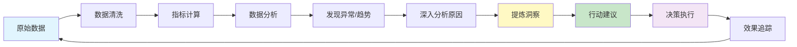
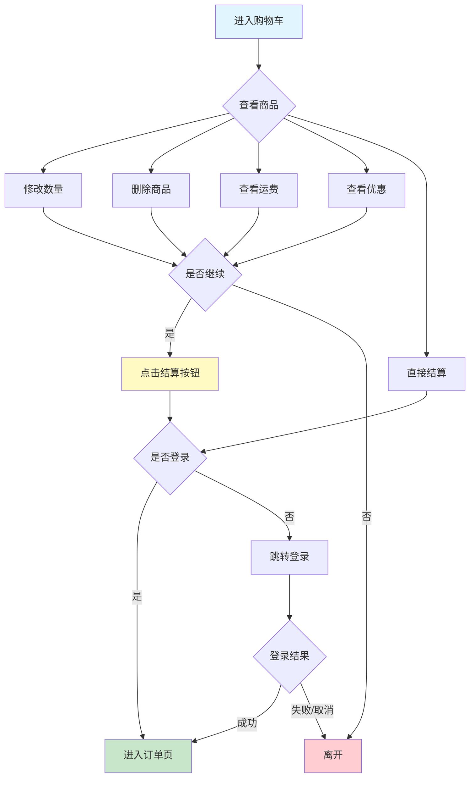

# 埋点分析概述

埋点分析是基于埋点采集的用户行为数据，运用数据分析方法和工具，挖掘用户行为模式、发现产品问题、验证业务假设、支持决策优化的过程。埋点数据是企业最宝贵的第一方数据资产，而埋点分析则是将这些数据转化为业务价值的关键手段。

## 什么是埋点分析

**埋点分析的定义**：埋点分析是指对通过埋点技术采集的用户行为数据进行清洗、处理、建模和可视化，从而发现用户行为规律、识别产品问题、评估功能效果、优化用户体验的一系列数据分析活动。

**埋点分析与传统数据分析的区别**：

传统数据分析更多关注业务结果数据（如销售额、订单量等），而埋点分析则深入到用户行为过程数据（如点击、浏览、停留等）。埋点分析能够回答"用户做了什么"、"为什么这样做"、"如何改进"等深层次问题。

下表展示了两者的主要区别：

<table style="width:100%; border-collapse:collapse;">
<thead>
  <tr style="background-color:#f0f0f0;">
    <th style="border:1px solid #ddd; padding:10px; width:20%;">对比维度</th>
    <th style="border:1px solid #ddd; padding:10px; width:40%;">传统数据分析</th>
    <th style="border:1px solid #ddd; padding:10px; width:40%;">埋点分析</th>
  </tr>
</thead>
<tbody>
  <tr>
    <td style="border:1px solid #ddd; padding:10px;"><strong>数据来源</strong></td>
    <td style="border:1px solid #ddd; padding:10px;">业务系统、数据库、财务报表</td>
    <td style="border:1px solid #ddd; padding:10px;">用户端埋点、前后端行为日志</td>
  </tr>
  <tr>
    <td style="border:1px solid #ddd; padding:10px;"><strong>分析对象</strong></td>
    <td style="border:1px solid #ddd; padding:10px;">业务结果数据（GMV、订单数等）</td>
    <td style="border:1px solid #ddd; padding:10px;">用户行为数据（点击、浏览、路径等）</td>
  </tr>
  <tr>
    <td style="border:1px solid #ddd; padding:10px;"><strong>分析粒度</strong></td>
    <td style="border:1px solid #ddd; padding:10px;">宏观、汇总级别</td>
    <td style="border:1px solid #ddd; padding:10px;">微观、事件级别</td>
  </tr>
  <tr>
    <td style="border:1px solid #ddd; padding:10px;"><strong>分析时效</strong></td>
    <td style="border:1px solid #ddd; padding:10px;">通常是T+1或更长</td>
    <td style="border:1px solid #ddd; padding:10px;">可以做到实时或准实时</td>
  </tr>
  <tr>
    <td style="border:1px solid #ddd; padding:10px;"><strong>关注重点</strong></td>
    <td style="border:1px solid #ddd; padding:10px;">结果是什么（What）</td>
    <td style="border:1px solid #ddd; padding:10px;">原因是什么（Why）、如何改进（How）</td>
  </tr>
  <tr>
    <td style="border:1px solid #ddd; padding:10px;"><strong>应用场景</strong></td>
    <td style="border:1px solid #ddd; padding:10px;">经营分析、财务分析、市场分析</td>
    <td style="border:1px solid #ddd; padding:10px;">产品优化、用户体验、功能迭代</td>
  </tr>
</tbody>
</table>

**埋点分析的核心价值**：

埋点分析能够为企业带来多维度的价值，从产品优化到业务增长，从用户洞察到决策支持，贯穿整个产品生命周期。下图展示了埋点分析在不同层面的价值体现：

```markmap
# 埋点分析价值

## 产品优化
- 功能使用分析
  - 识别高频功能
  - 发现僵尸功能
  - 优化功能布局
- 用户体验优化
  - 发现卡顿页面
  - 优化操作流程
  - 减少操作步骤
- 性能问题定位
  - 加载速度分析
  - 错误率监控
  - 崩溃原因定位
- 迭代效果评估
  - A/B测试分析
  - 新功能效果
  - 版本对比分析

## 用户洞察
- 用户画像构建
  - 人口统计特征
  - 行为偏好特征
  - 消费能力分层
- 用户分群
  - RFM模型分群
  - 行为特征分群
  - 生命周期分群
- 用户路径分析
  - 典型路径识别
  - 转化路径优化
  - 流失路径分析
- 用户生命周期管理
  - 新用户引导
  - 活跃用户运营
  - 流失用户召回

## 业务增长
- 转化率优化
  - 漏斗分析
  - 关键节点优化
  - 流失原因分析
- 留存率提升
  - 留存曲线分析
  - 关键行为识别
  - Magic Number发现
- 增长实验
  - 假设验证
  - A/B测试
  - 增长策略评估
- 精准营销
  - 用户分层运营
  - 个性化推荐
  - 营销效果评估

## 决策支持
- 数据驱动决策
  - 用数据说话
  - 减少主观判断
  - 提高决策质量
- 资源优化配置
  - 确定优先级
  - 集中优势资源
  - 提高ROI
- 风险预警
  - 异常指标监控
  - 负面趋势预警
  - 及时止损
- 战略规划
  - 市场机会识别
  - 竞争分析
  - 长期规划支持
```

从上图可以看出，埋点分析的价值体现在四个核心层面：

1. **产品优化**：通过分析用户行为数据，识别产品问题，优化用户体验，提升产品质量
2. **用户洞察**：深入理解用户特征和行为模式，构建精准的用户画像，实现精细化运营
3. **业务增长**：找到增长机会，优化转化漏斗，提升核心指标，驱动业务增长
4. **决策支持**：用数据支撑决策，降低决策风险，提高资源利用效率

## 埋点分析的核心能力

一个完整的埋点分析体系需要具备多种能力，从数据处理到洞察产出，每个环节都至关重要。优秀的数据分析师需要掌握以下核心能力：

### 数据处理能力

数据处理是埋点分析的基础，原始埋点数据往往存在各种问题，需要经过专业的处理才能用于分析。

**数据清洗**：
- **去重处理**：移除重复上报的数据，避免数据膨胀和指标失真
- **异常值处理**：识别和处理异常数据（如停留时长为负数、超长会话等）
- **缺失值处理**：对缺失数据进行填充或删除，确保数据完整性
- **格式统一**：统一时间格式、数值精度、枚举值等，便于后续分析

**数据转换**：
- **指标计算**：基于原始事件计算衍生指标（如PV、UV、转化率等）
- **维度转换**：时间维度聚合（日、周、月）、用户分群等
- **数据关联**：关联多个事件数据，构建完整的用户行为链路

**数据聚合**：
- **时间聚合**：按小时、天、周、月等时间粒度聚合
- **用户聚合**：按用户ID聚合，分析用户级别的行为
- **事件聚合**：按事件类型聚合，分析整体趋势

### 分析建模能力

分析建模是埋点分析的核心，通过科学的模型和方法挖掘数据价值。

**常用分析模型**：

```markmap
# 埋点分析模型

## 基础分析模型
- 事件分析
  - 单事件分析
  - 事件对比分析
  - 事件细分析
- 漏斗分析
  - 转化漏斗
  - 流失分析
  - 路径优化
- 留存分析
  - N日留存
  - 留存曲线
  - 关键行为
- 分布分析
  - 频次分布
  - 时长分布
  - 金额分布

## 高级分析模型
- 路径分析
  - 转化路径
  - 流失路径
  - 典型路径
- 用户分群
  - RFM分群
  - 行为分群
  - 价值分群
- 归因分析
  - 首次归因
  - 末次归因
  - 线性归因
  - 时间衰减归因
- 预测模型
  - 流失预测
  - LTV预测
  - 购买概率

## 实验分析模型
- A/B测试
  - 单变量测试
  - 多变量测试
  - 统计显著性
- 分层实验
  - 用户分层
  - 流量分配
  - 效果评估
- MAB算法
  - 动态分配
  - 快速收敛
  - 收益最大化
```

### 可视化呈现能力

数据可视化是将分析结果有效传达给决策者的关键手段。好的可视化能够让复杂的数据一目了然，提高决策效率。

**常用图表类型及适用场景**：

<table style="width:100%; border-collapse:collapse; font-size:14px;">
<thead>
  <tr style="background-color:#f0f0f0;">
    <th style="border:1px solid #ddd; padding:8px; width:15%;">图表类型</th>
    <th style="border:1px solid #ddd; padding:8px; width:35%;">适用场景</th>
    <th style="border:1px solid #ddd; padding:8px; width:30%;">优势</th>
    <th style="border:1px solid #ddd; padding:8px; width:20%;">注意事项</th>
  </tr>
</thead>
<tbody>
  <tr>
    <td style="border:1px solid #ddd; padding:8px;"><strong>折线图</strong></td>
    <td style="border:1px solid #ddd; padding:8px;">展示指标随时间的变化趋势，如DAU走势、GMV趋势等</td>
    <td style="border:1px solid #ddd; padding:8px;">清晰展示趋势、易于对比多个指标</td>
    <td style="border:1px solid #ddd; padding:8px;">注意Y轴起点，避免误导</td>
  </tr>
  <tr>
    <td style="border:1px solid #ddd; padding:8px;"><strong>柱状图</strong></td>
    <td style="border:1px solid #ddd; padding:8px;">对比不同分类的数据，如各渠道流量、各功能使用量</td>
    <td style="border:1px solid #ddd; padding:8px;">直观对比、适合离散数据</td>
    <td style="border:1px solid #ddd; padding:8px;">分类过多时考虑横向柱状图</td>
  </tr>
  <tr>
    <td style="border:1px solid #ddd; padding:8px;"><strong>饼图</strong></td>
    <td style="border:1px solid #ddd; padding:8px;">展示占比关系，如用户来源占比、设备类型分布</td>
    <td style="border:1px solid #ddd; padding:8px;">占比关系一目了然</td>
    <td style="border:1px solid #ddd; padding:8px;">分类不宜超过5个</td>
  </tr>
  <tr>
    <td style="border:1px solid #ddd; padding:8px;"><strong>漏斗图</strong></td>
    <td style="border:1px solid #ddd; padding:8px;">展示转化流程，如注册流程、购买流程的各环节转化率</td>
    <td style="border:1px solid #ddd; padding:8px;">清晰展示转化效率和流失环节</td>
    <td style="border:1px solid #ddd; padding:8px;">环节不宜过多，3-7个为宜</td>
  </tr>
  <tr>
    <td style="border:1px solid #ddd; padding:8px;"><strong>热力图</strong></td>
    <td style="border:1px solid #ddd; padding:8px;">展示页面点击分布、时段活跃度等二维数据分布</td>
    <td style="border:1px solid #ddd; padding:8px;">直观展示密集区域</td>
    <td style="border:1px solid #ddd; padding:8px;">颜色选择要有区分度</td>
  </tr>
  <tr>
    <td style="border:1px solid #ddd; padding:8px;"><strong>桑基图</strong></td>
    <td style="border:1px solid #ddd; padding:8px;">展示用户流向，如页面跳转、流量来源去向</td>
    <td style="border:1px solid #ddd; padding:8px;">清晰展示流量流向和占比</td>
    <td style="border:1px solid #ddd; padding:8px;">路径过多会杂乱，需要筛选</td>
  </tr>
  <tr>
    <td style="border:1px solid #ddd; padding:8px;"><strong>留存曲线</strong></td>
    <td style="border:1px solid #ddd; padding:8px;">展示用户留存情况，分析产品粘性</td>
    <td style="border:1px solid #ddd; padding:8px;">直观展示留存趋势</td>
    <td style="border:1px solid #ddd; padding:8px;">需要足够的时间跨度</td>
  </tr>
</tbody>
</table>

### 洞察提炼能力

数据分析的最终目的是产生洞察（Insight），即从数据中发现有价值的结论，并转化为可执行的行动建议。

**洞察的三个层次**：

1. **描述性洞察（What）**：描述现状，回答"发生了什么"
   - 示例：本月DAU下降了15%，主要集中在新用户群体

2. **解释性洞察（Why）**：分析原因，回答"为什么发生"
   - 示例：新用户DAU下降是因为注册流程优化后，虽然注册量增加了，但新用户首日留存率下降了20%

3. **预测性洞察（How）**：提出建议，回答"如何改进"
   - 示例：建议优化新用户引导流程，增加核心功能曝光，预计可将新用户次日留存提升至35%以上

**从数据到洞察的流程**：



# 埋点分析方法论

埋点分析需要遵循科学的方法论，系统化的分析流程能够确保分析的全面性和准确性，避免遗漏关键信息或得出错误结论。

## 分析流程

一个完整的埋点分析项目通常包括以下六个阶段，每个阶段都有其特定的目标和产出物。

### 明确分析目标

分析目标是整个分析工作的起点，决定了后续的分析方向和深度。一个清晰的分析目标应该回答以下问题：

**目标设定的SMART原则**：

- **Specific（具体的）**：目标要具体明确，不能模糊
  - ❌ 不好：分析用户行为
  - ✅ 好：分析新用户首日留存率下降的原因

- **Measurable（可衡量的）**：目标要可量化
  - ❌ 不好：提升用户体验
  - ✅ 好：将商品详情页的加购转化率从8%提升到10%

- **Achievable（可实现的）**：目标要现实可行
  - ❌ 不好：将DAU从10万提升到100万（短期内不现实）
  - ✅ 好：通过优化推荐算法，将人均浏览时长从5分钟提升到6分钟

- **Relevant（相关的）**：目标要与业务相关
  - ❌ 不好：分析用户的星座分布（与业务无关）
  - ✅ 好：分析高价值用户的行为特征，用于精准营销

- **Time-bound（有时限的）**：目标要有明确的时间期限
  - ❌ 不好：提升转化率
  - ✅ 好：在Q4季度末将整体转化率提升2个百分点

**常见分析目标类型**：


**问题诊断型分析**

当业务指标出现异常波动或未达预期时，需要通过分析找出问题原因。

**典型场景**：
- 某个核心指标突然下降
- 用户流失率异常升高
- 新功能上线后效果不佳
- 某个渠道的转化率低于预期

**分析目标示例**：
- 分析本月新用户留存率下降15%的原因
- 找出购物车到支付环节流失率高的原因
- 分析iOS端崩溃率突增的触发条件

**分析思路**：
1. 确认问题的具体表现（下降幅度、影响范围等）
2. 对比不同维度（时间、渠道、用户群等）找出差异
3. 分析异常时间点前后的变化
4. 深入分析可能的原因并验证
5. 提出改进建议
|||
**效果评估型分析**

在产品迭代、功能上线、营销活动后，需要评估实际效果是否达到预期。

**典型场景**：
- A/B测试效果评估
- 新版本上线效果
- 营销活动ROI评估
- 产品改版效果验证

**分析目标示例**：
- 评估新版首页改版对用户停留时长和转化率的影响
- 对比A/B测试中两个方案的核心指标差异
- 评估双11活动的整体转化效果和ROI

**分析思路**：
1. 明确评估的核心指标
2. 设置对照组和实验组
3. 收集足够的数据样本
4. 进行统计显著性检验
5. 综合评估正负面影响
6. 给出明确的结论和建议
|||
**机会探索型分析**

主动探索潜在的增长机会或优化空间，为业务决策提供新的方向。

**典型场景**：
- 探索新的用户增长点
- 发现高价值用户特征
- 识别潜在的产品优化机会
- 寻找交叉销售机会

**分析目标示例**：
- 探索高价值用户的行为特征，用于精准获客
- 分析用户的典型使用路径，发现产品优化机会
- 识别最有可能转化的潜在付费用户

**分析思路**：
1. 广泛探索数据，寻找有趣的模式
2. 进行用户分群和特征分析
3. 构建用户画像和行为模型
4. 验证发现的规律是否具有普遍性
5. 评估机会的商业价值
6. 提出具体的行动方案


### 数据准备

数据准备是分析工作的基础，数据质量直接决定了分析结果的可信度。这个阶段需要投入大量精力，通常占整个分析工作的50-70%。

**数据采集**：

确认所需数据是否已经通过埋点采集，如果没有，需要：
1. 补充埋点（需要开发周期）
2. 使用替代指标
3. 结合其他数据源

**数据验证**：

在正式分析前，必须验证数据的准确性和完整性：

```markmap
# 数据验证检查清单

## 完整性检查
- 时间完整性
  - 是否有数据断层
  - 是否覆盖分析期间
- 字段完整性
  - 必填字段是否齐全
  - 缺失率是否异常
- 用户完整性
  - 用户ID是否完整
  - 是否有用户去重

## 准确性检查
- 数值合理性
  - 是否有异常值
  - 数值范围是否正常
- 逻辑一致性
  - 前后逻辑是否矛盾
  - 关联数据是否一致
- 口径一致性
  - 与其他数据源对比
  - 历史数据对比

## 时效性检查
- 数据延迟
  - 实时性要求
  - 更新频率
- 数据回刷
  - 是否有数据修正
  - 回刷范围和时间
```

**数据清洗示例**（Python代码）：

```python
import pandas as pd
import numpy as np
from datetime import datetime, timedelta

# 假设这是我们的原始埋点数据
df = pd.read_csv('event_data.csv')

# ========== 1. 数据清洗 ==========

# 去重：同一用户同一事件在3秒内只保留一条
df = df.sort_values(['user_id', 'event_name', 'timestamp'])
df['time_diff'] = df.groupby(['user_id', 'event_name'])['timestamp'].diff()
df = df[(df['time_diff'].isna()) | (df['time_diff'] > 3000)]  # 保留时间差>3秒的记录
df = df.drop('time_diff', axis=1)

# 处理缺失值
# 对于必填字段，删除缺失行
df = df.dropna(subset=['user_id', 'event_name', 'timestamp'])

# 对于选填字段，用默认值填充
df['channel'] = df['channel'].fillna('unknown')
df['product_id'] = df['product_id'].fillna('none')

# 处理异常值
# 页面停留时长：0-3600秒之间是合理的
df.loc[df['page_duration'] < 0, 'page_duration'] = 0
df.loc[df['page_duration'] > 3600, 'page_duration'] = 3600

# 时间格式统一
df['timestamp'] = pd.to_datetime(df['timestamp'], unit='ms')
df['date'] = df['timestamp'].dt.date
df['hour'] = df['timestamp'].dt.hour

# ========== 2. 数据转换 ==========

# 计算会话ID（超过30分钟无操作算新会话）
df = df.sort_values(['user_id', 'timestamp'])
df['time_since_last'] = df.groupby('user_id')['timestamp'].diff().dt.total_seconds() / 60
df['is_new_session'] = (df['time_since_last'] > 30) | (df['time_since_last'].isna())
df['session_id'] = df.groupby('user_id')['is_new_session'].cumsum()
df['session_id'] = df['user_id'].astype(str) + '_' + df['session_id'].astype(str)

# 用户首次行为标记
df['is_first_action'] = ~df.duplicated(subset=['user_id', 'event_name'], keep='first')

# ========== 3. 特征工程 ==========

# 用户累计行为次数
df['user_event_count'] = df.groupby(['user_id', 'event_name']).cumcount() + 1

# 用户生命周期天数
user_first_day = df.groupby('user_id')['date'].min().to_dict()
df['user_first_day'] = df['user_id'].map(user_first_day)
df['user_lifecycle_days'] = (df['date'] - df['user_first_day']).dt.days

# 保存清洗后的数据
df.to_csv('event_data_cleaned.csv', index=False)

print(f"原始数据：{len(df)} 条")
print(f"清洗后数据：{len(df)} 条")
print("\n数据质量报告：")
print(f"用户数：{df['user_id'].nunique()}")
print(f"事件数：{df['event_name'].nunique()}")
print(f"时间范围：{df['date'].min()} 至 {df['date'].max()}")
```

### 探索性分析

探索性分析（EDA - Exploratory Data Analysis）是深入了解数据特征、发现数据规律的关键步骤。在这个阶段，我们从多个角度观察数据，寻找有趣的模式。

**探索性分析的核心任务**：

1. **整体趋势观察**：观察核心指标的时间趋势
2. **分布特征分析**：了解数据的分布形态
3. **相关性分析**：发现变量之间的关联关系
4. **异常检测**：识别异常数据点或时间段
5. **分群对比**：不同用户群体的行为差异

**用户活跃度趋势分析示例**：

下图展示了过去30天的DAU（日活跃用户数）趋势，我们可以从中观察到明显的周期性波动模式：

```echarts
{
  "title": {
    "text": "过去30天DAU趋势分析",
    "subtext": "数据来源：埋点系统 | 更新时间：2024-10-26",
    "left": "center",
    "top": 10
  },
  "tooltip": {
    "trigger": "axis",
    "axisPointer": {
      "type": "cross"
    }
  },
  "legend": {
    "data": ["DAU", "环比增长率"],
    "top": 55
  },
  "grid": {
    "left": "3%",
    "right": "4%",
    "bottom": "3%",
    "top": 100,
    "containLabel": true
  },
  "xAxis": {
    "type": "category",
    "boundaryGap": false,
    "data": ["10/01", "10/02", "10/03", "10/04", "10/05", "10/06", "10/07", 
             "10/08", "10/09", "10/10", "10/11", "10/12", "10/13", "10/14",
             "10/15", "10/16", "10/17", "10/18", "10/19", "10/20", "10/21",
             "10/22", "10/23", "10/24", "10/25", "10/26", "10/27", "10/28",
             "10/29", "10/30"]
  },
  "yAxis": [
    {
      "type": "value",
      "name": "DAU(人)",
      "position": "left",
      "axisLabel": {
        "formatter": "{value}"
      }
    },
    {
      "type": "value",
      "name": "环比增长率(%)",
      "position": "right",
      "axisLabel": {
        "formatter": "{value}%"
      }
    }
  ],
  "series": [
    {
      "name": "DAU",
      "type": "line",
      "smooth": true,
      "yAxisIndex": 0,
      "data": [125000, 128000, 132000, 135000, 138000, 155000, 152000,
               130000, 133000, 136000, 139000, 142000, 158000, 156000,
               134000, 137000, 140000, 143000, 146000, 162000, 160000,
               138000, 141000, 144000, 147000, 150000, 168000, 165000,
               142000, 145000],
      "itemStyle": {
        "color": "#5470c6"
      },
      "lineStyle": {
        "width": 3
      },
      "areaStyle": {
        "color": {
          "type": "linear",
          "x": 0,
          "y": 0,
          "x2": 0,
          "y2": 1,
          "colorStops": [
            { "offset": 0, "color": "rgba(84, 112, 198, 0.3)" },
            { "offset": 1, "color": "rgba(84, 112, 198, 0.05)" }
          ]
        }
      }
    },
    {
      "name": "环比增长率",
      "type": "line",
      "smooth": true,
      "yAxisIndex": 1,
      "data": [0, 2.4, 3.1, 2.3, 2.2, 12.3, -1.9,
               -14.5, 2.3, 2.3, 2.2, 2.2, 11.3, -1.3,
               -14.1, 2.2, 2.2, 2.1, 2.1, 11.0, -1.2,
               -13.8, 2.2, 2.1, 2.1, 2.0, 12.0, -1.8,
               -13.9, 2.1],
      "itemStyle": {
        "color": "#91cc75"
      },
      "lineStyle": {
        "width": 2,
        "type": "dashed"
      }
    }
  ]
}
```

**从上图可以得出以下洞察**：

1. **明显的周末效应**：每周六的DAU都会有显著提升（平均+11%），说明用户更倾向于在周末使用产品
2. **工作日波动稳定**：工作日DAU环比增长稳定在2-3%，呈现健康的增长态势
3. **周日下降现象**：周日DAU略有回落，但仍高于工作日水平
4. **整体增长趋势**：30天内DAU从12.5万增长到14.5万，增长16%，增长势头良好

**建议**：
- 针对周末的高活跃度，可以在周六推出限时活动，进一步提升用户参与度
- 工作日的稳定增长说明产品留存较好，可以加大获客投入
- 关注周日为什么会有回落，是否可以通过运营手段平滑周末的波动

### 深度分析

在探索性分析的基础上，深度分析聚焦于特定问题，运用专业的分析模型和方法深入挖掘。

**深度分析的常用方法**：


**1. 漏斗分析 - 用于转化流程优化**
- 适用场景：多步骤的转化流程（注册、购买、付费等）
- 关键产出：各环节转化率、流失率、流失原因
- 典型应用：购买漏斗、注册漏斗、付费漏斗

**2. 留存分析 - 用于评估产品粘性**
- 适用场景：评估用户回访情况和产品价值
- 关键产出：N日留存率、留存曲线、关键行为
- 典型应用：新用户留存、功能留存、付费用户留存

**3. 路径分析 - 用于了解用户行为**
- 适用场景：了解用户的典型使用路径和流失路径
- 关键产出：高频路径、转化路径、流失路径
- 典型应用：页面跳转分析、功能使用路径、流失路径

**4. 分群分析 - 用于精细化运营**
- 适用场景：不同用户群体的差异化分析
- 关键产出：用户画像、行为特征、价值分层
- 典型应用：RFM分群、行为分群、生命周期分群

**5. 归因分析 - 用于评估渠道效果**
- 适用场景：多触点的转化归因
- 关键产出：各渠道的转化贡献、ROI
- 典型应用：广告归因、渠道归因、营销归因

**6. A/B测试 - 用于科学决策**
- 适用场景：对比两个或多个方案的效果
- 关键产出：最优方案、统计显著性、效果量化
- 典型应用：功能A/B测试、页面A/B测试、算法A/B测试


### 洞察提炼

分析的最终目的是产生有价值的洞察，洞察是连接数据和业务的桥梁。好的洞察应该具备以下特征：

**洞察的SCQA模型**：

```markmap
# SCQA洞察表达模型

## S (Situation)
- 背景情况
  - 业务背景
  - 数据背景
  - 分析范围

## C (Complication)  
- 冲突问题
  - 发现的问题
  - 异常现象
  - 不符合预期的情况

## Q (Question)
- 关键问题
  - 为什么会这样
  - 影响有多大
  - 如何解决

## A (Answer)
- 答案建议
  - 数据支撑的结论
  - 根因分析
  - 具体建议和预期效果
```

**洞察示例对比**：

<table style="width:100%; border-collapse:collapse;">
<thead>
  <tr style="background-color:#f0f0f0;">
    <th style="border:1px solid #ddd; padding:10px; width:20%;">对比维度</th>
    <th style="border:1px solid #ddd; padding:10px; width:40%;">❌ 不好的洞察</th>
    <th style="border:1px solid #ddd; padding:10px; width:40%;">✅ 好的洞察</th>
  </tr>
</thead>
<tbody>
  <tr>
    <td style="border:1px solid #ddd; padding:10px;"><strong>描述性</strong></td>
    <td style="border:1px solid #ddd; padding:10px;">本月DAU下降了15%</td>
    <td style="border:1px solid #ddd; padding:10px;">本月DAU下降了15%，主要集中在新用户群体（-30%），而老用户DAU保持稳定（+2%）</td>
  </tr>
  <tr>
    <td style="border:1px solid #ddd; padding:10px;"><strong>解释性</strong></td>
    <td style="border:1px solid #ddd; padding:10px;">可能是因为用户体验不好</td>
    <td style="border:1px solid #ddd; padding:10px;">新用户DAU下降的主要原因是10月1日注册流程优化后，虽然注册量增加了50%，但新用户次日留存率从40%下降到28%，分析发现新流程减少了核心功能的引导环节</td>
  </tr>
  <tr>
    <td style="border:1px solid #ddd; padding:10px;"><strong>建议性</strong></td>
    <td style="border:1px solid #ddd; padding:10px;">需要优化新用户体验</td>
    <td style="border:1px solid #ddd; padding:10px;">建议在注册后增加30秒的核心功能引导动画，重点展示"每日推荐"和"智能搜索"两个高留存功能。根据小规模测试，该方案可将新用户次日留存提升至35%，预计可使整体DAU回升至原水平</td>
  </tr>
</tbody>
</table>

### 行动落地

洞察最终要转化为具体的行动才能产生价值。行动落地包括：

**1. 制定行动计划**：
- 明确责任人和时间节点
- 定义成功标准和验收指标
- 评估资源需求和优先级

**2. 跟踪执行进度**：
- 建立定期review机制
- 监控关键指标变化
- 及时调整优化方案

**3. 评估改进效果**：
- 对比改进前后的数据
- 评估是否达到预期目标
- 总结经验教训

**行动计划模板**：

| 项目 | 内容 |
|------|------|
| **发现的问题** | 新用户次日留存率从40%下降到28% |
| **根本原因** | 注册流程优化后，减少了核心功能引导环节 |
| **改进方案** | 在注册后增加核心功能引导动画 |
| **预期效果** | 新用户次日留存率提升至35%以上 |
| **责任人** | 产品经理：张三 / 开发：李四 / 设计：王五 |
| **时间计划** | 设计稿:10/28 / 开发:11/5 / 测试:11/8 / 上线:11/10 |
| **资源需求** | 设计师1人天 / 前端开发3人天 / 测试1人天 |
| **成功标准** | 新用户次日留存率≥35% / 注册转化率不下降 |
| **监控指标** | 新用户次日留存率、引导完成率、核心功能使用率 |
| **风险评估** | 引导过长可能导致用户流失 / 需要A/B测试验证 |

## 分析思维框架

除了标准的分析流程，还需要掌握一些经典的分析思维框架，帮助我们更系统、更全面地思考问题。

### 5W2H分析法

5W2H是一个简单但非常实用的分析框架，通过7个问题全面剖析问题：

<table style="width:100%; border-collapse:collapse;">
<thead>
  <tr style="background-color:#f0f0f0;">
    <th style="border:1px solid #ddd; padding:10px; width:15%;">维度</th>
    <th style="border:1px solid #ddd; padding:10px; width:20%;">英文</th>
    <th style="border:1px solid #ddd; padding:10px; width:15%;">核心问题</th>
    <th style="border:1px solid #ddd; padding:10px; width:50%;">分析要点</th>
  </tr>
</thead>
<tbody>
  <tr>
    <td style="border:1px solid #ddd; padding:10px;"><strong>What</strong></td>
    <td style="border:1px solid #ddd; padding:10px;">是什么</td>
    <td style="border:1px solid #ddd; padding:10px;">发生了什么</td>
    <td style="border:1px solid #ddd; padding:10px;">明确问题的具体表现、涉及的指标、问题的范围和程度</td>
  </tr>
  <tr>
    <td style="border:1px solid #ddd; padding:10px;"><strong>Who</strong></td>
    <td style="border:1px solid #ddd; padding:10px;">谁</td>
    <td style="border:1px solid #ddd; padding:10px;">影响了谁</td>
    <td style="border:1px solid #ddd; padding:10px;">识别受影响的用户群体、用户特征、占比情况</td>
  </tr>
  <tr>
    <td style="border:1px solid #ddd; padding:10px;"><strong>When</strong></td>
    <td style="border:1px solid #ddd; padding:10px;">何时</td>
    <td style="border:1px solid #ddd; padding:10px;">什么时候发生</td>
    <td style="border:1px solid #ddd; padding:10px;">问题开始的时间点、持续时间、是否有周期性</td>
  </tr>
  <tr>
    <td style="border:1px solid #ddd; padding:10px;"><strong>Where</strong></td>
    <td style="border:1px solid #ddd; padding:10px;">哪里</td>
    <td style="border:1px solid #ddd; padding:10px;">在哪里发生</td>
    <td style="border:1px solid #ddd; padding:10px;">具体页面、功能模块、地域、渠道等维度</td>
  </tr>
  <tr>
    <td style="border:1px solid #ddd; padding:10px;"><strong>Why</strong></td>
    <td style="border:1px solid #ddd; padding:10px;">为什么</td>
    <td style="border:1px solid #ddd; padding:10px;">为什么会发生</td>
    <td style="border:1px solid #ddd; padding:10px;">深入挖掘根本原因，可能的影响因素</td>
  </tr>
  <tr>
    <td style="border:1px solid #ddd; padding:10px;"><strong>How</strong></td>
    <td style="border:1px solid #ddd; padding:10px;">如何</td>
    <td style="border:1px solid #ddd; padding:10px;">如何解决</td>
    <td style="border:1px solid #ddd; padding:10px;">提出具体的解决方案和优化建议</td>
  </tr>
  <tr>
    <td style="border:1px solid #ddd; padding:10px;"><strong>How much</strong></td>
    <td style="border:1px solid #ddd; padding:10px;">多少</td>
    <td style="border:1px solid #ddd; padding:10px;">影响有多大</td>
    <td style="border:1px solid #ddd; padding:10px;">量化影响程度、改进预期、资源投入</td>
  </tr>
</tbody>
</table>

### AARRR增长模型

AARRR模型（海盗指标）是增长黑客领域最经典的分析框架，将用户生命周期分为五个阶段：

```markmap
# AARRR增长模型

## Acquisition - 获取用户
- 渠道分析
  - 各渠道流量
  - 获客成本CAC
  - 渠道质量对比
- 落地页分析
  - 转化率
  - 跳出率
  - 加载速度
- 关键指标
  - 新增用户数
  - 注册转化率
  - 获客ROI

## Activation - 激活用户
- 首次体验
  - Aha时刻
  - 新手引导完成率
  - 核心功能使用率
- 激活定义
  - 完成关键行为
  - 体验核心价值
  - 首次转化
- 关键指标
  - 激活率
  - 首日行为深度
  - 新用户留存

## Retention - 留存用户
- 留存分析
  - N日留存率
  - 留存曲线
  - 用户分层留存
- 关键行为
  - 高留存行为识别
  - Magic Number
  - 使用频次
- 关键指标
  - 次日留存
  - 7日留存
  - 30日留存

## Revenue - 获取收入
- 付费转化
  - 付费率
  - 客单价
  - 付费路径
- 收入分析
  - ARPU
  - ARPPU
  - LTV
- 关键指标
  - 付费用户数
  - 总收入GMV
  - 付费转化率

## Referral - 推荐传播
- 病毒传播
  - K因子
  - 分享率
  - 裂变路径
- 口碑营销
  - NPS评分
  - 用户评价
  - 社交传播
- 关键指标
  - 邀请率
  - 接受率
  - 病毒系数
```

每个阶段都有其核心指标和优化重点，通过系统性地优化各个环节，实现整体的增长提升。

# 核心分析模型

埋点分析有多种成熟的分析模型，每种模型适用于不同的分析场景。掌握这些模型是数据分析师的核心技能。

## 漏斗分析

漏斗分析是最常用的转化分析方法，用于分析多步骤流程中每个环节的转化情况，识别流失环节和优化机会。

### 漏斗分析原理

漏斗分析将用户完成某个目标的过程拆解为多个关键步骤，按照时间顺序排列，形成一个漏斗形的转化路径。每个步骤都会有用户流失，通过分析各环节的转化率和流失率，找出薄弱环节进行优化。

**漏斗分析的核心指标**：

- **转化率**：从上一步到下一步的用户转化比例
- **流失率**：在某个环节流失的用户比例  
- **平均转化时长**：用户完成整个流程的平均时间
- **整体转化率**：从第一步到最后一步的转化比例

### 电商购买漏斗案例

下面是一个典型的电商购买漏斗，从首页访问到支付成功共5个环节：

```echarts
{
  "title": {
    "text": "电商购买转化漏斗",
    "subtext": "2024年10月全月数据 | 样本量：100万用户",
    "left": "center",
    "top": 10
  },
  "tooltip": {
    "trigger": "item",
    "formatter": "{b}<br/>用户数: {c}<br/>转化率: {d}%"
  },
  "series": [
    {
      "name": "购买漏斗",
      "type": "funnel",
      "left": "10%",
      "top": 80,
      "bottom": 60,
      "width": "80%",
      "sort": "descending",
      "gap": 2,
      "label": {
        "show": true,
        "position": "inside",
        "formatter": "{b}\n{c}人\n转化率:{d}%",
        "fontSize": 13,
        "color": "#fff"
      },
      "labelLine": {
        "length": 10,
        "lineStyle": {
          "width": 1,
          "type": "solid"
        }
      },
      "itemStyle": {
        "borderColor": "#fff",
        "borderWidth": 2
      },
      "emphasis": {
        "label": {
          "fontSize": 15,
          "fontWeight": "bold"
        }
      },
      "data": [
        {
          "value": 1000000,
          "name": "首页访问",
          "itemStyle": { "color": "#5470c6" }
        },
        {
          "value": 450000,
          "name": "商品浏览",
          "itemStyle": { "color": "#91cc75" }
        },
        {
          "value": 180000,
          "name": "加入购物车",
          "itemStyle": { "color": "#fac858" }
        },
        {
          "value": 90000,
          "name": "提交订单",
          "itemStyle": { "color": "#ee6666" }
        },
        {
          "value": 60000,
          "name": "支付成功",
          "itemStyle": { "color": "#73c0de" }
        }
      ]
    }
  ]
}
```

**漏斗数据深度分析**：

从上述漏斗图可以得出以下关键洞察：

<table style="width:100%; border-collapse:collapse; font-size:14px;">
<thead>
  <tr style="background-color:#f0f0f0;">
    <th style="border:1px solid #ddd; padding:8px;">环节</th>
    <th style="border:1px solid #ddd; padding:8px;">用户数</th>
    <th style="border:1px solid #ddd; padding:8px;">环节转化率</th>
    <th style="border:1px solid #ddd; padding:8px;">累计转化率</th>
    <th style="border:1px solid #ddd; padding:8px;">问题诊断</th>
    <th style="border:1px solid #ddd; padding:8px;">优化建议</th>
  </tr>
</thead>
<tbody>
  <tr>
    <td style="border:1px solid #ddd; padding:8px;">首页访问</td>
    <td style="border:1px solid #ddd; padding:8px;">1,000,000</td>
    <td style="border:1px solid #ddd; padding:8px;">-</td>
    <td style="border:1px solid #ddd; padding:8px;">100%</td>
    <td style="border:1px solid #ddd; padding:8px;">-</td>
    <td style="border:1px solid #ddd; padding:8px;">提升首页内容吸引力</td>
  </tr>
  <tr style="background-color:#fff3cd;">
    <td style="border:1px solid #ddd; padding:8px;">商品浏览</td>
    <td style="border:1px solid #ddd; padding:8px;">450,000</td>
    <td style="border:1px solid #ddd; padding:8px;">45%</td>
    <td style="border:1px solid #ddd; padding:8px;">45%</td>
    <td style="border:1px solid #ddd; padding:8px;"><strong>⚠️ 流失严重</strong><br/>55%用户在首页就离开</td>
    <td style="border:1px solid #ddd; padding:8px;">优化推荐算法、增加促销活动曝光</td>
  </tr>
  <tr>
    <td style="border:1px solid #ddd; padding:8px;">加入购物车</td>
    <td style="border:1px solid #ddd; padding:8px;">180,000</td>
    <td style="border:1px solid #ddd; padding:8px;">40%</td>
    <td style="border:1px solid #ddd; padding:8px;">18%</td>
    <td style="border:1px solid #ddd; padding:8px;">60%用户浏览后未加购</td>
    <td style="border:1px solid #ddd; padding:8px;">优化商品详情页、突出卖点、展示用户评价</td>
  </tr>
  <tr style="background-color:#f8d7da;">
    <td style="border:1px solid #ddd; padding:8px;">提交订单</td>
    <td style="border:1px solid #ddd; padding:8px;">90,000</td>
    <td style="border:1px solid #ddd; padding:8px;">50%</td>
    <td style="border:1px solid #ddd; padding:8px;">9%</td>
    <td style="border:1px solid #ddd; padding:8px;"><strong>🚨 最大流失点</strong><br/>50%购物车用户未下单</td>
    <td style="border:1px solid #ddd; padding:8px;">简化结算流程、提供优惠券、减免运费</td>
  </tr>
  <tr>
    <td style="border:1px solid #ddd; padding:8px;">支付成功</td>
    <td style="border:1px solid #ddd; padding:8px;">60,000</td>
    <td style="border:1px solid #ddd; padding:8px;">67%</td>
    <td style="border:1px solid #ddd; padding:8px;">6%</td>
    <td style="border:1px solid #ddd; padding:8px;">33%用户下单后未支付</td>
    <td style="border:1px solid #ddd; padding:8px;">优化支付体验、增加支付方式、设置支付提醒</td>
  </tr>
</tbody>
</table>

**核心洞察**：

1. **首页到商品浏览（45%）** - 这是第一大流失点
   - 问题：超过一半用户在首页就离开了
   - 原因：首页内容不够吸引、推荐不够精准、缺少促销活动
   - 建议：优化推荐算法，提升内容相关性；增加促销活动和优惠券的曝光

2. **购物车到提交订单（50%）** - 这是最大的流失点
   - 问题：一半的加购用户放弃了结算
   - 原因：运费过高、价格不满意、结算流程复杂、缺少优惠
   - 建议：设置满减免邮、简化结算流程、在购物车页面展示优惠信息

3. **整体转化率仅6%** - 还有很大提升空间
   - 行业benchmark：优秀电商平台的整体转化率在8-12%
   - 提升空间：如果能将整体转化率提升到8%，月GMV可增长33%

**优化优先级**：
1. **高优先级**：优化购物车到订单环节（影响最大，提升1%可增加1万订单）
2. **中优先级**：提升首页到商品浏览转化（基数大，提升空间大）
3. **低优先级**：优化支付环节（转化率相对较好，优先级较低）

### 漏斗分析的进阶应用

**1. 时间窗口设置**：

漏斗分析需要设置合理的时间窗口，即用户完成整个流程的最大时长：

- **实时漏斗**：适用于短流程（如注册、支付），时间窗口1小时内
- **会话漏斗**：适用于单次访问内的流程，时间窗口为一个会话
- **天级漏斗**：适用于跨天的长流程，时间窗口1-7天

时间窗口设置不当会导致：
- 过短：低估转化率，因为部分用户需要更长时间决策
- 过长：高估转化率，因为包含了非目标行为

**2. 分群漏斗对比**：

不同用户群体的转化表现差异很大，需要分群对比分析：

```echarts
{
  "title": {
    "text": "新老用户购买转化对比",
    "subtext": "新用户vs老用户各环节转化率对比",
    "left": "center",
    "top": 10
  },
  "tooltip": {
    "trigger": "axis",
    "axisPointer": {
      "type": "shadow"
    }
  },
  "legend": {
    "data": ["新用户转化率", "老用户转化率"],
    "top": 55
  },
  "grid": {
    "left": "3%",
    "right": "4%",
    "bottom": "3%",
    "top": 100,
    "containLabel": true
  },
  "xAxis": {
    "type": "category",
    "data": ["首页→商品浏览", "商品浏览→加购", "加购→下单", "下单→支付"]
  },
  "yAxis": {
    "type": "value",
    "name": "转化率(%)",
    "min": 0,
    "max": 80
  },
  "series": [
    {
      "name": "新用户转化率",
      "type": "bar",
      "data": [35, 32, 38, 55],
      "itemStyle": {
        "color": "#ee6666"
      },
      "label": {
        "show": true,
        "position": "top",
        "formatter": "{c}%"
      }
    },
    {
      "name": "老用户转化率",
      "type": "bar",
      "data": [58, 52, 65, 75],
      "itemStyle": {
        "color": "#5470c6"
      },
      "label": {
        "show": true,
        "position": "top",
        "formatter": "{c}%"
      }
    }
  ]
}
```

从分群对比可以看出：

- **新用户转化率全面低于老用户**：每个环节差距在15-20个百分点
- **新用户在首页流失最严重**：65%的新用户在首页就离开了
- **老用户的购买意愿更强**：加购后的转化率明显更高

**针对性优化策略**：
- **新用户**：强化新手引导、推荐热门商品、提供新人优惠券
- **老用户**：个性化推荐、会员专属优惠、限时秒杀活动

## 留存分析

留存分析是衡量产品粘性和用户价值的核心方法，通过分析用户在不同时间周期的回访情况，评估产品对用户的长期吸引力。

### 留存分析原理

**留存率定义**：在某个时间周期内的新增用户中，在之后的第N天（周/月）仍然活跃的用户比例。

$$
N日留存率 = \frac{第N天仍活跃的用户数}{第0天的新增用户数} \times 100\%
$$

**留存的重要性**：

用户留存直接关系到产品的长期价值。一个用户的生命周期价值（LTV）可以用以下公式估算：

$$
LTV = ARPU \times \frac{1}{流失率} = ARPU \times 平均留存月数
$$

如果能将月留存率从20%提升到30%，平均留存月数将从5个月提升到10个月，LTV翻倍。

### 留存曲线分析

下图展示了一个典型产品的留存曲线，横轴是天数，纵轴是留存率：

```echarts
{
  "title": {
    "text": "用户留存曲线分析",
    "subtext": "2024年9月新增用户留存表现（样本量：10万用户）",
    "left": "center",
    "top": 10
  },
  "tooltip": {
    "trigger": "axis",
    "axisPointer": {
      "type": "cross"
    }
  },
  "legend": {
    "data": ["实际留存率", "行业平均", "目标留存率"],
    "top": 55
  },
  "grid": {
    "left": "3%",
    "right": "4%",
    "bottom": "3%",
    "top": 100,
    "containLabel": true
  },
  "xAxis": {
    "type": "category",
    "name": "天数",
    "boundaryGap": false,
    "data": ["D0", "D1", "D2", "D3", "D7", "D14", "D30", "D60", "D90"]
  },
  "yAxis": {
    "type": "value",
    "name": "留存率(%)",
    "min": 0,
    "max": 100
  },
  "series": [
    {
      "name": "实际留存率",
      "type": "line",
      "smooth": true,
      "data": [100, 42, 35, 30, 22, 16, 12, 9, 7],
      "itemStyle": {
        "color": "#5470c6"
      },
      "lineStyle": {
        "width": 3
      },
      "areaStyle": {
        "color": {
          "type": "linear",
          "x": 0,
          "y": 0,
          "x2": 0,
          "y2": 1,
          "colorStops": [
            { "offset": 0, "color": "rgba(84, 112, 198, 0.3)" },
            { "offset": 1, "color": "rgba(84, 112, 198, 0.05)" }
          ]
        }
      },
      "markPoint": {
        "data": [
          { "type": "max", "name": "最高值" }
        ]
      },
      "markLine": {
        "data": [
          { "type": "average", "name": "平均值" }
        ]
      }
    },
    {
      "name": "行业平均",
      "type": "line",
      "smooth": true,
      "data": [100, 35, 28, 24, 18, 13, 10, 7, 5],
      "itemStyle": {
        "color": "#91cc75"
      },
      "lineStyle": {
        "width": 2,
        "type": "dashed"
      }
    },
    {
      "name": "目标留存率",
      "type": "line",
      "smooth": true,
      "data": [100, 50, 42, 37, 28, 22, 18, 14, 12],
      "itemStyle": {
        "color": "#ee6666"
      },
      "lineStyle": {
        "width": 2,
        "type": "dashed"
      }
    }
  ]
}
```

**留存曲线洞察**：

1. **次日留存42%** - 高于行业平均（35%），说明产品首日体验较好
2. **3日留存30%** - 留存曲线开始趋缓，这是第一个稳定平台
3. **7日留存22%** - 进入第二个下降期，需要关注一周内的用户活跃
4. **30日留存12%** - 最终稳定在12%左右，这部分是产品的核心用户

**关键节点分析**：

- **0-3天**：快速流失期，流失率58%
  - 原因：用户初步体验后觉得产品不符合预期
  - 优化：强化新手引导、突出核心价值

- **3-7天**：第一平稳期，流失率27%
  - 原因：用户开始养成使用习惯，但还不稳定
  - 优化：push提醒、每日签到、新手任务

- **7-30天**：第二下降期，流失率45%
  - 原因：新鲜感消退，习惯未完全养成
  - 优化：个性化推荐、社交互动、会员权益

- **30天+**：稳定期，留存趋于平稳
  - 这部分用户已经成为忠实用户
  - 优化：提升活跃度和付费转化

### Magic Number - 关键行为分析

Magic Number是指与高留存强相关的关键行为指标。找到Magic Number能够指导产品优化方向。

**经典案例**：

- **Facebook**：10天内添加7个好友的用户，留存率显著更高
- **Twitter**：关注30个账号的用户，留存率提升3倍
- **Dropbox**：上传1个文件到至少1个文件夹的用户，留存率提升2倍
- **LinkedIn**：一周内完成5个连接的用户，留存率提升5倍

**如何找到Magic Number**：

```python
# Magic Number分析示例代码

import pandas as pd
import numpy as np
from scipy import stats

# 假设我们有用户行为数据
df_users = pd.read_csv('user_behavior.csv')

# 定义留存用户（30日留存）
df_users['is_retained'] = df_users['day30_active'] == 1

# 分析不同行为与留存的关系
behaviors = ['friend_count', 'post_count', 'comment_count', 'share_count']

results = []
for behavior in behaviors:
    # 按行为分组计算留存率
    retention_by_behavior = df_users.groupby(
        pd.cut(df_users[behavior], bins=[0, 1, 5, 10, 20, 100])
    )['is_retained'].mean()
    
    # 相关性分析
    correlation = df_users[behavior].corr(df_users['is_retained'])
    
    results.append({
        'behavior': behavior,
        'correlation': correlation,
        'retention_distribution': retention_by_behavior
    })

# 输出分析结果
for result in results:
    print(f"\n{result['behavior']} 与留存的相关性: {result['correlation']:.3f}")
    print("不同行为区间的留存率：")
    print(result['retention_distribution'])
```

**某产品的Magic Number发现**：

<table style="width:100%; border-collapse:collapse; font-size:14px;">
<thead>
  <tr style="background-color:#f0f0f0;">
    <th style="border:1px solid #ddd; padding:8px;">用户行为</th>
    <th style="border:1px solid #ddd; padding:8px;">行为次数区间</th>
    <th style="border:1px solid #ddd; padding:8px;">30日留存率</th>
    <th style="border:1px solid #ddd; padding:8px;">用户占比</th>
    <th style="border:1px solid #ddd; padding:8px;">提升空间</th>
  </tr>
</thead>
<tbody>
  <tr>
    <td style="border:1px solid #ddd; padding:8px;" rowspan="4"><strong>首周发帖数</strong></td>
    <td style="border:1px solid #ddd; padding:8px;">0次</td>
    <td style="border:1px solid #ddd; padding:8px;">5%</td>
    <td style="border:1px solid #ddd; padding:8px;">40%</td>
    <td style="border:1px solid #ddd; padding:8px;">⬆️ 最大</td>
  </tr>
  <tr>
    <td style="border:1px solid #ddd; padding:8px;">1-2次</td>
    <td style="border:1px solid #ddd; padding:8px;">18%</td>
    <td style="border:1px solid #ddd; padding:8px;">30%</td>
    <td style="border:1px solid #ddd; padding:8px;">⬆️ 较大</td>
  </tr>
  <tr style="background-color:#d1ecf1;">
    <td style="border:1px solid #ddd; padding:8px;"><strong>3-5次</strong></td>
    <td style="border:1px solid #ddd; padding:8px;"><strong>42%</strong></td>
    <td style="border:1px solid #ddd; padding:8px;">20%</td>
    <td style="border:1px solid #ddd; padding:8px;">✨ Magic Number</td>
  </tr>
  <tr>
    <td style="border:1px solid #ddd; padding:8px;">6次以上</td>
    <td style="border:1px solid #ddd; padding:8px;">55%</td>
    <td style="border:1px solid #ddd; padding:8px;">10%</td>
    <td style="border:1px solid #ddd; padding:8px;">-</td>
  </tr>
</tbody>
</table>

**Magic Number洞察**：

- **首周发帖3-5次的用户**，30日留存率达到42%，是平均留存率的3.5倍
- 目前只有20%的新用户达到这个行为标准
- 如果能将40%的0发帖用户引导到发帖3-5次，整体留存率可提升15个百分点

**优化策略**：
1. **新手任务**：设置"发布第一篇内容"任务，给予奖励
2. **内容模板**：提供内容模板降低创作门槛
3. **社交激励**：新人内容获得更多曝光和互动
4. **引导提醒**：Push/站内信提醒用户发布内容

## 路径分析

路径分析用于了解用户的实际使用路径，发现典型路径和异常路径，优化产品流程设计。

### 路径分析方法

**1. 转化路径分析**：找到从起点到终点的高转化路径

下图展示了用户从首页到支付成功的各种路径及其转化表现：

```echarts
{
  "title": {
    "text": "用户购买路径流向分析",
    "subtext": "首页到支付成功的主要路径（Sankey图）",
    "left": "center",
    "top": 10
  },
  "tooltip": {
    "trigger": "item",
    "triggerOn": "mousemove"
  },
  "series": [
    {
      "type": "sankey",
      "layout": "none",
      "emphasis": {
        "focus": "adjacency"
      },
      "data": [
        { "name": "首页" },
        { "name": "搜索" },
        { "name": "分类" },
        { "name": "推荐" },
        { "name": "商品详情" },
        { "name": "加购" },
        { "name": "购物车" },
        { "name": "下单" },
        { "name": "支付成功" }
      ],
      "links": [
        { "source": "首页", "target": "搜索", "value": 250000 },
        { "source": "首页", "target": "分类", "value": 150000 },
        { "source": "首页", "target": "推荐", "value": 200000 },
        { "source": "搜索", "target": "商品详情", "value": 180000 },
        { "source": "分类", "target": "商品详情", "value": 100000 },
        { "source": "推荐", "target": "商品详情", "value": 170000 },
        { "source": "商品详情", "target": "加购", "value": 180000 },
        { "source": "加购", "target": "购物车", "value": 150000 },
        { "source": "购物车", "target": "下单", "value": 90000 },
        { "source": "下单", "target": "支付成功", "value": 60000 }
      ],
      "lineStyle": {
        "color": "gradient",
        "curveness": 0.5
      }
    }
  ]
}
```

**路径分析洞察**：

1. **搜索路径转化率最高**（24%）
   - 搜索→商品详情→加购→购物车→下单→支付
   - 用户目标明确，购买意愿强
   - 优化：提升搜索精准度、推荐相关商品

2. **推荐路径规模最大**（占比42%）
   - 首页推荐是最大的流量来源
   - 但转化率相对较低（20%）
   - 优化：提升推荐算法准确度

3. **分类浏览路径转化一般**（18%）
   - 用户处于探索状态
   - 优化：分类页增加促销活动

## A/B测试分析

A/B测试是验证产品假设、优化用户体验的科学方法。通过对比实验组和对照组的数据表现，评估新方案的效果。

### A/B测试原理

A/B测试的核心思想是控制变量法：将用户随机分为两组，一组看到原有方案（对照组），一组看到新方案（实验组），对比两组的核心指标差异。

**A/B测试的基本要素**：

1. **假设（Hypothesis）**：我们认为什么改变会带来什么效果
2. **变量（Variable）**：要测试的具体变化点
3. **指标（Metrics）**：用来评估效果的关键指标
4. **样本（Sample）**：参与测试的用户群体
5. **显著性（Significance）**：结果是否具有统计学意义

### A/B测试案例

假设我们要测试商品详情页的两种按钮颜色对加购转化率的影响：

**测试设计**：
- **对照组A**：绿色加购按钮（原方案）
- **实验组B**：红色加购按钮（新方案）
- **核心指标**：加购转化率
- **样本量**：每组10万用户
- **测试周期**：7天

**测试结果对比**：

```echarts
{
  "title": {
    "text": "A/B测试结果对比",
    "subtext": "商品详情页按钮颜色测试（样本量：20万用户）",
    "left": "center",
    "top": 10
  },
  "tooltip": {
    "trigger": "axis",
    "axisPointer": {
      "type": "shadow"
    }
  },
  "legend": {
    "data": ["对照组A（绿色按钮）", "实验组B（红色按钮）"],
    "top": 55
  },
  "grid": {
    "left": "3%",
    "right": "4%",
    "bottom": "3%",
    "top": 100,
    "containLabel": true
  },
  "xAxis": {
    "type": "category",
    "data": ["页面浏览量", "按钮点击量", "加购成功量", "加购转化率(%)"]
  },
  "yAxis": {
    "type": "value"
  },
  "series": [
    {
      "name": "对照组A（绿色按钮）",
      "type": "bar",
      "data": [
        {"value": 100000, "label": {"show": true, "position": "top", "formatter": "100,000"}},
        {"value": 12000, "label": {"show": true, "position": "top", "formatter": "12,000"}},
        {"value": 9600, "label": {"show": true, "position": "top", "formatter": "9,600"}},
        {"value": 9.6, "label": {"show": true, "position": "top", "formatter": "9.6%"}}
      ],
      "itemStyle": {
        "color": "#91cc75"
      }
    },
    {
      "name": "实验组B（红色按钮）",
      "type": "bar",
      "data": [
        {"value": 100000, "label": {"show": true, "position": "top", "formatter": "100,000"}},
        {"value": 14500, "label": {"show": true, "position": "top", "formatter": "14,500"}},
        {"value": 12180, "label": {"show": true, "position": "top", "formatter": "12,180"}},
        {"value": 12.18, "label": {"show": true, "position": "top", "formatter": "12.18%"}}
      ],
      "itemStyle": {
        "color": "#ee6666"
      }
    }
  ]
}
```

**数据分析**：

<table style="width:100%; border-collapse:collapse; font-size:14px;">
<thead>
  <tr style="background-color:#f0f0f0;">
    <th style="border:1px solid #ddd; padding:8px;">指标</th>
    <th style="border:1px solid #ddd; padding:8px;">对照组A</th>
    <th style="border:1px solid #ddd; padding:8px;">实验组B</th>
    <th style="border:1px solid #ddd; padding:8px;">提升幅度</th>
    <th style="border:1px solid #ddd; padding:8px;">统计显著性</th>
  </tr>
</thead>
<tbody>
  <tr>
    <td style="border:1px solid #ddd; padding:8px;">页面浏览量</td>
    <td style="border:1px solid #ddd; padding:8px;">100,000</td>
    <td style="border:1px solid #ddd; padding:8px;">100,000</td>
    <td style="border:1px solid #ddd; padding:8px;">0%</td>
    <td style="border:1px solid #ddd; padding:8px;">-</td>
  </tr>
  <tr>
    <td style="border:1px solid #ddd; padding:8px;">按钮点击量</td>
    <td style="border:1px solid #ddd; padding:8px;">12,000</td>
    <td style="border:1px solid #ddd; padding:8px;">14,500</td>
    <td style="border:1px solid #ddd; padding:8px;">+20.8%</td>
    <td style="border:1px solid #ddd; padding:8px;">✅ p < 0.001</td>
  </tr>
  <tr style="background-color:#d1f2eb;">
    <td style="border:1px solid #ddd; padding:8px;"><strong>加购转化率</strong></td>
    <td style="border:1px solid #ddd; padding:8px;">9.6%</td>
    <td style="border:1px solid #ddd; padding:8px;">12.18%</td>
    <td style="border:1px solid #ddd; padding:8px;"><strong>+26.9%</strong></td>
    <td style="border:1px solid #ddd; padding:8px;">✅ p < 0.001</td>
  </tr>
  <tr>
    <td style="border:1px solid #ddd; padding:8px;">点击转加购率</td>
    <td style="border:1px solid #ddd; padding:8px;">80%</td>
    <td style="border:1px solid #ddd; padding:8px;">84%</td>
    <td style="border:1px solid #ddd; padding:8px;">+5%</td>
    <td style="border:1px solid #ddd; padding:8px;">✅ p < 0.05</td>
  </tr>
</tbody>
</table>

**A/B测试结论**：

1. **实验组B（红色按钮）胜出**
   - 加购转化率提升26.9%，具有高度统计显著性（p < 0.001）
   - 按钮点击率提升20.8%，说明红色按钮更吸引用户注意

2. **业务影响预估**
   - 如果全量上线，预计每月可增加约2.5万次加购
   - 假设后续转化率不变，预计月GMV增长约200万

3. **建议**：全量推广红色按钮方案

**A/B测试的注意事项**：


**1. 样本量不足**
- 问题：样本太小导致结果不可靠
- 解决：提前计算所需样本量，确保统计功效

**2. 测试时间过短**
- 问题：未覆盖完整的用户行为周期
- 解决：至少测试1-2周，覆盖工作日和周末

**3. 多重比较问题**
- 问题：同时测试多个指标，增加假阳性概率
- 解决：明确主要指标，对次要指标进行Bonferroni校正

**4. 新奇效应**
- 问题：用户对新方案感到新鲜，短期表现好
- 解决：延长测试周期，观察长期效果

**5. 分流不均**
- 问题：实验组和对照组用户特征不一致
- 解决：使用随机分流算法，确保组间均衡


## 用户分群分析

用户分群是精细化运营的基础，通过将用户划分为不同群体，针对性地进行产品优化和营销策略。

### RFM模型

RFM是最经典的用户价值分群模型，从三个维度评估用户价值：

- **R (Recency)**：最近一次消费时间，反映用户活跃度
- **F (Frequency)**：消费频次，反映用户忠诚度
- **M (Monetary)**：消费金额，反映用户价值

**RFM评分规则**：

将每个维度分为5个等级（1-5分），组合得到用户的RFM评分：

```markmap
# RFM用户分群

## 重要价值客户 (555, 554, 544)
- 特征
  - 最近消费
  - 高频次
  - 高金额
- 策略
  - VIP服务
  - 专属权益
  - 优先体验

## 重要保持客户 (545, 535, 525)
- 特征
  - 最近消费
  - 高金额
  - 中频次
- 策略
  - 提升频次
  - 会员权益
  - 个性化推荐

## 重要发展客户 (455, 445, 435)
- 特征
  - 较早消费
  - 高频次
  - 高金额
- 策略
  - 召回活动
  - 优惠刺激
  - 重建联系

## 重要挽留客户 (255, 245, 235)
- 特征
  - 很久未消费
  - 曾经高价值
- 策略
  - 流失预警
  - 大力召回
  - 问卷调研

## 一般价值客户 (344, 334, 324)
- 特征
  - 中等活跃
  - 中等价值
- 策略
  - 提升价值
  - 促进活跃
  - 交叉销售

## 一般发展客户 (343, 333, 323)
- 特征
  - 较早消费
  - 中等价值
- 策略
  - 促活动
  - 优惠券
  - 内容营销

## 一般保持客户 (244, 234, 224)
- 特征
  - 活跃度一般
  - 价值较低
- 策略
  - 提升客单价
  - 会员转化
  - 品类推荐

## 潜力客户 (155, 154, 144)
- 特征
  - 新用户
  - 消费少
  - 待培养
- 策略
  - 新手引导
  - 首单优惠
  - 培养习惯

## 流失客户 (111, 112, 113)
- 特征
  - 长期未消费
  - 低价值
- 策略
  - 低成本召回
  - 或放弃
```

**RFM用户分布示例**：

```echarts
{
  "title": {
    "text": "RFM用户价值分布",
    "subtext": "基于RFM模型的用户分群（总用户数：10万）",
    "left": "center",
    "top": 10
  },
  "tooltip": {
    "trigger": "item",
    "formatter": "{b}<br/>用户数: {c}<br/>占比: {d}%"
  },
  "legend": {
    "orient": "vertical",
    "left": "left",
    "top": 80
  },
  "series": [
    {
      "type": "pie",
      "radius": ["40%", "70%"],
      "center": ["60%", "55%"],
      "avoidLabelOverlap": false,
      "itemStyle": {
        "borderRadius": 10,
        "borderColor": "#fff",
        "borderWidth": 2
      },
      "label": {
        "show": true,
        "formatter": "{b}\n{d}%"
      },
      "emphasis": {
        "label": {
          "show": true,
          "fontSize": 16,
          "fontWeight": "bold"
        }
      },
      "data": [
        {
          "value": 5000,
          "name": "重要价值客户",
          "itemStyle": { "color": "#ee6666" }
        },
        {
          "value": 8000,
          "name": "重要保持客户",
          "itemStyle": { "color": "#fac858" }
        },
        {
          "value": 12000,
          "name": "重要发展客户",
          "itemStyle": { "color": "#73c0de" }
        },
        {
          "value": 15000,
          "name": "一般价值客户",
          "itemStyle": { "color": "#91cc75" }
        },
        {
          "value": 20000,
          "name": "潜力客户",
          "itemStyle": { "color": "#5470c6" }
        },
        {
          "value": 25000,
          "name": "一般发展客户",
          "itemStyle": { "color": "#9a60b4" }
        },
        {
          "value": 15000,
          "name": "流失客户",
          "itemStyle": { "color": "#ea7ccc" }
        }
      ]
    }
  ]
}
```

从用户分布可以看出：
- **高价值用户（重要价值+重要保持）占13%**：需要重点维护，提供优质服务
- **潜力用户占20%**：是增长的关键，需要精心培养
- **流失用户占15%**：评估召回成本，决定是否投入

# 埋点分析实战案例

理论结合实践才能真正掌握埋点分析。下面通过几个真实案例，展示如何运用埋点分析解决业务问题。

## 案例一：新用户留存率下降分析

### 问题背景

某社交APP在10月初上线了新版本，简化了注册流程，注册转化率从60%提升到75%。但一周后发现，新用户的次日留存率从40%下降到了28%，整体DAU反而下降了15%。

### 分析过程

**第一步：明确问题**

使用5W2H框架梳理问题：
- **What**：新用户次日留存率从40%降到28%
- **When**：10月1日新版本上线后
- **Who**：影响所有新注册用户
- **Where**：问题出现在新手引导阶段
- **Why**：需要深入分析
- **How**：需要优化新手体验
- **How much**：影响DAU下降15%，约1.5万用户

**第二步：数据对比分析**

对比新旧版本的用户行为数据：

<table style="width:100%; border-collapse:collapse; font-size:14px;">
<thead>
  <tr style="background-color:#f0f0f0;">
    <th style="border:1px solid #ddd; padding:8px;">指标</th>
    <th style="border:1px solid #ddd; padding:8px;">旧版本</th>
    <th style="border:1px solid #ddd; padding:8px;">新版本</th>
    <th style="border:1px solid #ddd; padding:8px;">变化</th>
  </tr>
</thead>
<tbody>
  <tr>
    <td style="border:1px solid #ddd; padding:8px;">注册转化率</td>
    <td style="border:1px solid #ddd; padding:8px;">60%</td>
    <td style="border:1px solid #ddd; padding:8px;">75%</td>
    <td style="border:1px solid #ddd; padding:8px;color:green;">+15% ✅</td>
  </tr>
  <tr>
    <td style="border:1px solid #ddd; padding:8px;">次日留存率</td>
    <td style="border:1px solid #ddd; padding:8px;">40%</td>
    <td style="border:1px solid #ddd; padding:8px;">28%</td>
    <td style="border:1px solid #ddd; padding:8px;color:red;">-30% ❌</td>
  </tr>
  <tr>
    <td style="border:1px solid #ddd; padding:8px;">引导完成率</td>
    <td style="border:1px solid #ddd; padding:8px;">85%</td>
    <td style="border:1px solid #ddd; padding:8px;">42%</td>
    <td style="border:1px solid #ddd; padding:8px;color:red;">-51% ❌</td>
  </tr>
  <tr>
    <td style="border:1px solid #ddd; padding:8px;">首日发帖率</td>
    <td style="border:1px solid #ddd; padding:8px;">52%</td>
    <td style="border:1px solid #ddd; padding:8px;">25%</td>
    <td style="border:1px solid #ddd; padding:8px;color:red;">-52% ❌</td>
  </tr>
  <tr>
    <td style="border:1px solid #ddd; padding:8px;">首日关注数</td>
    <td style="border:1px solid #ddd; padding:8px;">5.2人</td>
    <td style="border:1px solid #ddd; padding:8px;">2.1人</td>
    <td style="border:1px solid #ddd; padding:8px;color:red;">-60% ❌</td>
  </tr>
</tbody>
</table>

**第三步：深度分析原因**

通过路径分析发现，新版本为了提升注册率，删除了以下环节：
1. 推荐关注KOL的引导页
2. 发布第一条内容的引导页
3. 填写兴趣标签的引导页

结果是：
- 注册更简单了，但用户没有建立社交关系
- 没有生产内容，缺少参与感
- 系统无法推荐精准内容，用户看到的都是不感兴趣的内容

**第四步：提出解决方案**

设计A/B测试验证优化方案：


**方案A：渐进式引导**

注册后不立即引导，而是在用户浏览3分钟后，通过浮层提示：
- "关注感兴趣的人，看更多精彩内容"
- "发布第一条动态，开启你的社交之旅"

**预期效果**：
- 不影响注册流程的简洁性
- 在用户产生兴趣后再引导，接受度更高
- 预计次日留存提升至32%
|||
**方案B：智能推荐引导**

基于用户注册信息（年龄、性别、地域），智能推荐5个KOL：
- 一键关注，降低操作成本
- 提供"跳过"选项，不强制

**预期效果**：
- 帮助用户快速建立社交关系
- 推荐内容更精准
- 预计次日留存提升至35%
|||
**方案C：激励式引导**

设置新手任务，完成可获得奖励：
- 关注3个用户：奖励50积分
- 发布第一条内容：奖励100积分
- 填写兴趣标签：奖励30积分

**预期效果**：
- 通过激励提升引导完成率
- 用户更愿意完成关键行为
- 预计次日留存提升至38%


**第五步：验证和迭代**

经过A/B测试，方案C效果最好：
- 引导完成率提升至78%
- 首日发帖率提升至45%
- 次日留存率提升至37%
- DAU恢复并超越上线前水平

### 案例总结

**关键洞察**：
1. **单一指标优化可能伤害整体目标**：注册转化率提升了，但留存率下降导致整体DAU下降
2. **新手引导至关重要**：用户在首日的体验和行为，直接决定了长期留存
3. **需要找到平衡点**：在注册流程简洁性和新手引导完整性之间找到平衡

**方法论价值**：
- 使用5W2H框架系统性梳理问题
- 通过对比分析找到变化的原因
- 设计A/B测试科学验证解决方案
- 持续迭代优化，而不是一次性解决

## 案例二：购物车流失分析

### 问题背景

某电商平台发现，购物车页面的转化率只有45%，远低于行业平均的60%，每天有数千订单在购物车环节流失。

### 分析思路

**用户行为路径分析**：

通过埋点数据分析用户在购物车页面的行为序列：



**关键发现**：

通过分析10万个购物车会话，发现以下问题：

<table style="width:100%; border-collapse:collapse; font-size:14px;">
<thead>
  <tr style="background-color:#f0f0f0;">
    <th style="border:1px solid #ddd; padding:8px;">流失原因</th>
    <th style="border:1px solid #ddd; padding:8px;">占比</th>
    <th style="border:1px solid #ddd; padding:8px;">影响用户数</th>
    <th style="border:1px solid #ddd; padding:8px;">典型行为</th>
  </tr>
</thead>
<tbody>
  <tr>
    <td style="border:1px solid #ddd; padding:8px;"><strong>运费过高</strong></td>
    <td style="border:1px solid #ddd; padding:8px;">28%</td>
    <td style="border:1px solid #ddd; padding:8px;">15,400</td>
    <td style="border:1px solid #ddd; padding:8px;">查看运费后直接离开</td>
  </tr>
  <tr>
    <td style="border:1px solid #ddd; padding:8px;"><strong>价格不满意</strong></td>
    <td style="border:1px solid #ddd; padding:8px;">22%</td>
    <td style="border:1px solid #ddd; padding:8px;">12,100</td>
    <td style="border:1px solid #ddd; padding:8px;">反复查看价格和优惠券</td>
  </tr>
  <tr>
    <td style="border:1px solid #ddd; padding:8px;"><strong>登录流失</strong></td>
    <td style="border:1px solid #ddd; padding:8px;">18%</td>
    <td style="border:1px solid #ddd; padding:8px;">9,900</td>
    <td style="border:1px solid #ddd; padding:8px;">跳转登录页后未返回</td>
  </tr>
  <tr>
    <td style="border:1px solid #ddd; padding:8px;"><strong>犹豫不决</strong></td>
    <td style="border:1px solid #ddd; padding:8px;">15%</td>
    <td style="border:1px solid #ddd; padding:8px;">8,250</td>
    <td style="border:1px solid #ddd; padding:8px;">长时间停留但未操作</td>
  </tr>
  <tr>
    <td style="border:1px solid #ddd; padding:8px;"><strong>其他原因</strong></td>
    <td style="border:1px solid #ddd; padding:8px;">17%</td>
    <td style="border:1px solid #ddd; padding:8px;">9,350</td>
    <td style="border:1px solid #ddd; padding:8px;">-</td>
  </tr>
</tbody>
</table>

### 优化方案

针对不同的流失原因，制定对应的优化策略：

**1. 运费优化（影响最大）**
- **满减免邮**：满99元免邮（覆盖70%的订单）
- **运费补贴**：新用户首单运费减半
- **预期效果**：购物车转化率提升至52%

**2. 价格优化**
- **优惠券强提示**：在购物车页面突出展示可用优惠券
- **凑单推荐**：智能推荐商品凑满减
- **预期效果**：购物车转化率提升至48%

**3. 登录优化**
- **支持游客结算**：允许未登录用户下单，支付前再登录
- **一键登录**：支持微信/支付宝一键登录
- **预期效果**：购物车转化率提升至50%

### 实施效果

综合优化后，购物车转化率从45%提升到61%，超过行业平均水平：

```echarts
{
  "title": {
    "text": "购物车转化率优化效果",
    "subtext": "优化前后对比（2024年10月）",
    "left": "center",
    "top": 10
  },
  "tooltip": {
    "trigger": "axis",
    "axisPointer": {
      "type": "shadow"
    }
  },
  "legend": {
    "data": ["优化前", "优化后", "行业平均"],
    "top": 55
  },
  "grid": {
    "left": "3%",
    "right": "4%",
    "bottom": "3%",
    "top": 100,
    "containLabel": true
  },
  "xAxis": {
    "type": "category",
    "data": ["第1周", "第2周", "第3周", "第4周"]
  },
  "yAxis": {
    "type": "value",
    "name": "转化率(%)",
    "min": 0,
    "max": 70
  },
  "series": [
    {
      "name": "优化前",
      "type": "line",
      "data": [45, 44, 46, 45],
      "itemStyle": {
        "color": "#ee6666"
      },
      "lineStyle": {
        "width": 2
      }
    },
    {
      "name": "优化后",
      "type": "line",
      "data": [45, 52, 58, 61],
      "itemStyle": {
        "color": "#5470c6"
      },
      "lineStyle": {
        "width": 3
      }
    },
    {
      "name": "行业平均",
      "type": "line",
      "data": [60, 60, 60, 60],
      "itemStyle": {
        "color": "#91cc75"
      },
      "lineStyle": {
        "width": 2,
        "type": "dashed"
      }
    }
  ]
}
```

**业务价值**：
- 购物车转化率提升16个百分点（从45%到61%）
- 每月增加约8,800个订单
- 预计月GMV增长约660万元
- ROI：投入30万（开发+运费补贴），月收益660万，ROI达22倍

# 埋点分析工具

工欲善其事，必先利其器。掌握专业的分析工具能够大幅提升分析效率。

## 主流分析工具对比

<table style="width:100%; border-collapse:collapse; font-size:14px;">
<thead>
  <tr style="background-color:#f0f0f0;">
    <th style="border:1px solid #ddd; padding:8px; width:15%;">工具名称</th>
    <th style="border:1px solid #ddd; padding:8px; width:12%;">类型</th>
    <th style="border:1px solid #ddd; padding:8px; width:25%;">核心能力</th>
    <th style="border:1px solid #ddd; padding:8px; width:23%;">优势</th>
    <th style="border:1px solid #ddd; padding:8px; width:25%;">适用场景</th>
  </tr>
</thead>
<tbody>
  <tr>
    <td style="border:1px solid #ddd; padding:8px;"><strong>神策数据</strong></td>
    <td style="border:1px solid #ddd; padding:8px;">商业</td>
    <td style="border:1px solid #ddd; padding:8px;">全链路分析、用户画像、智能运营</td>
    <td style="border:1px solid #ddd; padding:8px;">功能强大、私有化部署、数据安全</td>
    <td style="border:1px solid #ddd; padding:8px;">中大型企业、对数据安全要求高</td>
  </tr>
  <tr>
    <td style="border:1px solid #ddd; padding:8px;"><strong>GrowingIO</strong></td>
    <td style="border:1px solid #ddd; padding:8px;">商业</td>
    <td style="border:1px solid #ddd; padding:8px;">无埋点、可视化埋点、增长分析</td>
    <td style="border:1px solid #ddd; padding:8px;">快速上手、无需开发、实时分析</td>
    <td style="border:1px solid #ddd; padding:8px;">初创企业、快速验证需求</td>
  </tr>
  <tr>
    <td style="border:1px solid #ddd; padding:8px;"><strong>诸葛IO</strong></td>
    <td style="border:1px solid #ddd; padding:8px;">商业</td>
    <td style="border:1px solid #ddd; padding:8px;">用户分群、智能推荐、精准营销</td>
    <td style="border:1px solid #ddd; padding:8px;">AI能力强、行业方案丰富</td>
    <td style="border:1px solid #ddd; padding:8px;">电商、金融、教育等行业</td>
  </tr>
  <tr>
    <td style="border:1px solid #ddd; padding:8px;"><strong>Mixpanel</strong></td>
    <td style="border:1px solid #ddd; padding:8px;">商业</td>
    <td style="border:1px solid #ddd; padding:8px;">事件分析、漏斗分析、A/B测试</td>
    <td style="border:1px solid #ddd; padding:8px;">国际化、功能全面、易用性好</td>
    <td style="border:1px solid #ddd; padding:8px;">海外业务、跨国企业</td>
  </tr>
  <tr>
    <td style="border:1px solid #ddd; padding:8px;"><strong>Tableau</strong></td>
    <td style="border:1px solid #ddd; padding:8px;">BI工具</td>
    <td style="border:1px solid #ddd; padding:8px;">数据可视化、仪表盘、报表</td>
    <td style="border:1px solid #ddd; padding:8px;">可视化能力强、支持多数据源</td>
    <td style="border:1px solid #ddd; padding:8px;">BI分析、高管看板</td>
  </tr>
  <tr>
    <td style="border:1px solid #ddd; padding:8px;"><strong>Python+SQL</strong></td>
    <td style="border:1px solid #ddd; padding:8px;">开源</td>
    <td style="border:1px solid #ddd; padding:8px;">灵活分析、机器学习、自定义</td>
    <td style="border:1px solid #ddd; padding:8px;">免费、灵活、功能强大</td>
    <td style="border:1px solid #ddd; padding:8px;">有技术能力的分析师</td>
  </tr>
</tbody>
</table>

## Python数据分析示例

对于有技术能力的分析师，Python提供了强大而灵活的分析能力：

```python
# 完整的埋点数据分析流程

import pandas as pd
import numpy as np
import matplotlib.pyplot as plt
import seaborn as sns
from datetime import datetime, timedelta

# 设置中文显示
plt.rcParams['font.sans-serif'] = ['SimHei']
plt.rcParams['axes.unicode_minus'] = False

# ========== 1. 数据加载 ==========
df = pd.read_csv('event_data.csv')
print(f"数据规模：{len(df)} 条记录")
print(f"时间范围：{df['date'].min()} 至 {df['date'].max()}")

# ========== 2. DAU趋势分析 ==========
dau = df.groupby('date')['user_id'].nunique().reset_index()
dau.columns = ['date', 'dau']
dau['date'] = pd.to_datetime(dau['date'])

# 绘制DAU趋势图
plt.figure(figsize=(12, 6))
plt.plot(dau['date'], dau['dau'], marker='o', linewidth=2)
plt.title('日活跃用户数(DAU)趋势', fontsize=16)
plt.xlabel('日期', fontsize=12)
plt.ylabel('DAU', fontsize=12)
plt.grid(True, alpha=0.3)
plt.tight_layout()
plt.savefig('dau_trend.png', dpi=300)
plt.close()

# ========== 3. 事件漏斗分析 ==========
funnel_events = ['page_view', 'add_to_cart', 'create_order', 'pay_success']
funnel_data = []

for event in funnel_events:
    count = df[df['event_name'] == event]['user_id'].nunique()
    funnel_data.append({'event': event, 'user_count': count})

funnel_df = pd.DataFrame(funnel_data)
funnel_df['conversion_rate'] = funnel_df['user_count'] / funnel_df['user_count'].iloc[0] * 100

print("\n转化漏斗分析：")
print(funnel_df)

# ========== 4. 用户留存分析 ==========
def calculate_retention(df, start_date, n_days=7):
    """计算N日留存率"""
    # 获取起始日期的新增用户
    new_users = df[df['date'] == start_date]['user_id'].unique()
    
    retention_rates = []
    for day in range(n_days + 1):
        target_date = pd.to_datetime(start_date) + timedelta(days=day)
        target_date_str = target_date.strftime('%Y-%m-%d')
        
        # 计算该日期仍活跃的用户数
        active_users = df[
            (df['date'] == target_date_str) &
            (df['user_id'].isin(new_users))
        ]['user_id'].nunique()
        
        retention_rate = active_users / len(new_users) * 100 if len(new_users) > 0 else 0
        retention_rates.append({
            'day': f'D{day}',
            'retention_rate': retention_rate,
            'active_users': active_users
        })
    
    return pd.DataFrame(retention_rates)

# 计算某日新增用户的7日留存
retention = calculate_retention(df, '2024-10-01', n_days=7)
print("\n留存分析：")
print(retention)

# 绘制留存曲线
plt.figure(figsize=(10, 6))
plt.plot(retention['day'], retention['retention_rate'], 
         marker='o', linewidth=2, markersize=8)
plt.title('用户留存曲线', fontsize=16)
plt.xlabel('天数', fontsize=12)
plt.ylabel('留存率 (%)', fontsize=12)
plt.grid(True, alpha=0.3)
plt.tight_layout()
plt.savefig('retention_curve.png', dpi=300)
plt.close()

# ========== 5. RFM用户分群 ==========
# 计算RFM指标
current_date = df['date'].max()

rfm = df.groupby('user_id').agg({
    'date': lambda x: (pd.to_datetime(current_date) - pd.to_datetime(x.max())).days,  # R
    'event_name': 'count',  # F
    'order_amount': 'sum'  # M
}).reset_index()

rfm.columns = ['user_id', 'recency', 'frequency', 'monetary']

# RFM评分（1-5分，5分最好）
rfm['r_score'] = pd.qcut(rfm['recency'], q=5, labels=[5, 4, 3, 2, 1])
rfm['f_score'] = pd.qcut(rfm['frequency'], q=5, labels=[1, 2, 3, 4, 5], duplicates='drop')
rfm['m_score'] = pd.qcut(rfm['monetary'], q=5, labels=[1, 2, 3, 4, 5], duplicates='drop')

# 计算RFM总分
rfm['rfm_score'] = rfm['r_score'].astype(str) + rfm['f_score'].astype(str) + rfm['m_score'].astype(str)

# 用户分群
def segment_users(row):
    score = row['rfm_score']
    if score in ['555', '554', '544', '545']:
        return '重要价值客户'
    elif score in ['455', '445', '435', '355']:
        return '重要发展客户'
    elif score in ['255', '245', '235', '155']:
        return '重要挽留客户'
    elif score in ['344', '334', '343', '333']:
        return '一般价值客户'
    elif score in ['244', '234', '243', '233']:
        return '一般保持客户'
    elif score in ['154', '144', '143', '134']:
        return '潜力客户'
    else:
        return '流失客户'

rfm['segment'] = rfm.apply(segment_users, axis=1)

print("\n用户分群统计：")
print(rfm['segment'].value_counts())

# ========== 6. 导出分析结果 ==========
rfm.to_csv('rfm_analysis_result.csv', index=False, encoding='utf-8-sig')
print("\nRFM分析结果已导出至 rfm_analysis_result.csv")
```

# 总结与展望

## 关键要点回顾

通过本文的学习，我们系统掌握了埋点分析的完整知识体系：

```markmap
# 埋点分析知识体系

## 基础概念
- 埋点分析定义
- 核心价值
- 能力要求
- 思维框架

## 分析方法
- 分析流程
  - 明确目标
  - 数据准备
  - 探索分析
  - 深度分析
  - 洞察提炼
  - 行动落地
- 思维框架
  - 5W2H
  - AARRR
  - RFM

## 核心模型
- 漏斗分析
- 留存分析
- 路径分析
- A/B测试
- 用户分群

## 实战应用
- 案例一：留存分析
- 案例二：转化优化
- 工具选择
- 代码实现
```

## 最佳实践建议


**1. 始终以业务为导向**
- 分析要服务于业务决策
- 避免为了分析而分析
- 洞察要转化为行动

**2. 建立系统化的分析流程**
- 遵循标准的分析流程
- 使用科学的分析方法
- 确保结论的可信度

**3. 注重数据质量**
- 数据质量是分析的基础
- 定期进行数据验证
- 发现问题及时修正

**4. 善用可视化**
- 选择合适的图表类型
- 突出关键信息
- 降低理解成本

**5. 持续学习和实践**
- 关注行业最新动态
- 学习优秀案例
- 不断提升分析能力


## 未来发展趋势

埋点分析领域正在快速发展，以下是值得关注的趋势：

**1. AI赋能数据分析**
- 自动化洞察发现
- 智能异常检测
- 预测性分析
- 自然语言查询

**2. 实时化分析**
- 实时数据处理
- 实时监控告警
- 实时决策支持

**3. 隐私保护增强**
- 用户隐私保护
- 数据合规要求
- 匿名化技术

**4. 多端融合分析**
- 跨设备用户识别
- 全渠道数据打通
- 统一用户画像

---

# 参考资料

## 推荐书籍

1. **《精益数据分析》** - Alistair Croll & Benjamin Yoskovitz
   - 系统阐述数据分析方法论
   - 适合产品经理和数据分析师

2. **《增长黑客》** - Sean Ellis & Morgan Brown
   - 介绍AARRR增长模型
   - 大量实战案例

3. **《数据思维》** - 车品觉
   - 阿里巴巴数据实践
   - 国内企业案例

## 在线资源

**学习平台**：
- Coursera - Data Analysis课程
- Udacity - 数据分析纳米学位
- 神策数据学院 - 专业埋点分析课程

**技术社区**：
- 人人都是产品经理 - 数据分析专题
- 知乎 - 数据分析话题
- GitHub - 开源分析工具

**行业报告**：
- 易观分析 - 数据分析行业报告
- 艾瑞咨询 - 互联网数据分析
- QuestMobile - 移动互联网报告


