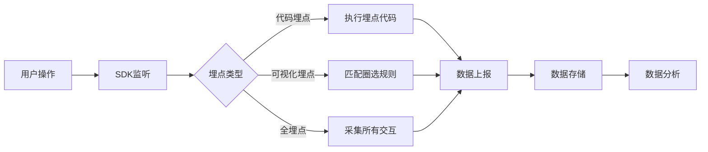
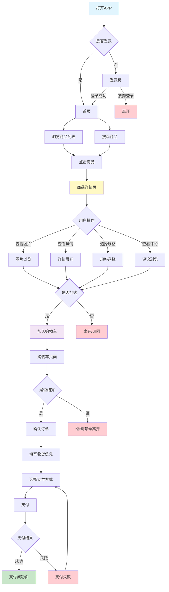

# 数据埋点概述

## 什么是数据埋点

数据埋点(Event Tracking)是数据采集的技术手段，是在应用程序、网站或其他数字产品中预先植入数据采集代码，用于监控和记录用户行为、系统状态及业务数据的过程。简单来说，就是在产品中"埋"下一些"点"，当用户触发这些点时，系统会自动记录相关数据。

**核心定义**：通过在关键业务节点嵌入数据采集代码，自动捕获用户行为轨迹、业务运营数据和系统运行状态，为产品优化和业务决策提供数据基础。

**埋点的本质**：
- **数据采集入口**：是企业获取第一手用户数据的主要途径
- **行为追踪手段**：记录用户在产品中的完整行为路径
- **决策支撑基础**：为产品迭代、运营优化提供数据依据
- **价值量化工具**：将用户行为转化为可分析的数据指标

**埋点与传统日志的区别**：传统日志主要用于问题排查和系统监控，记录的是系统事件；而埋点专注于用户行为和业务数据，记录的是业务事件。埋点数据更结构化、更有业务含义，可直接用于数据分析。

**数据埋点的核心价值**：

通过数据埋点，企业可以实现从"经验驱动"到"数据驱动"的转变。埋点数据帮助我们回答关键业务问题：用户从哪里来？用户做了什么？用户为什么流失？哪些功能最受欢迎？如何优化用户体验？

下图展示了埋点在不同层面的价值体现：

```markmap
# 数据埋点价值

## 业务层面
- 了解用户行为习惯
  - 用户访问路径分析
  - 功能使用频次统计
  - 停留时长分布
- 评估产品功能效果
  - 新功能使用率
  - 功能转化效率
  - 功能留存贡献
- 优化用户体验
  - 发现体验痛点
  - 识别流失节点
  - 改进交互设计
- 指导产品迭代方向
  - 功能优先级排序
  - 资源投入决策
  - 版本效果评估

## 运营层面
- 精准用户触达
  - 用户分层运营
  - 个性化推送
  - 精准广告投放
- 个性化内容推荐
  - 兴趣偏好识别
  - 协同过滤推荐
  - 内容匹配优化
- 活动效果评估
  - ROI计算
  - 渠道效果对比
  - 转化路径分析
- 流失用户召回
  - 流失预警
  - 召回策略制定
  - 效果跟踪验证

## 技术层面
- 性能监控
  - 页面加载速度
  - 接口响应时间
  - 资源占用情况
- 异常告警
  - 错误率监控
  - 崩溃日志收集
  - 异常行为识别
- 稳定性分析
  - 可用性统计
  - 故障定位分析
  - 容量规划支持
- 问题快速定位
  - 用户行为回溯
  - 错误现场还原
  - 影响范围评估

## 管理层面
- 数据驱动决策
  - 战略方向选择
  - 资源配置优化
  - 风险预警机制
- ROI效果评估
  - 投入产出分析
  - 成本效益测算
  - 价值量化展示
- 资源优化配置
  - 人力资源调配
  - 营销预算分配
  - 技术资源规划
- 战略规划支持
  - 市场趋势洞察
  - 竞争力分析
  - 增长机会识别
```

**埋点数据的三要素**：

任何一个完整的埋点事件都应该包含以下三个核心要素，这是构建埋点体系的基础：

1. **Who（谁）**：识别用户身份
   - **设备ID**：设备的唯一标识符(如IMEI、IDFA、AndroidID)
   - **用户ID**：登录后的用户唯一标识
   - **匿名ID**：未登录用户的临时标识
   - **会话ID**：标识用户的一次连续访问

2. **When（何时）**：记录事件发生时间
   - **时间戳**：精确到毫秒的事件发生时间
   - **时区信息**：用户所在时区
   - **服务器时间**：服务端记录时间（用于校准）

3. **What（做什么）**：记录具体行为和属性
   - **事件名称**：用户执行的动作(如点击、浏览、购买)
   - **事件属性**：事件相关的详细信息
   - **用户属性**：用户的静态特征(年龄、性别、会员等级等)
   - **环境属性**：设备、网络、操作系统等信息

## 数据埋点分类

根据实现方式和技术手段的不同，数据埋点可以分为以下几类。不同的埋点方式各有优劣，需要根据实际业务场景选择合适的方案。

### 按埋点方式分类

**1. 代码埋点（侵入式埋点 / 手动埋点）**

代码埋点是最传统、最精确的埋点方式，需要开发人员在代码中手动添加埋点代码。这种方式给予了最大的灵活性和控制力。

**实现原理**：开发人员在关键业务节点（如按钮点击、页面加载、表单提交等）手动插入数据采集代码，当用户触发这些节点时，代码会自动将事件数据发送到数据平台。

**优点**：
- **灵活度高**：可以精确控制埋点位置、采集时机和数据内容
- **数据准确**：能够采集到精确的业务数据和上下文信息
- **自定义强**：可以采集任何自定义的业务属性和计算字段
- **业务关联紧**：能够结合业务逻辑进行数据采集

**缺点**：
- **开发成本高**：需要开发人员编写和维护大量埋点代码
- **迭代周期长**：每次修改埋点都需要修改代码并发版
- **容易遗漏**：依赖人工实现，容易出现埋点遗漏或错误
- **维护困难**：随着业务发展，埋点代码会越来越多，难以管理

**适用场景**：
- 需要采集复杂业务数据的场景
- 对数据准确性要求极高的场景
- 需要采集后端业务逻辑数据
- 关键业务流程的精确追踪

**代码示例**：下面展示了前端和后端如何实现代码埋点，可以看到不同技术栈的实现方式。


```python
# Python Flask后端埋点示例
from flask import Flask, request, g
import analytics

app = Flask(__name__)

@app.route('/product/detail')
def product_detail():
    product_id = request.args.get('id')
    
    # 手动埋点代码
    analytics.track(
        user_id=get_user_id(),
        event='view_product',
        properties={
            'product_id': product_id,
            'product_name': get_product_name(product_id),
            'product_price': get_product_price(product_id),
            'source': request.args.get('from', 'direct'),
            'timestamp': time.time()
        }
    )
    
    return render_template('product_detail.html')

@app.route('/cart/add', methods=['POST'])
def add_to_cart():
    data = request.json
    
    # 加购埋点
    analytics.track(
        user_id=g.user_id,
        event='add_to_cart',
        properties={
            'product_id': data['product_id'],
            'quantity': data['quantity'],
            'price': data['price']
        }
    )
    
    return {'success': True}
```
|||
```go
// Go Gin后端埋点示例
package main

import (
    "time"
    "github.com/gin-gonic/gin"
)

func productDetail(c *gin.Context) {
    productID := c.Query("id")
    
    // 手动埋点代码
    analytics.Track(analytics.Track{
        UserId: getUserID(c),
        Event:  "view_product",
        Properties: map[string]interface{}{
            "product_id":    productID,
            "product_name":  getProductName(productID),
            "product_price": getProductPrice(productID),
            "source":        c.DefaultQuery("from", "direct"),
            "timestamp":     time.Now().Unix(),
        },
    })
    
    c.HTML(200, "product_detail.html", gin.H{})
}

func addToCart(c *gin.Context) {
    var data map[string]interface{}
    c.BindJSON(&data)
    
    // 加购埋点
    analytics.Track(analytics.Track{
        UserId: c.GetString("user_id"),
        Event:  "add_to_cart",
        Properties: map[string]interface{}{
            "product_id": data["product_id"],
            "quantity":   data["quantity"],
            "price":      data["price"],
        },
    })
    
    c.JSON(200, gin.H{"success": true})
}
```


**2. 可视化埋点（半自动埋点 / 圈选埋点）**

可视化埋点是一种介于代码埋点和全埋点之间的方案，通过可视化界面让非技术人员也能完成埋点配置，大大降低了埋点门槛。

**实现原理**：在可视化配置平台上，通过点选页面元素的方式"圈选"需要埋点的位置，系统会自动识别元素特征并生成埋点规则，当用户与该元素交互时自动触发数据上报。

**工作流程**：
1. 在埋点平台加载需要埋点的页面
2. 使用鼠标点击要埋点的元素（按钮、链接、图片等）
3. 配置该元素的事件名称和属性
4. 保存配置，无需发版即可生效

**优点**：
- **快速部署**：配置后即时生效，无需发版
- **降低门槛**：运营、产品人员可以自主配置
- **减少开发**：不需要开发人员编写埋点代码
- **灵活调整**：可以随时修改埋点配置

**缺点**：
- **功能有限**：只能采集页面元素的基础交互数据
- **无法采集业务数据**：无法获取后端业务逻辑数据
- **依赖页面结构**：页面改版可能导致埋点失效
- **覆盖不全**：复杂交互和动态内容难以圈选

**适用场景**：
- 页面点击、浏览等基础行为采集
- 快速验证埋点需求
- 补充代码埋点的遗漏
- 临时营销活动的数据追踪

**主流可视化埋点工具**：
- **GrowingIO**：国内最早推出可视化埋点的产品
- **神策数据**：提供完整的可视化埋点解决方案
- **诸葛IO**：支持Web和移动端的可视化埋点
- **Mixpanel**：国际知名的数据分析平台

**3. 全埋点（无埋点 / 自动埋点）**

全埋点是最"省事"的埋点方案，SDK会自动采集所有用户行为，无需任何手动配置。但"省事"不等于"好用"，这种方式有其特定的应用场景。

**实现原理**：集成SDK后，SDK会自动监听所有用户交互事件（点击、滑动、输入等），并自动采集相关数据上报。采集的数据包括元素的各种属性（id、class、文本内容、位置等）。

**采集范围**：
- **页面浏览**：自动记录所有页面访问
- **点击事件**：自动记录所有点击行为
- **表单输入**：记录表单字段的填写（不包含内容）
- **页面滚动**：记录用户的浏览深度
- **元素曝光**：记录页面元素的展示情况

**优点**：
- **零开发成本**：集成SDK后自动采集，无需编码
- **数据完整**：不会遗漏任何用户行为
- **快速上线**：最快的埋点实施方案
- **方便回溯**：可以事后定义想要分析的事件

**缺点**：
- **数据冗余**：采集大量无用数据，增加成本
- **缺少业务含义**：只有行为数据，缺少业务属性
- **分析复杂**：需要事后定义和清洗数据
- **性能影响**：大量数据采集可能影响应用性能
- **存储成本高**：需要存储海量原始数据

**适用场景**：
- 初创团队快速搭建数据体系
- 探索性数据分析
- 作为代码埋点的补充
- 不确定需要哪些数据时的过渡方案

**工作流程对比**：



**三种埋点方式对比总结**：

<table style="width:100%; border-collapse:collapse;">
<thead>
  <tr style="background-color:#f0f0f0;">
    <th style="border:1px solid #ddd; padding:10px;">对比维度</th>
    <th style="border:1px solid #ddd; padding:10px;">代码埋点</th>
    <th style="border:1px solid #ddd; padding:10px;">可视化埋点</th>
    <th style="border:1px solid #ddd; padding:10px;">全埋点</th>
  </tr>
</thead>
<tbody>
  <tr>
    <td style="border:1px solid #ddd; padding:10px;"><strong>实施成本</strong></td>
    <td style="border:1px solid #ddd; padding:10px;">高（需要开发）</td>
    <td style="border:1px solid #ddd; padding:10px;">中（需要配置）</td>
    <td style="border:1px solid #ddd; padding:10px;">低（自动采集）</td>
  </tr>
  <tr>
    <td style="border:1px solid #ddd; padding:10px;"><strong>数据准确性</strong></td>
    <td style="border:1px solid #ddd; padding:10px;">最高</td>
    <td style="border:1px solid #ddd; padding:10px;">较高</td>
    <td style="border:1px solid #ddd; padding:10px;">中等</td>
  </tr>
  <tr>
    <td style="border:1px solid #ddd; padding:10px;"><strong>业务关联</strong></td>
    <td style="border:1px solid #ddd; padding:10px;">强（可采集业务数据）</td>
    <td style="border:1px solid #ddd; padding:10px;">弱（仅基础交互）</td>
    <td style="border:1px solid #ddd; padding:10px;">弱（仅交互数据）</td>
  </tr>
  <tr>
    <td style="border:1px solid #ddd; padding:10px;"><strong>灵活性</strong></td>
    <td style="border:1px solid #ddd; padding:10px;">最强</td>
    <td style="border:1px solid #ddd; padding:10px;">中等</td>
    <td style="border:1px solid #ddd; padding:10px;">最弱</td>
  </tr>
  <tr>
    <td style="border:1px solid #ddd; padding:10px;"><strong>维护难度</strong></td>
    <td style="border:1px solid #ddd; padding:10px;">高</td>
    <td style="border:1px solid #ddd; padding:10px;">低</td>
    <td style="border:1px solid #ddd; padding:10px;">最低</td>
  </tr>
  <tr>
    <td style="border:1px solid #ddd; padding:10px;"><strong>数据存储成本</strong></td>
    <td style="border:1px solid #ddd; padding:10px;">低（按需采集）</td>
    <td style="border:1px solid #ddd; padding:10px;">低</td>
    <td style="border:1px solid #ddd; padding:10px;">高（大量数据）</td>
  </tr>
  <tr>
    <td style="border:1px solid #ddd; padding:10px;"><strong>推荐场景</strong></td>
    <td style="border:1px solid #ddd; padding:10px;">核心业务流程</td>
    <td style="border:1px solid #ddd; padding:10px;">快速验证需求</td>
    <td style="border:1px solid #ddd; padding:10px;">探索性分析</td>
  </tr>
</tbody>
</table>

**实践建议**：在实际项目中，通常采用"组合拳"的方式，即：
- **核心业务流程**：使用代码埋点，保证数据准确性
- **页面基础交互**：使用可视化埋点，快速补充
- **探索性分析**：使用全埋点作为补充手段

### 按数据类型分类

除了按实现方式分类，埋点还可以按照采集的数据类型进行分类。不同类型的埋点关注不同的数据维度，需要设计不同的采集方案。

**1. 页面浏览埋点（PV埋点）**

页面浏览埋点是最基础、最常见的埋点类型，用于记录用户访问了哪些页面。这类埋点通常在页面加载完成时自动触发。

**采集内容**：
- **页面标识**：页面URL、页面名称、页面ID
- **访问信息**：访问时间、来源页面（Referrer）、来源渠道
- **停留时长**：用户在页面的停留时间
- **页面属性**：页面分类、页面参数、A/B测试分组

**应用价值**：
- 统计网站/APP的流量规模（PV、UV）
- 分析用户的访问路径和跳转关系
- 评估不同页面的受欢迎程度
- 发现用户流失的关键页面

**实现要点**：
- 单页应用(SPA)需要监听路由变化
- 需要处理页面刷新和返回的情况
- 停留时长需要在页面卸载时计算

**2. 事件埋点（Event埋点）**

事件埋点记录用户的具体操作行为，是最重要的埋点类型。每个用户动作都可以作为一个事件进行追踪。

**常见事件类型**：
- **点击事件**：按钮点击、链接点击、图片点击
- **提交事件**：表单提交、搜索提交、评论提交
- **播放事件**：视频播放、音频播放、直播观看
- **交易事件**：加入购物车、创建订单、完成支付
- **社交事件**：点赞、收藏、分享、关注
- **功能事件**：筛选、排序、切换、展开/收起

**采集内容**：
- **事件基本信息**：事件名称、触发时间、用户ID
- **事件属性**：与事件相关的业务数据
- **操作详情**：操作对象、操作方式、操作结果
- **上下文信息**：所在页面、来源渠道、设备信息

**设计原则**：
- 事件名称要有明确的业务含义
- 属性要包含完整的业务信息
- 同类事件的属性要保持一致
- 避免过度拆分或过度合并

**3. 曝光埋点（Exposure埋点）**

曝光埋点用于记录内容被展示给用户的情况，即使用户没有点击，也要记录。这对于评估推荐算法、广告投放效果非常重要。

**触发时机**：
- 元素进入可视区域（Viewport）
- 元素停留一定时间（如1秒）
- 元素可见面积达到阈值（如50%）

**采集内容**：
- **曝光对象**：内容ID、内容类型、内容标题
- **曝光位置**：页面位置、模块名称、展示顺序
- **曝光时长**：内容在可视区域的停留时间
- **曝光策略**：推荐算法、排序规则、A/B测试分组

**应用场景**：
- 电商商品卡片曝光
- 信息流内容曝光
- 广告位曝光
- 推荐内容曝光

**实现难点**：
- 需要使用Intersection Observer API或滚动监听
- 需要防止重复曝光
- 需要处理快速滚动的情况
- 需要批量上报优化性能

**4. 时长埋点（Duration埋点）**

时长埋点用于记录用户在某个状态下持续的时间，帮助我们了解用户的投入程度。

**常见类型**：
- **页面停留时长**：用户在页面上的总时间
- **视频观看时长**：用户实际观看的时长
- **功能使用时长**：某个功能的连续使用时间
- **会话时长**：用户一次访问的总时长

**计算方法**：
- 记录开始时间戳
- 记录结束时间戳
- 计算时间差
- 考虑页面切换、APP后台等特殊情况

**注意事项**：
- 需要处理页面刷新和关闭
- 需要过滤异常的时长数据（如页面最小化）
- 移动端需要处理APP切到后台的情况
- Web端需要使用visibilitychange事件

## 数据埋点常用指标

埋点采集的数据最终要转化为业务指标，才能发挥价值。下面介绍数据分析中最常用的埋点指标体系。

### 流量指标

流量指标是衡量产品规模和用户覆盖的基础指标，也是最容易理解的指标。

**核心流量指标详解**：

<table style="width:100%; border-collapse:collapse;">
<thead>
  <tr style="background-color:#f0f0f0;">
    <th style="border:1px solid #ddd; padding:10px; width:15%;">指标名称</th>
    <th style="border:1px solid #ddd; padding:10px; width:20%;">英文缩写</th>
    <th style="border:1px solid #ddd; padding:10px; width:25%;">计算公式</th>
    <th style="border:1px solid #ddd; padding:10px; width:40%;">说明与应用</th>
  </tr>
</thead>
<tbody>
  <tr>
    <td style="border:1px solid #ddd; padding:10px;"><strong>页面浏览量</strong></td>
    <td style="border:1px solid #ddd; padding:10px;">PV (Page View)</td>
    <td style="border:1px solid #ddd; padding:10px;">页面被打开的总次数</td>
    <td style="border:1px solid #ddd; padding:10px;">衡量网站流量的基础指标，一个用户多次访问会累计多次PV</td>
  </tr>
  <tr>
    <td style="border:1px solid #ddd; padding:10px;"><strong>独立访客数</strong></td>
    <td style="border:1px solid #ddd; padding:10px;">UV (Unique Visitor)</td>
    <td style="border:1px solid #ddd; padding:10px;">去重后的访问用户数</td>
    <td style="border:1px solid #ddd; padding:10px;">衡量网站覆盖人群规模，一个用户在统计周期内只计算一次</td>
  </tr>
  <tr>
    <td style="border:1px solid #ddd; padding:10px;"><strong>人均浏览量</strong></td>
    <td style="border:1px solid #ddd; padding:10px;">PV/UV</td>
    <td style="border:1px solid #ddd; padding:10px;">PV ÷ UV</td>
    <td style="border:1px solid #ddd; padding:10px;">衡量用户粘性，比值越高说明用户越活跃</td>
  </tr>
  <tr>
    <td style="border:1px solid #ddd; padding:10px;"><strong>访问次数</strong></td>
    <td style="border:1px solid #ddd; padding:10px;">Visits / Sessions</td>
    <td style="border:1px solid #ddd; padding:10px;">用户访问网站的次数</td>
    <td style="border:1px solid #ddd; padding:10px;">一次访问包含多个PV，通常以30分钟无操作作为会话结束标志</td>
  </tr>
  <tr>
    <td style="border:1px solid #ddd; padding:10px;"><strong>独立IP数</strong></td>
    <td style="border:1px solid #ddd; padding:10px;">IP</td>
    <td style="border:1px solid #ddd; padding:10px;">独立IP地址数</td>
    <td style="border:1px solid #ddd; padding:10px;">粗略估算访问人数，准确性不如UV（多人可能共用一个IP）</td>
  </tr>
</tbody>
</table>

**PV与UV的关系**：
- PV/UV比值反映用户粘性：比值越大，用户浏览页面越多
- 内容类产品通常PV/UV > 5
- 工具类产品通常PV/UV < 3
- 电商类产品通常PV/UV在3-10之间

### 用户行为指标

用户行为指标用于衡量用户与产品的互动质量，是评估产品体验和运营效果的关键指标。

**常用行为指标详解**：

<table style="width:100%; border-collapse:collapse;">
<thead>
  <tr style="background-color:#f0f0f0;">
    <th style="border:1px solid #ddd; padding:10px; width:18%;">指标名称</th>
    <th style="border:1px solid #ddd; padding:10px; width:30%;">计算公式</th>
    <th style="border:1px solid #ddd; padding:10px; width:52%;">说明与应用</th>
  </tr>
</thead>
<tbody>
  <tr>
    <td style="border:1px solid #ddd; padding:10px;"><strong>点击率(CTR)</strong></td>
    <td style="border:1px solid #ddd; padding:10px;">点击次数 ÷ 曝光次数 × 100%</td>
    <td style="border:1px solid #ddd; padding:10px;">衡量内容吸引力，广告CTR一般在0.1%-5%之间，信息流推荐CTR一般在5%-20%之间</td>
  </tr>
  <tr>
    <td style="border:1px solid #ddd; padding:10px;"><strong>转化率(CVR)</strong></td>
    <td style="border:1px solid #ddd; padding:10px;">转化次数 ÷ 访问次数 × 100%</td>
    <td style="border:1px solid #ddd; padding:10px;">衡量业务效果，电商加购转化率一般10%-30%，支付转化率一般3%-10%</td>
  </tr>
  <tr>
    <td style="border:1px solid #ddd; padding:10px;"><strong>跳出率</strong></td>
    <td style="border:1px solid #ddd; padding:10px;">只访问一个页面就离开的次数 ÷ 总访问次数 × 100%</td>
    <td style="border:1px solid #ddd; padding:10px;">衡量首页质量，跳出率过高说明首页不够吸引人或与预期不符</td>
  </tr>
  <tr>
    <td style="border:1px solid #ddd; padding:10px;"><strong>退出率</strong></td>
    <td style="border:1px solid #ddd; padding:10px;">从某页面退出的次数 ÷ 该页面浏览次数 × 100%</td>
    <td style="border:1px solid #ddd; padding:10px;">衡量页面质量，退出率高的页面可能存在体验问题</td>
  </tr>
  <tr>
    <td style="border:1px solid #ddd; padding:10px;"><strong>平均访问深度</strong></td>
    <td style="border:1px solid #ddd; padding:10px;">PV ÷ Visits</td>
    <td style="border:1px solid #ddd; padding:10px;">衡量用户探索意愿，深度越大说明用户对内容越感兴趣</td>
  </tr>
  <tr>
    <td style="border:1px solid #ddd; padding:10px;"><strong>平均停留时长</strong></td>
    <td style="border:1px solid #ddd; padding:10px;">总停留时长 ÷ 访问次数</td>
    <td style="border:1px solid #ddd; padding:10px;">衡量用户参与度，时长越长说明内容越吸引人</td>
  </tr>
</tbody>
</table>

**跳出率 vs 退出率的区别**：
- **跳出率**：只看了一个页面就离开，分母是总访问次数
- **退出率**：从该页面离开，分母是该页面的浏览次数
- 所有页面的退出率平均值约等于跳出率

### 留存指标

留存指标是衡量产品价值和用户忠诚度的核心指标，也是投资人最关注的指标之一。留存率直接反映了产品对用户的长期价值。

**留存指标的重要性**：
- **成本效益**：获取新用户成本是留存老用户的5-25倍
- **增长基础**：只有留存做好了，增长才有意义
- **产品价值**：留存率是产品核心价值的直接体现
- **商业模型**：留存决定了用户生命周期价值(LTV)

**留存率计算方式**：
- **次日留存率** = 第2天仍活跃的用户数 ÷ 第1天的新增用户数 × 100%
- **7日留存率** = 第8天仍活跃的用户数 ÷ 第1天的新增用户数 × 100%
- **30日留存率** = 第31天仍活跃的用户数 ÷ 第1天的新增用户数 × 100%

**不同产品类型的留存标准**：
- **社交类**：次日留存 > 40%，7日留存 > 20%
- **工具类**：次日留存 > 30%，7日留存 > 15%
- **游戏类**：次日留存 > 30%，7日留存 > 10%
- **电商类**：次日留存 > 20%，30日留存 > 10%

下图展示了一个产品的用户留存曲线变化趋势：

```echarts
{
  "title": {
    "text": "用户留存曲线示例",
    "subtext": "展示不同留存周期的变化趋势",
    "left": "center",
    "top": 10,
    "textStyle": { "fontSize": 16 }
  },
  "tooltip": {
    "trigger": "axis",
    "formatter": "{b}<br/>{a}: {c}%"
  },
  "legend": {
    "top": 55,
    "data": ["次日留存", "7日留存", "30日留存"]
  },
  "grid": {
    "left": "8%",
    "right": "5%",
    "top": 100,
    "bottom": 60
  },
  "xAxis": {
    "type": "category",
    "name": "日期",
    "data": ["D1", "D2", "D3", "D4", "D5", "D6", "D7", "D8", "D9", "D10"]
  },
  "yAxis": {
    "type": "value",
    "name": "留存率(%)",
    "min": 0,
    "max": 100
  },
  "series": [
    {
      "name": "次日留存",
      "type": "line",
      "data": [45, 42, 48, 46, 44, 47, 45, 46, 48, 47],
      "smooth": true,
      "itemStyle": { "color": "#4B84E6" },
      "lineStyle": { "width": 3 }
    },
    {
      "name": "7日留存",
      "type": "line",
      "data": [28, 26, 30, 29, 27, 31, 28, 29, 30, 29],
      "smooth": true,
      "itemStyle": { "color": "#F28E2B" },
      "lineStyle": { "width": 3 }
    },
    {
      "name": "30日留存",
      "type": "line",
      "data": [12, 11, 13, 12, 11, 14, 12, 13, 13, 12],
      "smooth": true,
      "itemStyle": { "color": "#36B37E" },
      "lineStyle": { "width": 3 }
    }
  ]
}
```

从图中可以看出：
- **次日留存**最高但波动较大，需要关注首日体验
- **7日留存**明显下降，这是产品留住用户的第一道关卡
- **30日留存**趋于稳定，这部分是产品的核心用户

**留存分析的关键点**：
1. **关注留存曲线的形状**：健康的留存曲线应该是逐渐平缓，而不是持续陡降
2. **找到留存拐点**：通常在3-7天会有明显的留存下降，这是优化重点
3. **分群留存分析**：不同渠道、不同功能使用者的留存差异很大
4. **关注长期留存**：90日留存比次日留存更能反映产品价值

# 数据埋点设计流程

数据埋点不是简单地在代码里加几行日志，而是一个系统工程，需要经过完整的设计流程。一个好的埋点方案能够准确反映业务需求，为数据分析提供可靠基础。

## 埋点需求分析

埋点需求分析是整个埋点工作的起点，这个阶段要明确"为什么埋点"、"埋什么点"、"怎么埋点"。很多埋点项目失败的原因都是需求分析不充分，导致采集的数据无法支撑业务分析。

### 明确业务目标

在开始埋点设计前，必须深入理解业务场景和分析需求。埋点是手段不是目的，最终是要服务于业务决策。

**业务需求分析的核心问题**：


**1. 业务背景**
- 产品处于什么发展阶段（初创/成长/成熟）？
- 当前面临什么业务问题或挑战？
- 需要数据来验证什么假设？

**2. 分析目标**
- 希望通过数据了解什么信息？
- 需要回答哪些具体的业务问题？
- 数据分析的预期产出是什么？

**3. 决策支持**
- 数据将如何影响业务决策？
- 哪些决策依赖这些数据？
- 决策的紧急程度如何？

**4. 优先级评估**
- 哪些数据最重要、最紧急？
- 哪些数据可以后期补充？
- 如何平衡完整性和实施成本？

**5. 时效性要求**
- 数据需要实时分析还是离线分析？
- 数据更新频率的要求是什么？
- 是否需要实时监控和告警？


**案例：电商APP商品详情页埋点需求分析**

假设我们是一个电商平台，最近发现商品详情页的转化率下降了20%，需要通过埋点来分析原因。

下图展示了我们需要关注的核心问题和数据需求：

```markmap
# 商品详情页埋点需求

## 业务目标
- 提升详情页转化率
  - 当前转化率: 8%
  - 目标转化率: 10%
  - 提升幅度: 25%
- 优化页面布局
  - 识别无效模块
  - 优化内容排序
  - 提升加载速度
- 改善用户体验
  - 减少用户流失
  - 提高用户满意度
  - 增加复购率

## 核心问题
- 用户从哪里来？
  - 搜索流量占比
  - 推荐流量占比
  - 直接访问占比
  - 不同来源转化差异
- 用户看了什么？
  - 图片查看率
  - 详情展开率
  - 评论查看率
  - 页面滚动深度
- 用户为什么不买？
  - 在哪个环节流失
  - 流失前做了什么
  - 什么因素影响决策
  - 竞品对比情况
- 哪些因素影响购买？
  - 价格敏感度
  - 评论影响力
  - 活动吸引力
  - 配送时效要求

## 数据需求
- 页面浏览数据
  - PV/UV统计
  - 停留时长分布
  - 来源渠道分析
  - 访问时段分布
- 用户行为数据
  - 图片点击热力图
  - 详情展开次数
  - 规格选择偏好
  - 加购按钮点击
- 转化数据
  - 加购转化率
  - 下单转化率
  - 支付转化率
  - 漏斗流失分析
- 用户特征数据
  - 新老用户对比
  - 会员等级分布
  - 购买力分层
  - 设备系统分布
```

### 梳理业务流程

在明确了业务目标后，需要梳理完整的用户行为路径，识别所有关键节点。这一步要画出用户从进入到离开的完整流程图。

**用户行为路径分析**

以电商购物为例，用户从打开APP到完成支付的完整流程如下图所示：



**流程梳理的关键点**：

1. **识别所有入口**：用户可能从哪些地方进入这个流程
2. **标注关键节点**：哪些节点是必经之路，哪些是可选路径
3. **找出分支路径**：用户在哪些地方可能做出不同选择
4. **定位流失点**：用户可能在哪些节点离开
5. **分析决策因素**：用户在每个节点基于什么做决策

**基于流程图设计埋点**：
- **每个页面**都需要页面浏览埋点
- **每个操作**都需要事件埋点
- **每个分支**都需要记录选择
- **每个流失点**都需要记录原因

### 确定埋点事件

基于业务流程，我们需要确定具体要埋哪些点。埋点事件要覆盖完整的用户路径，但不是越多越好，要找到关键节点。

**事件分类的思维模型**：

埋点事件可以按照不同的维度进行分类，形成一个立体的事件体系。下图展示了埋点事件的分类结构：

```echarts
{
  "title": {
    "text": "埋点事件分类体系",
    "subtext": "按业务类型划分的事件结构",
    "left": "center",
    "top": 10
  },
  "tooltip": {
    "trigger": "item",
    "formatter": "{b}: {c}"
  },
  "series": [
    {
      "type": "sunburst",
      "data": [
        {
          "name": "用户事件",
          "children": [
            {
              "name": "注册登录",
              "value": 100,
              "children": [
                { "name": "手机注册", "value": 40 },
                { "name": "邮箱注册", "value": 30 },
                { "name": "第三方登录", "value": 30 }
              ]
            },
            {
              "name": "个人信息",
              "value": 80,
              "children": [
                { "name": "编辑资料", "value": 50 },
                { "name": "上传头像", "value": 30 }
              ]
            }
          ]
        },
        {
          "name": "页面事件",
          "children": [
            {
              "name": "页面浏览",
              "value": 150,
              "children": [
                { "name": "首页", "value": 50 },
                { "name": "列表页", "value": 50 },
                { "name": "详情页", "value": 50 }
              ]
            },
            {
              "name": "页面操作",
              "value": 100,
              "children": [
                { "name": "滚动", "value": 50 },
                { "name": "切换Tab", "value": 50 }
              ]
            }
          ]
        },
        {
          "name": "业务事件",
          "children": [
            {
              "name": "商品相关",
              "value": 200,
              "children": [
                { "name": "搜索", "value": 50 },
                { "name": "浏览", "value": 50 },
                { "name": "收藏", "value": 50 },
                { "name": "加购", "value": 50 }
              ]
            },
            {
              "name": "交易相关",
              "value": 150,
              "children": [
                { "name": "下单", "value": 50 },
                { "name": "支付", "value": 50 },
                { "name": "退款", "value": 50 }
              ]
            }
          ]
        }
      ],
      "radius": ["15%", "80%"],
      "label": {
        "rotate": "radial"
      }
    }
  ]
}
```

从图中可以看出，埋点事件主要分为三大类：

**1. 用户事件**：与用户账号相关的操作
- 注册、登录、登出
- 个人信息维护
- 账号安全设置

**2. 页面事件**：用户的页面访问行为
- 页面浏览（PV）
- 页面交互（滚动、切换等）
- 页面停留时长

**3. 业务事件**：核心业务操作
- 商品相关：搜索、浏览、收藏、加购
- 交易相关：下单、支付、评价、退款
- 社交相关：关注、分享、评论、点赞

**事件设计的MECE原则**：
- **Mutually Exclusive（相互独立）**：事件之间不重复
- **Collectively Exhaustive（完全穷尽）**：覆盖所有关键行为

## 埋点方案设计

需求分析完成后，进入具体的方案设计阶段。这个阶段要定义事件模型、设计属性结构、编写数据字典，形成完整的埋点规范文档。

### 事件模型设计

事件模型是埋点设计的核心，定义了如何描述一个用户行为。一个好的事件模型应该具备清晰的命名、完整的属性、一致的结构。

**事件命名规范**

统一的命名规范是团队协作的基础，也是后期数据分析的前提。采用标准化的命名方式可以避免混乱和歧义。

**命名格式**：`{对象}_{动作}_{补充说明}`

**命名规则**：
- 使用小写字母和下划线分隔
- 长度控制在50个字符以内
- 使用英文，避免中文和特殊符号
- 动词使用一般现在时
- 保持团队内术语统一

**命名示例表**：

| 业务场景 | 事件名称 | 说明 | 触发时机 |
|---------|---------|------|---------|
| 用户注册 | `user_register_submit` | 用户提交注册表单 | 点击注册按钮且提交成功时 |
| 用户登录 | `user_login_success` | 用户登录成功 | 登录接口返回成功时 |
| 页面浏览 | `page_view_product_detail` | 浏览商品详情页 | 详情页加载完成时 |
| 按钮点击 | `button_click_add_cart` | 点击加入购物车按钮 | 点击加购按钮时 |
| 视频播放 | `video_play_start` | 开始播放视频 | 视频开始播放时 |
| 订单提交 | `order_submit_success` | 订单提交成功 | 订单创建成功后 |
| 支付完成 | `payment_complete_success` | 支付完成成功 | 收到支付成功回调时 |
| 分享操作 | `share_click_wechat` | 点击微信分享 | 点击微信分享按钮时 |


**1. 保持简洁明确**
- ✅ 好：`button_click_add_cart`
- ❌ 差：`user_click_the_add_to_shopping_cart_button_on_product_detail_page`

**2. 统一术语**
- 团队内统一使用相同的术语（如统一用product还是goods）
- 建立术语词典，避免混用

**3. 避免特殊字符**
- 不使用空格、中文、emoji、连字符
- 只使用小写字母、数字和下划线

**4. 区分状态**
- 对于有结果的事件，明确标注状态
- 如：`login_success`、`login_fail`、`login_cancel`

**5. 预留扩展性**
- 考虑后续可能的变化
- 避免过于具体的命名限制扩展


### 属性设计

事件属性是埋点数据的血肉，决定了数据分析的深度。属性设计要在完整性和简洁性之间找到平衡。

**属性分类体系**：

<table style="width:100%; border-collapse:collapse;">
<thead>
  <tr style="background-color:#f0f0f0;">
    <th style="border:1px solid #ddd; padding:10px; width:18%;">属性类型</th>
    <th style="border:1px solid #ddd; padding:10px; width:35%;">说明</th>
    <th style="border:1px solid #ddd; padding:10px; width:47%;">示例</th>
  </tr>
</thead>
<tbody>
  <tr>
    <td style="border:1px solid #ddd; padding:10px;"><strong>预置属性</strong></td>
    <td style="border:1px solid #ddd; padding:10px;">SDK自动采集的通用属性，无需手动设置</td>
    <td style="border:1px solid #ddd; padding:10px;">设备型号(device_model)、操作系统(os)、APP版本(app_version)、网络类型(network_type)、屏幕分辨率(screen_size)</td>
  </tr>
  <tr>
    <td style="border:1px solid #ddd; padding:10px;"><strong>公共属性</strong></td>
    <td style="border:1px solid #ddd; padding:10px;">所有事件共享的业务属性，设置一次全局生效</td>
    <td style="border:1px solid #ddd; padding:10px;">用户ID(user_id)、用户等级(user_level)、会员类型(vip_type)、渠道来源(channel)、城市(city)</td>
  </tr>
  <tr>
    <td style="border:1px solid #ddd; padding:10px;"><strong>事件属性</strong></td>
    <td style="border:1px solid #ddd; padding:10px;">特定事件独有的业务属性，每次上报时设置</td>
    <td style="border:1px solid #ddd; padding:10px;">商品ID(product_id)、商品价格(product_price)、订单金额(order_amount)、视频时长(video_duration)</td>
  </tr>
</tbody>
</table>

**属性设计原则**：

1. **完整性**：能够支撑所有分析需求，不遗漏关键信息
2. **准确性**：数据类型和取值范围明确，避免歧义
3. **一致性**：同一含义的属性在不同事件中保持一致
4. **可扩展性**：预留未来可能的扩展空间

**属性命名规范**：

| 属性类别 | 属性名 | 数据类型 | 取值说明 | 示例值 |
|---------|--------|---------|---------|---------|
| 用户标识 | `user_id` | String | 用户唯一标识 | "U123456" |
| 设备标识 | `device_id` | String | 设备唯一标识 | "abc-def-ghi" |
| 平台信息 | `platform` | String | iOS/Android/Web/小程序 | "iOS" |
| APP版本 | `app_version` | String | 语义化版本号 | "3.2.1" |
| 操作系统 | `os_version` | String | 系统版本号 | "iOS 17.0" |
| 网络类型 | `network_type` | String | WiFi/4G/5G/未知 | "WiFi" |
| 商品ID | `product_id` | String | 商品唯一标识 | "P100001" |
| 商品名称 | `product_name` | String | 商品完整名称 | "iPhone 15 Pro" |
| 商品价格 | `product_price` | Number | 单位:元,保留2位小数 | 7999.00 |
| 页面标题 | `page_title` | String | 页面标题 | "商品详情" |
| 页面路径 | `page_path` | String | 页面URL路径 | "/product/detail" |
| 来源类型 | `source_type` | String | recommend/search/direct | "recommend" |

**商品详情页事件属性设计示例**：

下面展示两个核心事件的完整属性设计，展示了如何组织事件数据：


```json
{
  "event": "page_view_product_detail",
  "properties": {
    // ========== 公共属性 ==========
    "user_id": "123456",
    "device_id": "abc-def-ghi",
    "platform": "iOS",
    "app_version": "3.2.1",
    "os_version": "iOS 17.0",
    "network_type": "WiFi",
    "city": "北京",
    "timestamp": 1698220800000,
    
    // ========== 页面属性 ==========
    "page_title": "iPhone 15 Pro",
    "page_url": "/product/detail?id=100001",
    "referrer_page": "/category/phone",
    "referrer_module": "recommend_list",
    
    // ========== 商品属性 ==========
    "product_id": "100001",
    "product_name": "iPhone 15 Pro",
    "product_category_l1": "数码",
    "product_category_l2": "手机",
    "product_category_l3": "苹果手机",
    "product_price": 7999,
    "product_original_price": 8999,
    "product_stock": "有货",
    "product_brand": "Apple",
    "product_tags": ["5G", "A17芯片", "钛金属"],
    
    // ========== 来源属性 ==========
    "source_type": "推荐",
    "source_module": "猜你喜欢",
    "source_position": 3,
    "source_algorithm": "collaborative_filtering"
  }
}
```
|||
```json
{
  "event": "button_click_add_cart",
  "properties": {
    // ========== 公共属性 ==========
    "user_id": "123456",
    "device_id": "abc-def-ghi",
    "timestamp": 1698220845000,
    
    // ========== 商品属性 ==========
    "product_id": "100001",
    "product_name": "iPhone 15 Pro",
    "product_price": 7999,
    "product_sku_id": "sku_001",
    
    // ========== 操作属性 ==========
    "quantity": 1,
    "selected_color": "钛金色",
    "selected_storage": "256GB",
    "is_first_add": true,
    
    // ========== 行为属性 ==========
    "time_on_page": 45.3,
    "images_viewed": 5,
    "detail_expanded": true,
    "reviews_viewed": true,
    
    // ========== 结果属性 ==========
    "cart_item_count": 3,
    "cart_total_amount": 15998,
    "operation_result": "success"
  }
}
```


从上面的示例可以看出，一个完整的事件数据包含了多个维度的信息，这些信息共同构成了用户行为的完整画像。

### 数据字典编写

数据字典是埋点文档的核心产出，是开发、测试、分析各方协作的基础文档。一份好的数据字典应该清晰、完整、易于维护。

**数据字典的作用**：
- **开发依据**：开发人员按照字典实现埋点
- **测试标准**：测试人员按照字典验证埋点
- **分析手册**：分析人员按照字典理解数据
- **沟通工具**：团队成员对齐理解的工具

**标准数据字典模板**：

<table style="width:100%; border-collapse:collapse; font-size:14px;">
<thead>
  <tr style="background-color:#f0f0f0;">
    <th style="border:1px solid #ddd; padding:8px;">字段</th>
    <th style="border:1px solid #ddd; padding:8px;">说明</th>
    <th style="border:1px solid #ddd; padding:8px;">示例</th>
  </tr>
</thead>
<tbody>
  <tr>
    <td style="border:1px solid #ddd; padding:8px;"><strong>事件ID</strong></td>
    <td style="border:1px solid #ddd; padding:8px;">事件唯一标识符，用于内部管理</td>
    <td style="border:1px solid #ddd; padding:8px;">E_001</td>
  </tr>
  <tr>
    <td style="border:1px solid #ddd; padding:8px;"><strong>事件名称</strong></td>
    <td style="border:1px solid #ddd; padding:8px;">事件的中文名称，便于理解</td>
    <td style="border:1px solid #ddd; padding:8px;">商品加入购物车</td>
  </tr>
  <tr>
    <td style="border:1px solid #ddd; padding:8px;"><strong>事件code</strong></td>
    <td style="border:1px solid #ddd; padding:8px;">事件的英文编码，实际上报使用</td>
    <td style="border:1px solid #ddd; padding:8px;">button_click_add_cart</td>
  </tr>
  <tr>
    <td style="border:1px solid #ddd; padding:8px;"><strong>触发时机</strong></td>
    <td style="border:1px solid #ddd; padding:8px;">什么情况下触发事件</td>
    <td style="border:1px solid #ddd; padding:8px;">用户点击"加入购物车"按钮且操作成功时</td>
  </tr>
  <tr>
    <td style="border:1px solid #ddd; padding:8px;"><strong>触发位置</strong></td>
    <td style="border:1px solid #ddd; padding:8px;">在哪个页面/模块触发</td>
    <td style="border:1px solid #ddd; padding:8px;">商品详情页</td>
  </tr>
  <tr>
    <td style="border:1px solid #ddd; padding:8px;"><strong>属性列表</strong></td>
    <td style="border:1px solid #ddd; padding:8px;">该事件包含的所有属性及定义</td>
    <td style="border:1px solid #ddd; padding:8px;">见属性定义表</td>
  </tr>
  <tr>
    <td style="border:1px solid #ddd; padding:8px;"><strong>数据样例</strong></td>
    <td style="border:1px solid #ddd; padding:8px;">实际上报数据的JSON示例</td>
    <td style="border:1px solid #ddd; padding:8px;">见JSON示例</td>
  </tr>
  <tr>
    <td style="border:1px solid #ddd; padding:8px;"><strong>业务负责人</strong></td>
    <td style="border:1px solid #ddd; padding:8px;">业务需求提出人</td>
    <td style="border:1px solid #ddd; padding:8px;">张三（产品经理）</td>
  </tr>
  <tr>
    <td style="border:1px solid #ddd; padding:8px;"><strong>开发负责人</strong></td>
    <td style="border:1px solid #ddd; padding:8px;">开发实现负责人</td>
    <td style="border:1px solid #ddd; padding:8px;">李四（前端开发）</td>
  </tr>
  <tr>
    <td style="border:1px solid #ddd; padding:8px;"><strong>更新时间</strong></td>
    <td style="border:1px solid #ddd; padding:8px;">最后更新时间</td>
    <td style="border:1px solid #ddd; padding:8px;">2024-10-25</td>
  </tr>
  <tr>
    <td style="border:1px solid #ddd; padding:8px;"><strong>状态</strong></td>
    <td style="border:1px solid #ddd; padding:8px;">待开发/开发中/已上线/已下线</td>
    <td style="border:1px solid #ddd; padding:8px;">已上线</td>
  </tr>
</tbody>
</table>

**完整数据字典示例**：



**事件基本信息**

| 项目 | 内容 |
|------|------|
| 事件ID | E_001 |
| 事件名称 | 商品加入购物车 |
| 事件code | button_click_add_cart |
| 所属模块 | 商品详情页 |
| 触发时机 | 用户点击"加入购物车"按钮且操作成功时触发（失败不触发） |
| 业务负责人 | 张三（产品经理） |
| 开发负责人 | 李四（iOS）、王五（Android）、赵六（Web） |
| 状态 | 已上线 |
| 更新时间 | 2024-10-25 |

**属性定义表**

| 属性名 | 属性code | 数据类型 | 是否必填 | 取值说明 | 示例值 |
|--------|----------|----------|----------|----------|---------|
| 用户ID | user_id | String | 是 | 用户唯一标识 | "123456" |
| 商品ID | product_id | String | 是 | 商品唯一标识 | "P10001" |
| 商品名称 | product_name | String | 是 | 商品完整名称 | "iPhone 15 Pro" |
| 商品价格 | product_price | Number | 是 | 单位:元,保留2位小数 | 7999.00 |
| SKU ID | sku_id | String | 是 | 具体规格的SKU标识 | "SKU001" |
| 购买数量 | quantity | Integer | 是 | 加购数量,正整数 | 1 |
| 选择颜色 | selected_color | String | 否 | 用户选择的颜色 | "钛金色" |
| 选择存储 | selected_storage | String | 否 | 用户选择的存储容量 | "256GB" |
| 是否首次加购 | is_first_add | Boolean | 是 | 该商品是否首次加购 | true |
| 页面停留时长 | time_on_page | Number | 是 | 单位:秒,保留1位小数 | 45.3 |
| 购物车商品数 | cart_item_count | Integer | 是 | 加购后购物车总商品数 | 3 |
| 购物车总金额 | cart_total_amount | Number | 是 | 加购后购物车总金额 | 15998.00 |

**数据样例**

```json
{
  "event": "button_click_add_cart",
  "user_id": "123456",
  "timestamp": 1698220845000,
  "properties": {
    "product_id": "P10001",
    "product_name": "iPhone 15 Pro",
    "product_price": 7999.00,
    "sku_id": "SKU001",
    "quantity": 1,
    "selected_color": "钛金色",
    "selected_storage": "256GB",
    "is_first_add": true,
    "time_on_page": 45.3,
    "cart_item_count": 3,
    "cart_total_amount": 15998.00
  }
}
```



# 埋点技术实现

埋点设计完成后，进入技术实现阶段。这个阶段要选择合适的SDK、编写埋点代码、搭建数据管道。技术实现的质量直接影响数据的准确性和稳定性。

## 埋点SDK选型

SDK是埋点实现的基础工具，选择合适的SDK可以事半功倍。市面上有很多成熟的埋点SDK，也可以选择自研。

### 主流埋点SDK对比

不同的SDK有不同的特点和适用场景，需要根据团队情况和业务需求选择：

<table style="width:100%; border-collapse:collapse; font-size:14px;">
<thead>
  <tr style="background-color:#f0f0f0;">
    <th style="border:1px solid #ddd; padding:8px; width:15%;">SDK名称</th>
    <th style="border:1px solid #ddd; padding:8px; width:12%;">类型</th>
    <th style="border:1px solid #ddd; padding:8px; width:28%;">优势</th>
    <th style="border:1px solid #ddd; padding:8px; width:25%;">劣势</th>
    <th style="border:1px solid #ddd; padding:8px; width:20%;">适用场景</th>
  </tr>
</thead>
<tbody>
  <tr>
    <td style="border:1px solid #ddd; padding:8px;"><strong>神策数据</strong></td>
    <td style="border:1px solid #ddd; padding:8px;">商业</td>
    <td style="border:1px solid #ddd; padding:8px;">功能完善、稳定性高、技术支持好、有完整的分析平台</td>
    <td style="border:1px solid #ddd; padding:8px;">价格较贵，中小企业成本压力大</td>
    <td style="border:1px solid #ddd; padding:8px;">中大型企业，对数据准确性和稳定性要求高</td>
  </tr>
  <tr>
    <td style="border:1px solid #ddd; padding:8px;"><strong>GrowingIO</strong></td>
    <td style="border:1px solid #ddd; padding:8px;">商业</td>
    <td style="border:1px solid #ddd; padding:8px;">无埋点方案成熟、可视化埋点简单、部署快速</td>
    <td style="border:1px solid #ddd; padding:8px;">深度定制受限，复杂业务场景支持不足</td>
    <td style="border:1px solid #ddd; padding:8px;">快速验证需求，初创团队</td>
  </tr>
  <tr>
    <td style="border:1px solid #ddd; padding:8px;"><strong>友盟+</strong></td>
    <td style="border:1px solid #ddd; padding:8px;">商业</td>
    <td style="border:1px solid #ddd; padding:8px;">免费、接入简单、文档完善、社区活跃</td>
    <td style="border:1px solid #ddd; padding:8px;">功能基础，数据不能导出，定制化不足</td>
    <td style="border:1px solid #ddd; padding:8px;">小型APP，预算有限的团队</td>
  </tr>
  <tr>
    <td style="border:1px solid #ddd; padding:8px;"><strong>诸葛IO</strong></td>
    <td style="border:1px solid #ddd; padding:8px;">商业</td>
    <td style="border:1px solid #ddd; padding:8px;">智能分析能力强、用户画像完善、行业解决方案丰富</td>
    <td style="border:1px solid #ddd; padding:8px;">价格中等，学习成本较高</td>
    <td style="border:1px solid #ddd; padding:8px;">电商、金融、教育等行业</td>
  </tr>
  <tr>
    <td style="border:1px solid #ddd; padding:8px;"><strong>Google Analytics</strong></td>
    <td style="border:1px solid #ddd; padding:8px;">商业</td>
    <td style="border:1px solid #ddd; padding:8px;">免费、功能强大、国际化、与Google生态集成好</td>
    <td style="border:1px solid #ddd; padding:8px;">国内访问不稳定，数据存储在国外</td>
    <td style="border:1px solid #ddd; padding:8px;">海外业务，跨境电商</td>
  </tr>
  <tr>
    <td style="border:1px solid #ddd; padding:8px;"><strong>自研SDK</strong></td>
    <td style="border:1px solid #ddd; padding:8px;">开源</td>
    <td style="border:1px solid #ddd; padding:8px;">完全可控、定制化强、数据安全、无成本限制</td>
    <td style="border:1px solid #ddd; padding:8px;">开发成本高、维护难度大、需要技术积累</td>
    <td style="border:1px solid #ddd; padding:8px;">大型企业，有技术实力的团队</td>
  </tr>
</tbody>
</table>

### SDK核心功能要求

无论选择哪种SDK，都应该具备以下核心功能。下图展示了一个完整的埋点SDK应该包含的模块：

```markmap
# SDK核心功能

## 数据采集
- 自动采集
  - 页面浏览PV
  - 页面停留时长
  - APP启动/关闭
  - APP前后台切换
- 手动埋点
  - 事件上报API
  - 属性设置API
  - 用户识别API
- 批量操作
  - 批量设置属性
  - 批量上报事件

## 数据处理
- 数据验证
  - 类型校验
  - 必填校验
  - 格式校验
- 数据清洗
  - 去重处理
  - 异常过滤
  - 数据标准化
- 数据缓存
  - 本地队列
  - 持久化存储
  - 内存管理
- 数据加密
  - 传输加密
  - 敏感信息脱敏

## 数据上报
- 实时上报
  - 立即发送
  - 优先级队列
- 批量上报
  - 定时发送
  - 达到阈值发送
- 离线缓存
  - 网络异常缓存
  - 自动重试
- 失败重试
  - 指数退避
  - 最大重试次数

## 用户标识
- 设备ID
  - iOS: IDFV/IDFA
  - Android: AndroidID
  - Web: Cookie/LocalStorage
- 用户ID
  - 登录后绑定
  - 跨设备识别
- 匿名ID
  - 未登录标识
  - 设备唯一ID
- ID映射
  - 设备ID→用户ID
  - 匿名ID→用户ID

## 性能优化
- 异步上报
  - 不阻塞主线程
  - 后台线程处理
- 流量控制
  - 采样上报
  - 频率限制
  - 数据压缩
- 电量优化
  - 批量上报
  - 低电量模式
- 包体积小
  - 代码精简
  - 按需加载
```

## 埋点代码实现

有了SDK之后，就可以开始编写具体的埋点代码。下面展示不同平台的埋点实现方式。

### Web端埋点实现

Web端埋点相对简单，可以通过JavaScript SDK快速实现。下面展示原生JavaScript和Vue框架的埋点实现。


```javascript
// ========== 原生JavaScript埋点实现 ==========

// 1. 初始化SDK
const AnalyticsSDK = (function() {
    let userID = null;
    let config = {};
    
    // 初始化函数
    function initialize(appKey, options = {}) {
        config = {
            appKey: appKey,
            endpoint: options.endpoint || '/api/analytics',
            debug: options.debug || false,
            autoTrack: options.autoTrack !== false
        };
        
        // 自动采集页面浏览
        if (config.autoTrack) {
            trackPageView();
            
            // 监听路由变化(SPA应用)
            if (window.history && window.history.pushState) {
                const originalPushState = history.pushState;
                history.pushState = function() {
                    originalPushState.apply(this, arguments);
                    trackPageView();
                };
                
                window.addEventListener('popstate', trackPageView);
            }
        }
        
        // 页面卸载时上报剩余数据
        window.addEventListener('beforeunload', flush);
        
        if (config.debug) {
            console.log('AnalyticsSDK initialized:', config);
        }
    }
    
    // 设置用户ID
    function setUserID(id) {
        userID = id;
        if (config.debug) {
            console.log('User ID set:', id);
        }
    }
    
    // 追踪事件
    function track(event, properties = {}) {
        const eventData = {
            event: event,
            properties: properties,
            timestamp: Date.now(),
            user_id: userID,
            page_url: window.location.href,
            page_title: document.title,
            referrer: document.referrer,
            screen_width: window.screen.width,
            screen_height: window.screen.height,
            viewport_width: window.innerWidth,
            viewport_height: window.innerHeight
        };
        
        sendData(eventData);
    }
    
    // 追踪页面浏览
    function trackPageView(properties = {}) {
        track('page_view', {
            ...properties,
            page_url: window.location.href,
            page_title: document.title,
            page_path: window.location.pathname
        });
    }
    
    // 数据上报
    function sendData(data) {
        if (config.debug) {
            console.log('Tracking event:', data);
        }
        
        // 使用sendBeacon确保页面卸载时也能发送
        if (navigator.sendBeacon) {
            const success = navigator.sendBeacon(
                config.endpoint,
                JSON.stringify(data)
            );
            if (!success && config.debug) {
                console.warn('sendBeacon failed, fallback to fetch');
            }
        } else {
            // 降级方案：使用fetch
            fetch(config.endpoint, {
                method: 'POST',
                headers: {
                    'Content-Type': 'application/json'
                },
                body: JSON.stringify(data),
                keepalive: true
            }).catch(err => {
                console.error('Failed to send analytics:', err);
            });
        }
    }
    
    // 刷新缓存数据
    function flush() {
        // 发送所有缓存的数据
    }
    
    // 对外暴露的API
    return {
        initialize,
        setUserID,
        track,
        trackPageView
    };
})();

// 2. 使用示例
// 初始化
AnalyticsSDK.initialize('your-app-key', {
    debug: true,
    autoTrack: true,
    endpoint: 'https://analytics.example.com/track'
});

// 用户登录后设置用户ID
AnalyticsSDK.setUserID('123456');

// 3. 商品详情页埋点
document.addEventListener('DOMContentLoaded', function() {
    // 页面加载完成埋点
    const loadTime = performance.timing.loadEventEnd - performance.timing.navigationStart;
    AnalyticsSDK.track('page_load_complete', {
        product_id: '100001',
        load_time: loadTime
    });
    
    // 加入购物车按钮点击
    const addToCartBtn = document.getElementById('addToCartBtn');
    if (addToCartBtn) {
        addToCartBtn.addEventListener('click', function() {
            AnalyticsSDK.track('button_click_add_cart', {
                product_id: '100001',
                product_name: 'iPhone 15 Pro',
                product_price: 7999,
                quantity: 1,
                selected_color: document.querySelector('[name="color"]:checked')?.value,
                selected_storage: document.querySelector('[name="storage"]:checked')?.value
            });
        });
    }
    
    // 商品图片点击
    document.querySelectorAll('.product-image').forEach((img, index) => {
        img.addEventListener('click', function() {
            AnalyticsSDK.track('image_click_product', {
                product_id: '100001',
                image_index: index,
                image_url: img.src
            });
        });
    });
    
    // 评论展开
    const reviewToggle = document.getElementById('reviewToggle');
    if (reviewToggle) {
        reviewToggle.addEventListener('click', function() {
            AnalyticsSDK.track('button_click_expand_reviews', {
                product_id: '100001',
                review_count: document.querySelectorAll('.review-item').length
            });
        });
    }
});
```
|||
```javascript
// ========== Vue 3框架埋点实现 ==========

// 1. 埋点插件 (analytics-plugin.js)
export default {
    install(app, options) {
        // 初始化SDK
        AnalyticsSDK.initialize(options.appKey, {
            endpoint: options.endpoint,
            debug: options.debug || false
        });
        
        // 全局混入 - 自动追踪组件加载
        app.mixin({
            mounted() {
                if (this.$options.analyticsName) {
                    AnalyticsSDK.track('component_mounted', {
                        component_name: this.$options.analyticsName,
                        route_path: this.$route?.path
                    });
                }
            }
        });
        
        // 挂载到全局属性
        app.config.globalProperties.$analytics = {
            // 追踪事件
            track: (event, properties) => {
                AnalyticsSDK.track(event, properties);
            },
            // 设置用户ID
            setUserID: (userID) => {
                AnalyticsSDK.setUserID(userID);
            },
            // 追踪页面浏览
            trackPageView: (properties) => {
                AnalyticsSDK.trackPageView(properties);
            }
        };
        
        // 路由埋点
        if (options.router) {
            options.router.afterEach((to, from) => {
                AnalyticsSDK.trackPageView({
                    page_path: to.path,
                    page_name: to.name,
                    page_params: JSON.stringify(to.params),
                    from_path: from.path,
                    from_name: from.name
                });
            });
        }
    }
};

// 2. main.js - 注册插件
import { createApp } from 'vue';
import App from './App.vue';
import router from './router';
import analyticsPlugin from './plugins/analytics-plugin';

const app = createApp(App);

app.use(router);
app.use(analyticsPlugin, {
    appKey: 'your-app-key',
    endpoint: 'https://analytics.example.com/track',
    router: router,
    debug: process.env.NODE_ENV === 'development'
});

app.mount('#app');

// 3. ProductDetail.vue - 商品详情页组件
<template>
  <div class="product-detail">
    <h1>{{ product.name }}</h1>
    <div class="product-images">
      
    </div>
    
    <div class="product-info">
      <p class="price">¥{{ product.price }}</p>
      <button @click="handleAddToCart" class="add-to-cart-btn">
        加入购物车
      </button>
    </div>
    
    <div class="reviews">
      <button @click="toggleReviews">
        {{ showReviews ? '收起' : '展开' }}评论
      </button>
      <div v-if="showReviews" class="reviews-content">
        <!-- 评论内容 -->
      </div>
    </div>
  </div>
</template>

<script>
export default {
    name: 'ProductDetail',
    analyticsName: 'ProductDetail', // 用于自动埋点
    
    data() {
        return {
            product: {
                id: '100001',
                name: 'iPhone 15 Pro',
                price: 7999,
                images: [
                    '/images/product1.jpg',
                    '/images/product2.jpg',
                    '/images/product3.jpg'
                ]
            },
            showReviews: false,
            pageEnterTime: null
        };
    },
    
    mounted() {
        // 记录进入时间
        this.pageEnterTime = Date.now();
        
        // 页面浏览埋点
        this.$analytics.track('page_view_product_detail', {
            product_id: this.product.id,
            product_name: this.product.name,
            product_price: this.product.price,
            source: this.$route.query.from || 'direct'
        });
    },
    
    beforeUnmount() {
        // 页面离开埋点 - 记录停留时长
        const timeOnPage = (Date.now() - this.pageEnterTime) / 1000;
        this.$analytics.track('page_leave_product_detail', {
            product_id: this.product.id,
            time_on_page: timeOnPage
        });
    },
    
    methods: {
        handleAddToCart() {
            // 加购埋点
            this.$analytics.track('button_click_add_cart', {
                product_id: this.product.id,
                product_name: this.product.name,
                product_price: this.product.price,
                quantity: 1,
                time_on_page: (Date.now() - this.pageEnterTime) / 1000
            });
            
            // 执行加购逻辑
            this.addToCart();
        },
        
        handleImageClick(index, imageUrl) {
            // 图片点击埋点
            this.$analytics.track('image_click_product', {
                product_id: this.product.id,
                image_index: index,
                image_url: imageUrl
            });
        },
        
        toggleReviews() {
            this.showReviews = !this.showReviews;
            
            // 评论展开/收起埋点
            this.$analytics.track(
                this.showReviews ? 'button_click_expand_reviews' : 'button_click_collapse_reviews',
                {
                    product_id: this.product.id
                }
            );
        },
        
        addToCart() {
            // 实际的加购业务逻辑
            console.log('Adding to cart...');
        }
    }
};
</script>
```


从上面的代码可以看出：
- **原生JavaScript方式**更灵活，适合各种场景，可以在任何项目中使用
- **Vue框架方式**更优雅，可以利用框架特性（如路由守卫、生命周期等）实现自动埋点，减少重复代码

### 后端埋点实现

后端埋点主要用于记录服务端业务逻辑和用户行为，相比前端埋点更加准确可靠，不受客户端环境影响，是关键业务数据采集的重要手段。

**后端埋点的优势**：
- **数据准确性高**：不受用户禁用JavaScript、广告拦截等影响
- **安全性好**：敏感数据不暴露在前端
- **业务数据完整**：可以采集到前端无法获取的业务数据
- **不依赖客户端**：服务端控制，更可靠

**后端埋点的应用场景**：
- 订单创建、支付成功等关键交易事件
- 后端计算的业务指标（如实际库存、真实价格等）
- 敏感操作记录（如账户余额变动）
- API调用统计和性能监控

下面展示Python和Go两种后端语言的埋点实现：


```python
# ========== Python Flask 后端埋点实现 ==========

from flask import Flask, request, g
from functools import wraps
import time
import requests
from datetime import datetime
import json

app = Flask(__name__)

# 埋点SDK类
class AnalyticsSDK:
    """后端埋点SDK"""
    
    def __init__(self, endpoint, app_key):
        self.endpoint = endpoint
        self.app_key = app_key
    
    def track(self, user_id, event, properties=None):
        """追踪事件"""
        event_data = {
            'app_key': self.app_key,
            'user_id': user_id,
            'event': event,
            'properties': properties or {},
            'timestamp': int(time.time() * 1000),
            'server_time': datetime.now().isoformat(),
            'server_ip': request.remote_addr
        }
        
        # 异步发送(生产环境建议使用消息队列)
        try:
            response = requests.post(
                self.endpoint,
                json=event_data,
                timeout=2
            )
            if response.status_code != 200:
                app.logger.warning(f"Analytics track failed: {response.status_code}")
        except Exception as e:
            # 记录失败日志，不影响业务
            app.logger.error(f"Analytics track error: {e}")
    
    def track_decorator(self, event_name):
        """装饰器方式埋点"""
        def decorator(f):
            @wraps(f)
            def decorated_function(*args, **kwargs):
                start_time = time.time()
                
                # 执行业务逻辑
                try:
                    result = f(*args, **kwargs)
                    success = True
                except Exception as e:
                    success = False
                    raise e
                finally:
                    # 记录接口调用埋点
                    duration = time.time() - start_time
                    user_id = getattr(g, 'user_id', None)
                    
                    if user_id:
                        properties = {
                            'endpoint': request.endpoint,
                            'method': request.method,
                            'url': request.url,
                            'duration': round(duration * 1000, 2),  # 毫秒
                            'success': success
                        }
                        self.track(user_id, event_name, properties)
                
                return result
            return decorated_function
        return decorator

# 初始化SDK
analytics = AnalyticsSDK(
    endpoint='http://analytics-api.example.com/track',
    app_key='your-app-key'
)

# 用户认证中间件
@app.before_request
def load_user():
    """从token获取用户ID"""
    token = request.headers.get('Authorization')
    if token:
        g.user_id = verify_token(token)
    else:
        g.user_id = None

# ========== API接口埋点示例 ==========

@app.route('/api/product/<product_id>', methods=['GET'])
@analytics.track_decorator('api_product_view')
def get_product(product_id):
    """商品详情API"""
    product = get_product_from_db(product_id)
    
    # 额外的业务埋点
    if g.user_id:
        analytics.track(
            user_id=g.user_id,
            event='product_view',
            properties={
                'product_id': product_id,
                'product_name': product['name'],
                'product_price': product['price'],
                'product_stock': product['stock'],
                'category': product['category'],
                'view_source': request.args.get('from', 'direct')
            }
        )
    
    return jsonify(product)

@app.route('/api/cart/add', methods=['POST'])
def add_to_cart():
    """加入购物车API"""
    data = request.json
    product_id = data.get('product_id')
    quantity = data.get('quantity', 1)
    
    # 执行加购逻辑
    success = add_to_cart_service(g.user_id, product_id, quantity)
    
    if success:
        # 加购成功埋点
        product = get_product_from_db(product_id)
        cart_info = get_cart_info(g.user_id)
        
        analytics.track(
            user_id=g.user_id,
            event='add_to_cart_success',
            properties={
                'product_id': product_id,
                'product_name': product['name'],
                'product_price': product['price'],
                'quantity': quantity,
                'cart_total_items': cart_info['total_items'],
                'cart_total_amount': cart_info['total_amount']
            }
        )
        
        return jsonify({'success': True, 'cart': cart_info})
    else:
        # 加购失败埋点
        analytics.track(
            user_id=g.user_id,
            event='add_to_cart_failed',
            properties={
                'product_id': product_id,
                'quantity': quantity,
                'error_reason': 'out_of_stock'
            }
        )
        
        return jsonify({'success': False, 'error': 'Out of stock'}), 400

@app.route('/api/order/create', methods=['POST'])
def create_order():
    """创建订单API"""
    data = request.json
    
    # 创建订单
    order = create_order_service(g.user_id, data)
    
    # 订单创建埋点 - 完整记录订单信息
    analytics.track(
        user_id=g.user_id,
        event='order_created',
        properties={
            'order_id': order['id'],
            'order_amount': order['amount'],
            'discount_amount': order['discount'],
            'actual_amount': order['actual_amount'],
            'product_count': len(order['items']),
            'payment_method': data.get('payment_method'),
            'shipping_address_id': data.get('address_id'),
            'coupon_id': data.get('coupon_id'),
            'is_first_order': is_first_order(g.user_id)
        }
    )
    
    return jsonify(order)

@app.route('/api/payment/callback', methods=['POST'])
def payment_callback():
    """支付回调 - 关键埋点"""
    data = request.json
    order_id = data.get('order_id')
    
    # 验证支付结果
    if verify_payment(data):
        # 更新订单状态
        update_order_status(order_id, 'paid')
        
        # 支付成功埋点
        order = get_order(order_id)
        analytics.track(
            user_id=order['user_id'],
            event='payment_success',
            properties={
                'order_id': order_id,
                'order_amount': order['amount'],
                'payment_method': data.get('payment_method'),
                'payment_channel': data.get('channel'),
                'payment_time': datetime.now().isoformat()
            }
        )
        
        return jsonify({'success': True})
    else:
        return jsonify({'success': False}), 400

# ========== 辅助函数 ==========

def verify_token(token):
    """验证token并返回用户ID"""
    # 实际的token验证逻辑
    return "user_123"

def get_product_from_db(product_id):
    """从数据库获取商品信息"""
    # 实际的数据库查询逻辑
    return {
        'id': product_id,
        'name': 'iPhone 15 Pro',
        'price': 7999,
        'stock': 100,
        'category': 'Electronics'
    }

def add_to_cart_service(user_id, product_id, quantity):
    """加购业务逻辑"""
    # 实际的加购逻辑
    return True

def get_cart_info(user_id):
    """获取购物车信息"""
    # 实际的购物车查询逻辑
    return {
        'total_items': 3,
        'total_amount': 15998
    }

def create_order_service(user_id, data):
    """创建订单业务逻辑"""
    # 实际的订单创建逻辑
    return {
        'id': 'ORD123456',
        'amount': 7999,
        'discount': 200,
        'actual_amount': 7799,
        'items': []
    }

def is_first_order(user_id):
    """判断是否首单"""
    # 实际的查询逻辑
    return True

def verify_payment(data):
    """验证支付结果"""
    # 实际的支付验证逻辑
    return True

def update_order_status(order_id, status):
    """更新订单状态"""
    # 实际的更新逻辑
    pass

def get_order(order_id):
    """获取订单信息"""
    # 实际的查询逻辑
    return {
        'user_id': 'user_123',
        'amount': 7999
    }

if __name__ == '__main__':
    app.run(debug=True)
```
|||
```go
// ========== Go Gin 后端埋点实现 ==========

package main

import (
    "bytes"
    "encoding/json"
    "net/http"
    "time"
    
    "github.com/gin-gonic/gin"
)

// AnalyticsSDK 埋点SDK结构体
type AnalyticsSDK struct {
    Endpoint string
    AppKey   string
    Client   *http.Client
}

// EventData 事件数据结构
type EventData struct {
    AppKey     string                 `json:"app_key"`
    UserID     string                 `json:"user_id"`
    Event      string                 `json:"event"`
    Properties map[string]interface{} `json:"properties"`
    Timestamp  int64                  `json:"timestamp"`
    ServerTime string                 `json:"server_time"`
    ServerIP   string                 `json:"server_ip"`
}

// NewAnalyticsSDK 创建SDK实例
func NewAnalyticsSDK(endpoint, appKey string) *AnalyticsSDK {
    return &AnalyticsSDK{
        Endpoint: endpoint,
        AppKey:   appKey,
        Client: &http.Client{
            Timeout: 2 * time.Second,
        },
    }
}

// Track 追踪事件
func (sdk *AnalyticsSDK) Track(userID, event string, properties map[string]interface{}) {
    eventData := EventData{
        AppKey:     sdk.AppKey,
        UserID:     userID,
        Event:      event,
        Properties: properties,
        Timestamp:  time.Now().UnixMilli(),
        ServerTime: time.Now().Format(time.RFC3339),
    }
    
    // 异步发送（生产环境建议使用消息队列）
    go func() {
        data, err := json.Marshal(eventData)
        if err != nil {
            // 记录错误日志
            return
        }
        
        resp, err := sdk.Client.Post(
            sdk.Endpoint,
            "application/json",
            bytes.NewBuffer(data),
        )
        if err != nil {
            // 记录错误日志
            return
        }
        defer resp.Body.Close()
        
        if resp.StatusCode != 200 {
            // 记录警告日志
        }
    }()
}

// TrackMiddleware 埋点中间件
func (sdk *AnalyticsSDK) TrackMiddleware(eventName string) gin.HandlerFunc {
    return func(c *gin.Context) {
        startTime := time.Now()
        
        // 执行业务逻辑
        c.Next()
        
        // 记录接口调用埋点
        duration := time.Since(startTime).Milliseconds()
        
        if userID, exists := c.Get("user_id"); exists {
            properties := map[string]interface{}{
                "path":     c.Request.URL.Path,
                "method":   c.Request.Method,
                "status":   c.Writer.Status(),
                "duration": duration,
                "success":  c.Writer.Status() < 400,
            }
            sdk.Track(userID.(string), eventName, properties)
        }
    }
}

// 全局SDK实例
var analytics *AnalyticsSDK

func main() {
    // 初始化SDK
    analytics = NewAnalyticsSDK(
        "http://analytics-api.example.com/track",
        "your-app-key",
    )
    
    r := gin.Default()
    
    // 用户认证中间件
    r.Use(AuthMiddleware())
    
    // ========== API路由 ==========
    
    // 商品详情API
    r.GET("/api/product/:id", analytics.TrackMiddleware("api_product_view"), getProduct)
    
    // 加入购物车API
    r.POST("/api/cart/add", addToCart)
    
    // 创建订单API
    r.POST("/api/order/create", createOrder)
    
    // 支付回调API
    r.POST("/api/payment/callback", paymentCallback)
    
    r.Run(":8080")
}

// ========== 中间件 ==========

// AuthMiddleware 认证中间件
func AuthMiddleware() gin.HandlerFunc {
    return func(c *gin.Context) {
        token := c.GetHeader("Authorization")
        if token != "" {
            userID := verifyToken(token)
            c.Set("user_id", userID)
        }
        c.Next()
    }
}

// ========== API处理函数 ==========

// getProduct 商品详情
func getProduct(c *gin.Context) {
    productID := c.Param("id")
    product := getProductFromDB(productID)
    
    // 业务埋点
    if userID, exists := c.Get("user_id"); exists {
        source := c.DefaultQuery("from", "direct")
        
        analytics.Track(userID.(string), "product_view", map[string]interface{}{
            "product_id":    productID,
            "product_name":  product["name"],
            "product_price": product["price"],
            "product_stock": product["stock"],
            "category":      product["category"],
            "view_source":   source,
        })
    }
    
    c.JSON(http.StatusOK, product)
}

// addToCart 加入购物车
func addToCart(c *gin.Context) {
    var req struct {
        ProductID string `json:"product_id"`
        Quantity  int    `json:"quantity"`
    }
    
    if err := c.ShouldBindJSON(&req); err != nil {
        c.JSON(http.StatusBadRequest, gin.H{"error": err.Error()})
        return
    }
    
    userID, _ := c.Get("user_id")
    
    // 执行加购逻辑
    success := addToCartService(userID.(string), req.ProductID, req.Quantity)
    
    if success {
        // 加购成功埋点
        product := getProductFromDB(req.ProductID)
        cartInfo := getCartInfo(userID.(string))
        
        analytics.Track(userID.(string), "add_to_cart_success", map[string]interface{}{
            "product_id":       req.ProductID,
            "product_name":     product["name"],
            "product_price":    product["price"],
            "quantity":         req.Quantity,
            "cart_total_items": cartInfo["total_items"],
            "cart_total_amount": cartInfo["total_amount"],
        })
        
        c.JSON(http.StatusOK, gin.H{
            "success": true,
            "cart":    cartInfo,
        })
    } else {
        // 加购失败埋点
        analytics.Track(userID.(string), "add_to_cart_failed", map[string]interface{}{
            "product_id":   req.ProductID,
            "quantity":     req.Quantity,
            "error_reason": "out_of_stock",
        })
        
        c.JSON(http.StatusBadRequest, gin.H{
            "success": false,
            "error":   "Out of stock",
        })
    }
}

// createOrder 创建订单
func createOrder(c *gin.Context) {
    var req map[string]interface{}
    if err := c.ShouldBindJSON(&req); err != nil {
        c.JSON(http.StatusBadRequest, gin.H{"error": err.Error()})
        return
    }
    
    userID, _ := c.Get("user_id")
    
    // 创建订单
    order := createOrderService(userID.(string), req)
    
    // 订单创建埋点
    analytics.Track(userID.(string), "order_created", map[string]interface{}{
        "order_id":          order["id"],
        "order_amount":      order["amount"],
        "discount_amount":   order["discount"],
        "actual_amount":     order["actual_amount"],
        "product_count":     len(order["items"].([]interface{})),
        "payment_method":    req["payment_method"],
        "shipping_address_id": req["address_id"],
        "coupon_id":         req["coupon_id"],
        "is_first_order":    isFirstOrder(userID.(string)),
    })
    
    c.JSON(http.StatusOK, order)
}

// paymentCallback 支付回调
func paymentCallback(c *gin.Context) {
    var data map[string]interface{}
    if err := c.ShouldBindJSON(&data); err != nil {
        c.JSON(http.StatusBadRequest, gin.H{"error": err.Error()})
        return
    }
    
    orderID := data["order_id"].(string)
    
    // 验证支付结果
    if verifyPayment(data) {
        // 更新订单状态
        updateOrderStatus(orderID, "paid")
        
        // 支付成功埋点
        order := getOrder(orderID)
        analytics.Track(order["user_id"].(string), "payment_success", map[string]interface{}{
            "order_id":       orderID,
            "order_amount":   order["amount"],
            "payment_method": data["payment_method"],
            "payment_channel": data["channel"],
            "payment_time":   time.Now().Format(time.RFC3339),
        })
        
        c.JSON(http.StatusOK, gin.H{"success": true})
    } else {
        c.JSON(http.StatusBadRequest, gin.H{"success": false})
    }
}

// ========== 辅助函数 ==========

func verifyToken(token string) string {
    // 实际的token验证逻辑
    return "user_123"
}

func getProductFromDB(productID string) map[string]interface{} {
    // 实际的数据库查询逻辑
    return map[string]interface{}{
        "id":       productID,
        "name":     "iPhone 15 Pro",
        "price":    7999,
        "stock":    100,
        "category": "Electronics",
    }
}

func addToCartService(userID, productID string, quantity int) bool {
    // 实际的加购逻辑
    return true
}

func getCartInfo(userID string) map[string]interface{} {
    // 实际的购物车查询逻辑
    return map[string]interface{}{
        "total_items":  3,
        "total_amount": 15998,
    }
}

func createOrderService(userID string, data map[string]interface{}) map[string]interface{} {
    // 实际的订单创建逻辑
    return map[string]interface{}{
        "id":            "ORD123456",
        "amount":        7999,
        "discount":      200,
        "actual_amount": 7799,
        "items":         []interface{}{},
    }
}

func isFirstOrder(userID string) bool {
    // 实际的查询逻辑
    return true
}

func verifyPayment(data map[string]interface{}) bool {
    // 实际的支付验证逻辑
    return true
}

func updateOrderStatus(orderID, status string) {
    // 实际的更新逻辑
}

func getOrder(orderID string) map[string]interface{} {
    // 实际的查询逻辑
    return map[string]interface{}{
        "user_id": "user_123",
        "amount":  7999,
    }
}
```


**后端埋点的关键点**：

1. **异步处理**：埋点代码不应阻塞业务逻辑，建议使用消息队列异步处理
2. **异常容错**：埋点失败不应影响业务，要做好异常捕获和降级处理
3. **性能优化**：控制埋点频率，避免对性能产生明显影响
4. **数据完整性**：后端能采集到更完整准确的业务数据

# 埋点规范与管理

良好的埋点规范是保证数据质量的前提。规范化管理能够降低沟通成本，提高协作效率，确保数据的一致性和可维护性。

## 命名规范

统一的命名规范是团队协作的基础。清晰的命名能让数据更易理解、更易分析。

### 事件命名规范

**命名格式**：`{对象}_{动作}_{补充说明}`

**命名原则**：
- 使用小写字母和下划线分隔（snake_case）
- 长度控制在50个字符以内
- 使用英文，避免中文和特殊符号
- 动词使用一般现在时
- 保持团队内术语统一

**命名示例表**：

| 业务场景 | 事件名称 | 说明 | 触发时机 |
|---------|---------|------|---------|
| 用户注册 | `user_register_submit` | 用户提交注册表单 | 点击注册按钮且提交成功时 |
| 用户登录 | `user_login_success` | 用户登录成功 | 登录接口返回成功时 |
| 页面浏览 | `page_view_product_detail` | 浏览商品详情页 | 详情页加载完成时 |
| 按钮点击 | `button_click_add_cart` | 点击加入购物车按钮 | 点击加购按钮时 |
| 视频播放 | `video_play_start` | 开始播放视频 | 视频开始播放时 |
| 订单提交 | `order_submit_success` | 订单提交成功 | 订单创建成功后 |
| 支付完成 | `payment_complete_success` | 支付完成成功 | 收到支付成功回调时 |
| 分享操作 | `share_click_wechat` | 点击微信分享 | 点击微信分享按钮时 |

## 埋点文档管理

完善的文档管理是埋点项目成功的关键。文档应该包含从需求到上线的全流程信息。

### 文档结构

一个完整的埋点项目需要维护多份文档，形成文档体系：

```markmap
# 埋点文档体系

## 需求文档
- 业务背景
  - 产品阶段
  - 业务问题
  - 分析目标
- 分析目标
  - 核心问题
  - 关键指标
  - 预期产出
- 数据需求
  - 事件列表
  - 属性需求
  - 分析维度
- 验收标准
  - 功能验收
  - 数据验收
  - 性能要求

## 设计文档
- 事件列表
  - 事件清单
  - 优先级
  - 依赖关系
- 属性定义
  - 公共属性
  - 事件属性
  - 数据类型
- 数据字典
  - 完整定义
  - 示例数据
  - 取值说明
- 上报时机
  - 触发条件
  - 触发位置
  - 特殊说明

## 开发文档
- 技术方案
  - SDK选型
  - 架构设计
  - 技术栈
- 接口文档
  - API定义
  - 参数说明
  - 返回格式
- 测试用例
  - 功能测试
  - 数据验证
  - 异常测试
- 上线计划
  - 开发排期
  - 灰度方案
  - 监控方案

## 管理文档
- 版本记录
  - 版本历史
  - 变更内容
  - 发布日期
- 变更日志
  - 新增事件
  - 修改事件
  - 废弃事件
- 问题记录
  - 问题描述
  - 解决方案
  - 责任人
- 优化建议
  - 性能优化
  - 体验优化
  - 成本优化
```

# 常见场景埋点设计

不同业务场景有不同的埋点重点。下面介绍几个典型场景的埋点设计方案。

## 电商场景埋点

电商场景的埋点需要覆盖用户从浏览到购买的完整链路，重点关注转化漏斗的各个环节。

### 商品浏览路径

电商用户的典型购物路径如下图所示，每个节点都需要埋点记录：


从流程图可以看出，用户购物过程中有多个关键节点和流失点：
- **蓝色节点（入口）**：APP启动，是流量的起点
- **黄色节点（核心页面）**：商品详情页，是转化的关键
- **紫色节点（转化动作）**：加入购物车，是购买意向的体现
- **绿色节点（成功）**：支付成功，是最终目标
- **红色节点（流失）**：用户离开的节点，需要重点分析原因

### 转化漏斗分析

电商转化漏斗展示了从流量到成交的转化效率。下图展示了一个典型的电商转化漏斗：

```echarts
{
  "title": {
    "text": "电商转化漏斗",
    "subtext": "从首页访问到支付成功的完整转化路径",
    "left": "center",
    "top": 10
  },
  "tooltip": {
    "trigger": "item",
    "formatter": "{b}<br/>用户数: {c}<br/>转化率: {d}%"
  },
  "series": [
    {
      "type": "funnel",
      "left": "15%",
      "width": "70%",
      "minSize": "5%",
      "maxSize": "100%",
      "sort": "descending",
      "gap": 3,
      "label": {
        "show": true,
        "position": "inside",
        "formatter": "{b}\n{c}人\n转化率:{d}%",
        "color": "#fff",
        "fontSize": 14
      },
      "itemStyle": {
        "borderColor": "#fff",
        "borderWidth": 2
      },
      "data": [
        {
          "value": 100000,
          "name": "首页访问",
          "itemStyle": { "color": "#5470c6" }
        },
        {
          "value": 45000,
          "name": "商品浏览",
          "itemStyle": { "color": "#91cc75" }
        },
        {
          "value": 18000,
          "name": "加入购物车",
          "itemStyle": { "color": "#fac858" }
        },
        {
          "value": 9000,
          "name": "提交订单",
          "itemStyle": { "color": "#ee6666" }
        },
        {
          "value": 6000,
          "name": "支付成功",
          "itemStyle": { "color": "#73c0de" }
        }
      ]
    }
  ]
}
```

**漏斗数据分析**：
- **首页到商品浏览（45%）**：有55%的用户在首页就离开了，需要优化首页内容推荐
- **商品浏览到加购（40%）**：说明商品详情页转化还有提升空间
- **加购到下单（50%）**：购物车流失严重，可能是价格、运费等因素
- **下单到支付（67%）**：支付环节转化率相对较好

## 内容社区场景

内容社区关注用户的内容消费和互动行为，需要记录完整的内容消费路径。

### 用户互动分析

下图展示了内容社区一周内的用户互动数据分布：

```echarts
{
  "title": {
    "text": "用户互动行为分析",
    "subtext": "一周内各类互动行为的数据趋势",
    "left": "center",
    "top": 10
  },
  "tooltip": {
    "trigger": "axis",
    "axisPointer": {
      "type": "shadow"
    }
  },
  "legend": {
    "top": 55,
    "data": ["浏览", "点赞", "评论", "分享", "收藏"]
  },
  "grid": {
    "left": "3%",
    "right": "4%",
    "bottom": "3%",
    "top": 100,
    "containLabel": true
  },
  "xAxis": {
    "type": "category",
    "data": ["周一", "周二", "周三", "周四", "周五", "周六", "周日"]
  },
  "yAxis": {
    "type": "value",
    "name": "互动次数"
  },
  "series": [
    {
      "name": "浏览",
      "type": "bar",
      "data": [120000, 132000, 101000, 134000, 190000, 230000, 210000],
      "itemStyle": { "color": "#5470c6" }
    },
    {
      "name": "点赞",
      "type": "bar",
      "data": [22000, 18000, 19000, 23000, 29000, 37000, 36000],
      "itemStyle": { "color": "#91cc75" }
    },
    {
      "name": "评论",
      "type": "bar",
      "data": [15000, 23000, 22000, 21000, 13000, 26000, 28000],
      "itemStyle": { "color": "#fac858" }
    },
    {
      "name": "分享",
      "type": "bar",
      "data": [8200, 8300, 8100, 6400, 9000, 13000, 12000],
      "itemStyle": { "color": "#ee6666" }
    },
    {
      "name": "收藏",
      "type": "bar",
      "data": [8200, 7300, 9100, 7400, 8000, 11000, 11000],
      "itemStyle": { "color": "#73c0de" }
    }
  ]
}
```

**数据洞察**：
- **周末效应明显**：周五、周六、周日的各项数据都明显提升
- **浏览占主导**：浏览量远大于其他互动，说明大部分用户是内容消费者
- **互动率需提升**：点赞率约15-18%，评论率约10-15%，还有提升空间
- **分享价值高**：虽然分享量不大，但能带来新用户，ROI高

# 埋点优化与最佳实践

埋点不是一次性工作，需要持续优化。好的埋点方案要在数据完整性、系统性能、成本控制之间找到平衡。

## 性能优化

埋点代码执行不当会影响用户体验和系统性能。下面介绍常用的性能优化策略。

### 数据上报优化策略

```markmap
# 上报优化策略

## 批量上报
- 设置缓存队列
  - 内存队列
  - 本地存储
- 定时批量发送
  - 固定时间间隔
  - 达到数量阈值
- 减少网络请求次数
  - 降低服务器压力
  - 节省用户流量

## 数据压缩
- Gzip压缩
  - 压缩比可达70%
  - 浏览器原生支持
- 减小传输体积
  - 缩短传输时间
  - 降低失败率
- 节省带宽成本
  - 降低CDN费用
  - 节省用户流量

## 采样上报
- 高频事件采样
  - 滚动事件
  - 鼠标移动
- 按用户分层采样
  - VIP用户全量
  - 普通用户采样
- 降低服务压力
  - 减少数据量
  - 降低成本

## 失败重试
- 指数退避策略
  - 1s、2s、4s、8s
  - 避免雪崩
- 最大重试次数
  - 通常3-5次
  - 防止无限重试
- 本地持久化
  - 网络恢复后补发
  - 确保数据完整性
```

## 最佳实践总结

### 埋点设计原则

基于多年实践经验，总结出以下埋点设计最佳实践：

```markmap
# 埋点设计最佳实践

## 业务先行
- 明确业务目标
  - 要解决什么问题
  - 需要什么数据支撑
- 梳理分析需求
  - 定义核心指标
  - 确定分析维度
- 定义核心指标
  - 北极星指标
  - 关键行为指标
- 避免盲目埋点
  - 不是越多越好
  - 关注投入产出比

## 简洁高效
- 事件数量适度
  - 关注核心事件
  - 定期清理无效埋点
- 属性精简必要
  - 只采集有用的属性
  - 避免冗余字段
- 避免冗余数据
  - 前后端不重复采集
  - 减少存储成本
- 控制上报频率
  - 高频事件采样
  - 批量上报

## 标准规范
- 统一命名规范
  - 团队统一术语
  - 建立数据字典
- 统一数据格式
  - 类型规范
  - 取值规范
- 完善文档管理
  - 及时更新文档
  - 版本管理
- 严格代码审查
  - Code Review
  - 测试验证

## 质量保障
- 数据验证机制
  - 客户端验证
  - 服务端验证
- 测试验证流程
  - 功能测试
  - 数据测试
- 监控告警体系
  - 实时监控
  - 异常告警
- 定期数据核查
  - 数据质量报告
  - 问题追踪

## 持续优化
- 定期评审埋点
  - 季度评审
  - 年度复盘
- 清理无效埋点
  - 下线无用事件
  - 简化属性
- 优化性能开销
  - 批量上报
  - 采样策略
- 迭代改进方案
  - 持续优化
  - 拥抱变化
```

---

# 参考资料

## 行业标准文档

1. **诸葛io标准埋点规范** - 提供了完整的埋点设计和实施指南
2. **数据实践·用户分析埋点最佳实践白皮书** - 详细阐述用户分析场景的埋点方法
3. **玩转数据分析和数据埋点** - 涵盖数据分析全流程的埋点实践

## 推荐学习资源

**书籍推荐**：
- 《增长黑客》 - Sean Ellis / 如何通过数据驱动增长
- 《精益数据分析》 - Alistair Croll / 数据分析方法论
- 《数据驱动营销》 - Mark Jeffery / 营销数据应用实践

**在线资源**：
- Google Analytics Academy - 免费的GA课程体系
- GrowingIO 增长学院 - 丰富的数据分析实战案例
- 神策数据学院 - 完整的技术文档和最佳实践

**技术社区**：
- 人人都是产品经理 - 产品和数据分析社区
- 知乎数据分析话题 - 经验分享和问题讨论
- GitHub - 开源埋点SDK和工具
